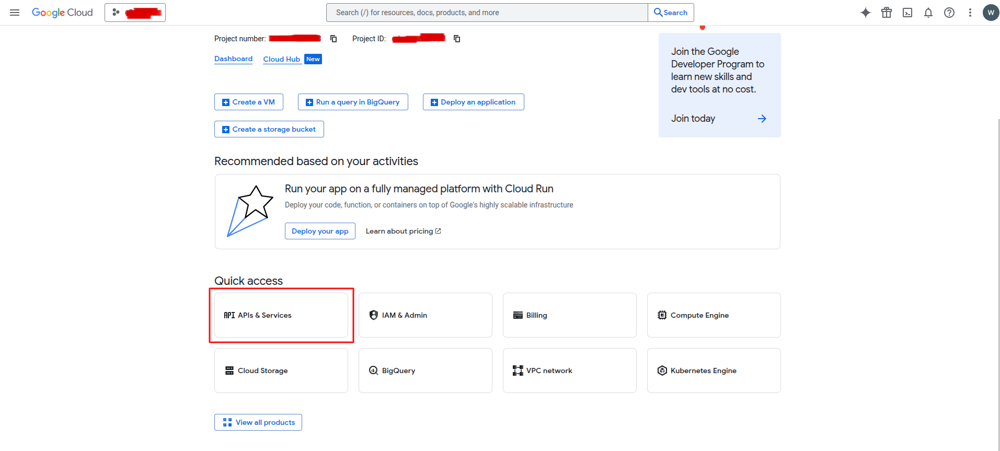
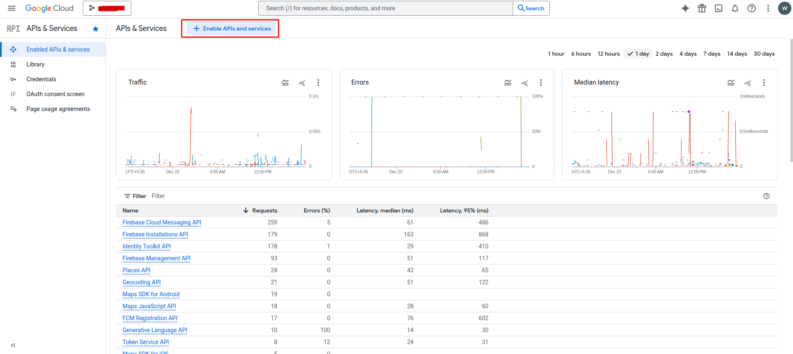
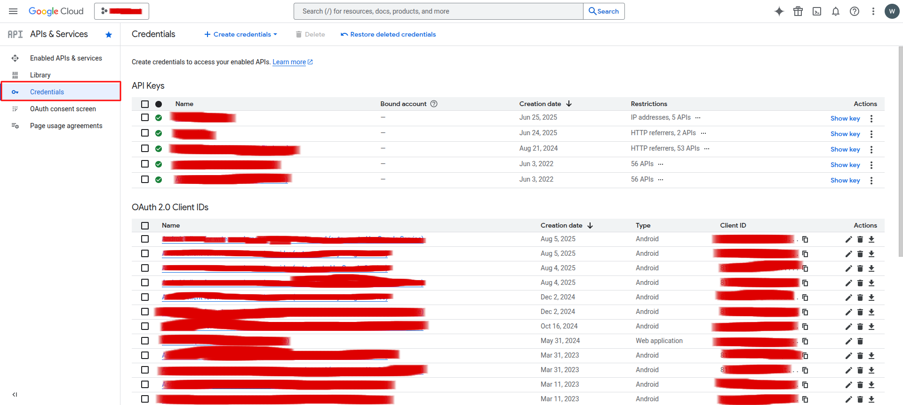
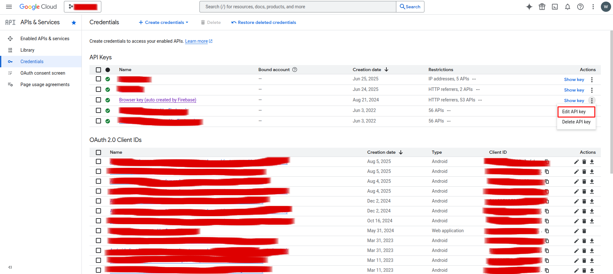
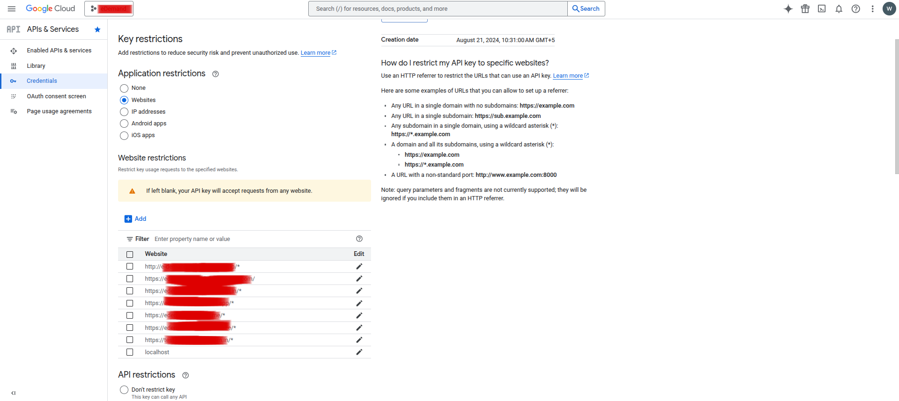
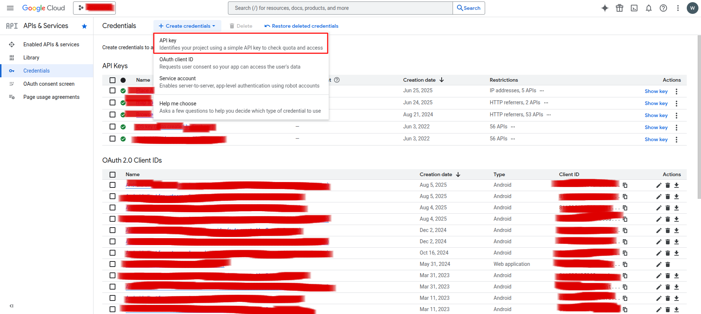
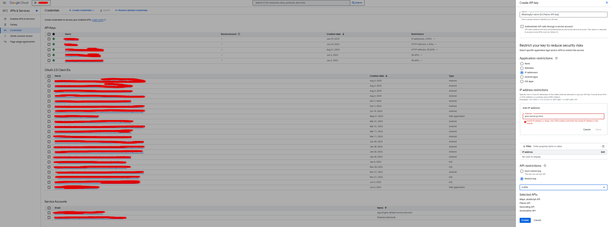

# API Key Settings

::::note

Correct **Google Maps API key** configuration is required for all **maps**, **location search**, and **address suggestions** to work in the **admin panel**, **app**, and **web**.

::::

## What you will set up

- **Enable required Google APIs** for maps and location.
- **Create / edit API keys** with the right **application restrictions**.
- **Restrict APIs and IPs** so keys are safe.
- **Copy keys into eDemand** configuration.

Use the table below as a quick reference:

| Key type           | Used by                     | Typical restrictions                                    |
|--------------------|----------------------------|--------------------------------------------------------|
| Browser (frontend) | Web + Admin + Firebase     | HTTP referrers (domains), selected Maps APIs           |
| Server (backend)   | Backend calls to Maps APIs | IP address of server (IPv4 + IPv6), selected Maps APIs |

## Step 1: Open Google Cloud Console

1. Go to the **Google Cloud Platform / Google Developer Console**.
2. Select the project used for your eDemand deployment.
3. Open **APIs & Services**.

   

## Step 2: Enable Required APIs

In the **Enabled APIs & Services** section, click **Enable APIs and services** and enable at least the following:

- **Maps Javascript API**  
- **Places API**  
- **Geocoding API**  
- **Geolocation API**  

   

If any of these are missing, search for them by name and click **Enable**.

## Step 3: Configure Browser (Frontend) Key

1. In the sidebar, go to the **Credentials** page to view and manage API keys.

   

2. Find your existing **browser key** (or create one if needed) and click **Edit**.

3. Under **Application restrictions**:
   - Choose **HTTP referrers (web sites)**.
   - Add URL patterns like:
     - `https://your-domain.com/*`
     - `https://admin.your-domain.com/*`
     - `https://your-firebase-auth-domain/*`

:::::note

The **Firebase Auth domain** comes from your Firebase project settings.  
You can find it in the **Firebase Console -> Project Settings -> General** section, inside the web app configuration as the `authDomain` field (for example: `your-project-id.firebaseapp.com`).  
You **must** add this exact Auth domain under the HTTP referrer restrictions above; if it is missing, the Firebase-based **login functionality will not work**. Ensure that the **https://** portion is there before the firebase Auth domain

:::::

   

4. Under **API restrictions**, select **Restrict key**, then allow only:
   - **Maps Javascript API**  
   - **Geocoding API**  

   

Click **Save** to apply the changes.

## Step 4: Configure Server (Backend) Key

If needed, create an additional key for server-side usage:

1. On the **Credentials** page, click **Create credentials -> API key**.
2. Give the key a clear name such as `edemand-backend-maps`.
3. Under **Application restrictions**, choose **IP addresses** and:
   - Add the **IPv4** address of your server.
   - Add the **IPv6** address if available (recommended).
4. Under **API restrictions**, allow:
   - **Places API**  
   - **Geocoding API**  
   - **Geolocation API**  
   - (Optionally) **Maps Javascript API** if needed on the server.

   
   

::::note

Google may require both **IPv4** and **IPv6** addresses in IP restrictions. Always add the IPv6 address for more reliable verification.

::::

## Step 5: Update eDemand Configuration

After you finish configuring and saving these keys:

1. Copy the **browser key** and **server key** values.
2. Paste them into the corresponding fields in your eDemand configuration (see **Installation** and **Configure eDemand** guides).
3. Save the configuration and test:
   - Open the web and admin panel map pages.
   - Try searching for an address and placing a pin on the map.

If maps or autocomplete do not work, re-check:

- That all required APIs are **enabled**.
- That the correct **domains / IPs** are added under restrictions.
- That you are using the **right key** in the right place (browser vs server).

