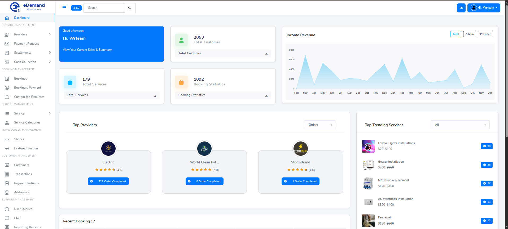
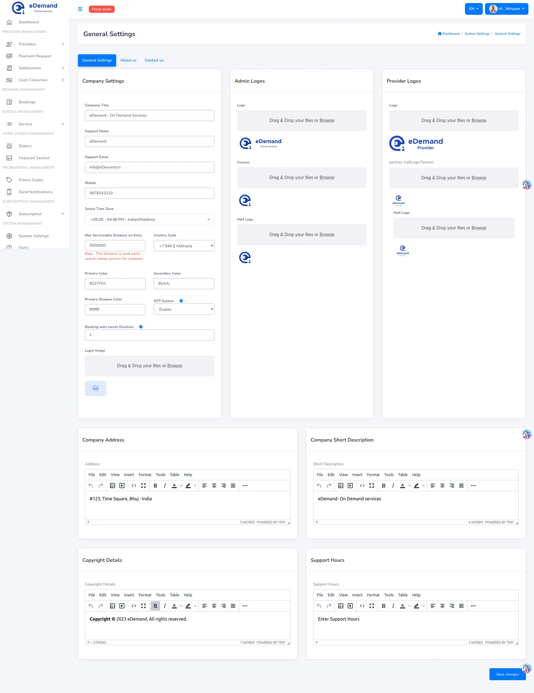
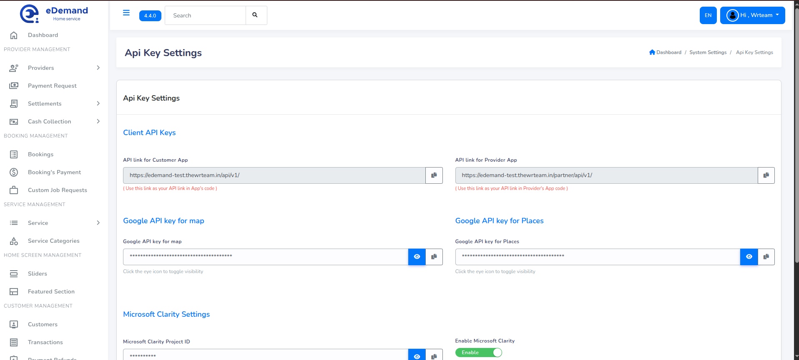
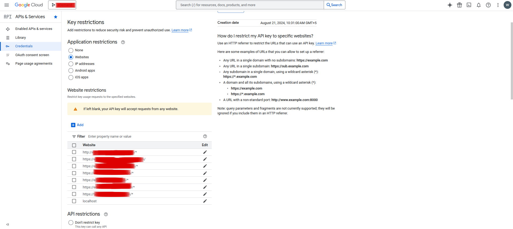
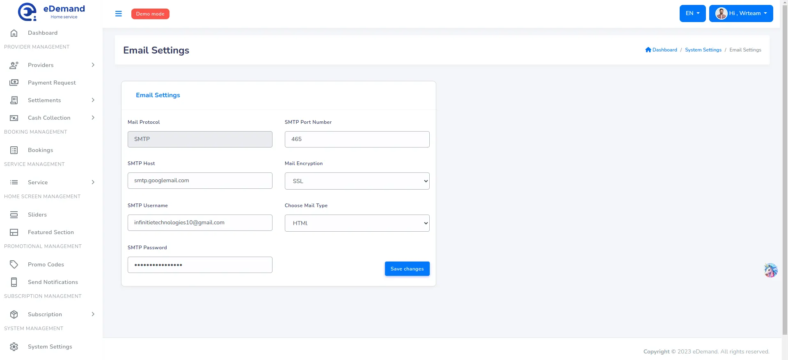
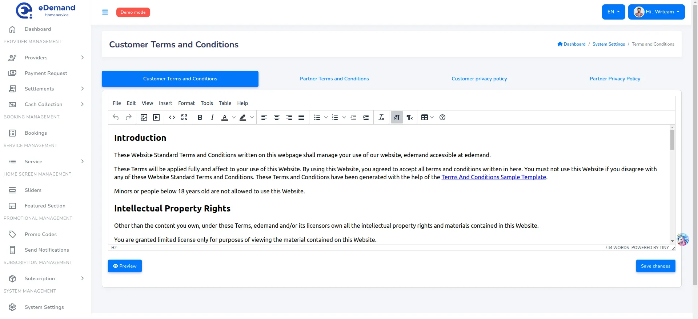
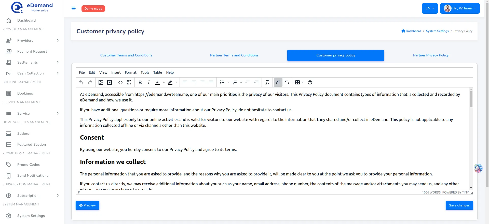

# Configure eDemand

:::note

In order to Configure eDemand you must have Admin Account.

:::

## Use the given guide to configure and customize eDemand as you need.

Login as admin by

1. Enter Admin Login id and Password. Click Login
   

2. Great! You have logged in as Admin.
   

#### Follow the steps given below to customize eDemand.

## General Settings

All the General Settings like Company Title, Support Name, Support Email, favicon, Half Logo, Currency Symbol, TimeZone, Phone, Site Colors, Address, Description, Copyright Details, And Support Hours. Just go to Settings -> General.

## API key settings

:::note
You need to enable the billing to make work of map on admin panel. If its not dispalying the map then you had miss some step on google console so please do proper setup for key.
:::

:::note
If map is not dispalying then it is your responsibiliy to do proper things.
:::

:::note
Installation and map setup is out of the scope.Please note it down.
:::

1. First step is to go to google developer console and go to API and services.

2. In the Enabled APIs & Services section click on the Enable APIs and services button and enable the following:
   <ul>
      <li>Maps Javascript API</li>
      <li>Places API</li>
      <li>Geocoding API</li>
      <li>Geolocation API</li>
   </ul>

 

3. In the side bar go to Credentials page to get the list of API keys:

   

4. There is already browser key, edit it to add restrictions.

    

5. Add Application restrictions by following the following pattern (https://domain/*). You must add the following domains:
   <ul>
      <li>Web</li>
      <li>Admin panel</li>
      <li>Firebase auth domain</li>
   </ul>

   Please ensure that the Maps Javascript, and Geocoding APIs are added in the API restrictions.

   

6. Now in credentials page where we list the API keys click on Create new credentials and select API key.
   

7. Give a meaningful name and add IP based restrictions this time for the Application restrictions. Add the IP of the server on which admin panel code is added and in API restrictions add the Places, GeoCoding, Geolocation, and optionally Maps Javascript APIs.
    

> **Note**: Please also add IPv6 of server to the IP restrictions as sometimes Google requires IPv6.

## Email Settings

Configure Email settings. Just go to Settings -> SMTP (Email).

1. Type the host name.
2. Type SMTP user name.
3. Type SMTP Password.
4. Enter SMTP Port no.
5. Select SMTP Encryption Type
6. Select Mail type (HTML,TEXT)

## Terms And Conditions

Configure Terms And Conditions settings. Just go to Settings -> Terms and Conditions.

1. Enter all Terms and conditions under Terms and conditions section.

   

## Privacy Policy

Configure Privacy Policy settings. Just go to Settings -> Privacy Policy.

1. Enter all Privacy Policy under Privacy Policy section.

   

## Language Settings

You can manage languages for the system from admin panel for apps, web, and panel. To do this go to Settings -> Language Setting

Note: code for the language must be two-letter code and all small letters. Ensure all files for each is uploaded to ensure it works in app, and web

    
