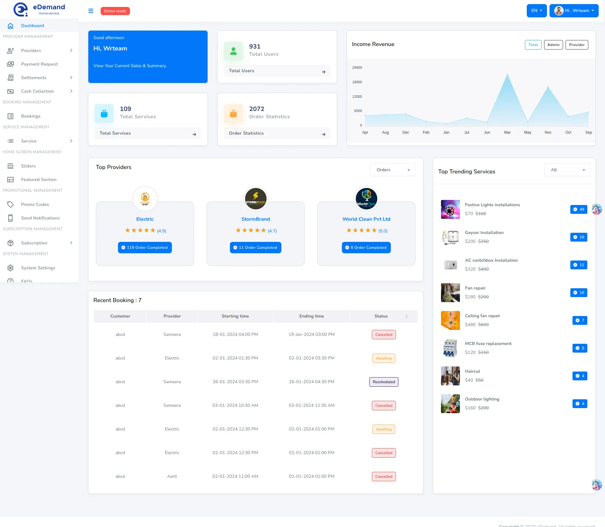
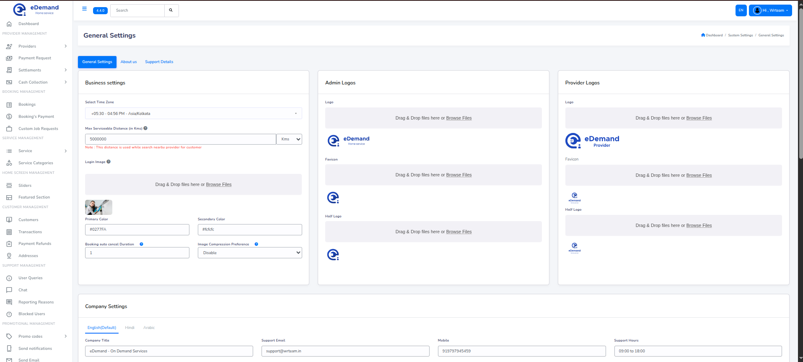
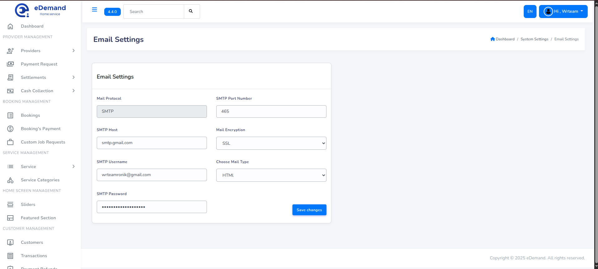
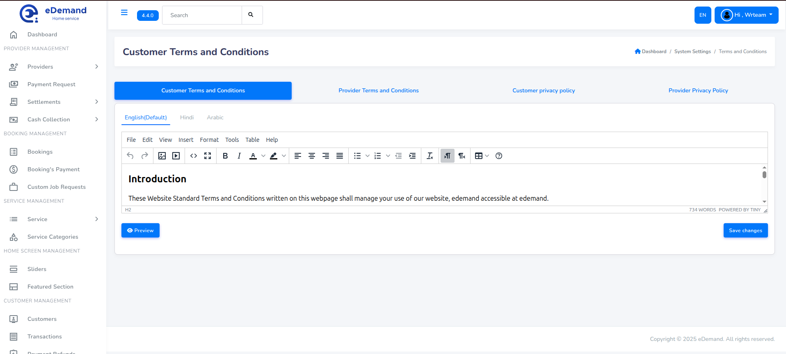
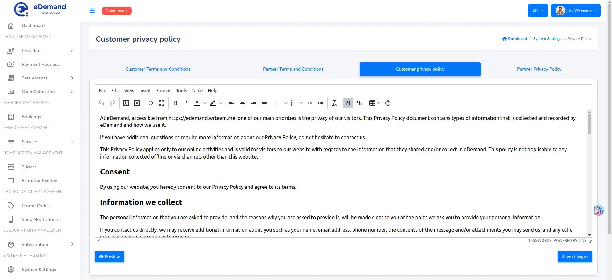

# Configure eDemand

:::note

In order to Configure eDemand you must have Admin Account.

:::

## Use the given guide to configure and customize eDemand as you need.

Login as admin by

1. Enter Admin Login id and Password. Click Login
   

2. Great! You have logged in as Admin.
   

#### Follow the steps given below to customize eDemand.

## General Settings

All the General Settings like Company Title, Support Name, Support Email, favicon, Half Logo, Currency Symbol, TimeZone, Phone, Site Colors, Address, Description, Copyright Details, And Support Hours. Just go to Settings -> General.

## Email Settings

Configure Email settings. Just go to Settings -> SMTP (Email).

1. Type the host name.
2. Type SMTP user name.
3. Type SMTP Password.
4. Enter SMTP Port no.
5. Select SMTP Encryption Type
6. Select Mail type (HTML,TEXT)

## Terms And Conditions

Configure Terms And Conditions settings. Just go to Settings -> Terms and Conditions.

1. Enter all Terms and conditions under Terms and conditions section.

   

## Privacy Policy

Configure Privacy Policy settings. Just go to Settings -> Privacy Policy.

1. Enter all Privacy Policy under Privacy Policy section.

   

## Language Settings

You can manage languages for the system from admin panel for apps, web, and panel. To do this go to Settings -> Language Setting

Note: code for the language must be two-letter code and all small letters. Ensure all files for each is uploaded to ensure it works in app, and web

    

