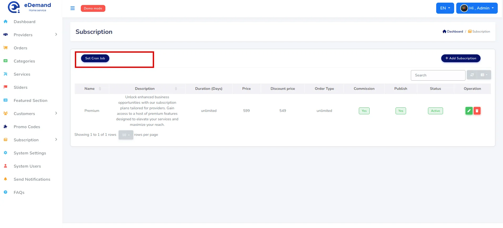
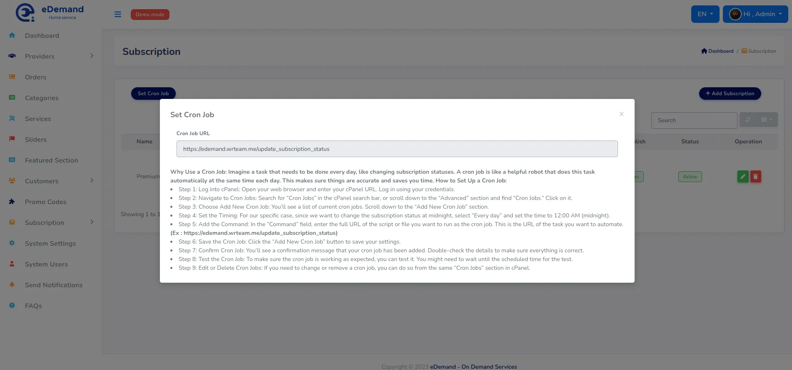

# Cron Jobs

Cron jobs are scheduled tasks that your server runs automatically.
They make sure important background work happens on time, without you having to log in and do it manually.

In **eDemand** you typically need **two cron jobs**:

- **Subscription status update cron**: updates subscription statuses (for example, when a subscription expires at midnight).
- **Notification queue cron**: processes queued email, SMS, and FCM notifications so they are sent reliably without slowing down the app.

If these cron jobs are not set:

- Subscription statuses may not update on time.
- Notifications may stay in the queue or be delayed.

You can run cron jobs in two common ways:

1. **URL-based cron** using `curl` or `wget`.
2. **PHP CLI cron** using the `spark` command (recommended for the notification queue).

Below you will find step‑by‑step instructions for both, including examples for **cPanel**.

---

## 1. Finding Your Cron URLs in the Admin Panel

For URL‑based cron, you first need the URLs that eDemand exposes.
These are shown in the admin panel.

1. Log in to your **eDemand admin panel**.
2. Go to the section where cron URLs are listed.
3. You will see URLs similar to your subscription cron route, for example:
   - `https://your-domain.com/update_subscription_status`
   - or `https://your-domain.com/admin/dashboard/update_subscription_status` (depending on how routes are defined in your project)

You may also see screens similar to:





Copy the URL you want to schedule – you will paste them into your cron commands.

---

## 2. URL‑Based Cron (using `curl` or `wget`)

URL‑based cron means your server simply calls a URL at a fixed interval.
This is easy to set up and works well for tasks like **subscription status updates**.

We will show:

- How to set it up in **cPanel**.
- The exact commands for **`curl`** and **`wget`**, with output discarded so no log files are created on server.

### cPanel – Add a URL‑Based Cron Job 

1. **Log in to cPanel**
   - Open your hosting cPanel URL and sign in.

2. **Open the Cron Jobs screen**
   - In the search bar, type `Cron Jobs`, or
   - Scroll to the **Advanced** section and click **Cron Jobs**.

3. **Choose “Add New Cron Job”**
   - Scroll down to the **Add New Cron Job** section.

4. **Set the schedule**
   - For a **daily subscription status update** at midnight:
     - Use the “Common Settings” dropdown (e.g. `Once Per Day`) and adjust the time to **00:00** if available.
     - Or manually set:  
       - Minute: `0`  
       - Hour: `0`  
       - Day: `*`  
       - Month: `*`  
       - Weekday: `*`

5. **Add the command using `curl`**

   Replace `<CRON_URL>` with your actual cron URL.

   ```shell
   curl -s -o /dev/null -m 60 "<CRON_URL>" >/dev/null 2>&1
   ```

   - `-s`: silent mode (no progress output).
   - `-o /dev/null`: discard the body.
   - `-m 60`: timeout after 60 seconds.
   - `>/dev/null 2>&1`: send all remaining output and errors to the void.

   Example:

   ```shell
   curl -s -o /dev/null -m 60 "https://your-domain.com/admin/dashboard/update_subscription_status" >/dev/null 2>&1
   ```

   > Most shared hosting servers allow you to call `curl` directly as above.
   > If your host requires a full path, you can prepend it, for example: `/usr/bin/curl`.

6. **Alternative: command using `wget`**

   If your server uses `wget`, you can use:

   ```shell
   wget -q -O /dev/null "https://your-domain.com/admin/dashboard/update_subscription_status" >/dev/null 2>&1
   ```

   - `-q`: quiet mode.
   - `-O /dev/null`: discard the downloaded content.

   > As with `curl`, most servers let you use `wget` directly.
   > If needed, you can prepend the full path your host provides (for example `/usr/bin/wget`).

7. **Save**
   - Click **Add New Cron Job**.
   - Confirm that the new cron job appears in the list.

---

## 3. PHP CLI Cron for the Notification Queue (spark) {#php-cli-cron-for-the-notification-queue-spark}

Sending email, SMS, or FCM notifications to many users can be slow if you try to do it during the web request itself.
To solve this, eDemand uses a **queue**.
The **notification queue cron** regularly runs a `spark` command that processes a fixed number of jobs and then exits.

The command looks like this:

```shell
<path-to-php> <path-to-your-project>/spark queue:work notifications -max-jobs 20 --stop-when-empty
```

- `<path-to-php>`: full path to the PHP binary.
- `<path-to-your-project>`: full path to the project root where the `spark` file is located.

You need to find both paths on your server.

### 3.1. How to Find `<path-to-php>`

#### a) On a normal Linux server (SSH)

1. Connect via SSH.
2. Run:

   ```shell
   which php
   ```

3. The output is usually something like:

   ```shell
   /usr/bin/php
   ```

This is your `<path-to-php>`.

#### b) In cPanel

There are a few common ways:

- **Terminal feature** (if enabled):
  1. In cPanel, search for **Terminal** and open it.
  2. Run:

     ```shell
     which php
     ```

  3. Use the resulting path (for example `/usr/bin/php` or `/usr/local/bin/php`).

- **Select PHP Version / MultiPHP**:
  - Some hosts show the PHP path on the **PHP Selector / MultiPHP Manager** page.
  - Look for text like “PHP executable path” or similar in your host’s documentation.

If you cannot find it, your hosting provider’s documentation or support can usually tell you the correct PHP path for cron jobs.

### 3.2. How to Find `<path-to-your-project>`

You need the absolute path to the folder where the `spark` file lives.

Common patterns on shared hosting:

- `/home/<cpanel-username>/public_html`
- `/home/<cpanel-username>/domains/<your-domain>/public_html`

#### a) Using cPanel File Manager

1. In cPanel, open **File Manager**.
2. Navigate to your **document root** for the domain where eDemand runs.
   - For the main domain, this is often `public_html`.
   - For addon domains or subdomains, use **Domains** in cPanel to see the **Document Root**.
3. Find the folder where eDemand is installed (the folder that contains the `spark` file).
4. Look at the **full path** displayed at the top of File Manager, or right‑click the folder and check “Copy path” if your host provides that.

Example full path:

```text
/home/user/domains/domain.com/public_html/edemand
```

This becomes your `<path-to-your-project>`.

#### b) Using SSH

1. Go to your project folder:

   ```shell
   cd /path/to/your/project
   ```

2. Run:

   ```shell
   pwd
   ```

3. The output is your `<path-to-your-project>`.

### 3.3. Example Full spark Command

Putting it together:

```shell
/usr/bin/php /home/user/domains/domain.com/public_html/edemand/spark queue:work notifications -max-jobs 20 --stop-when-empty
```

You can adjust:

- `notifications` queue name if your setup uses a different one.
- `-max-jobs 20` to process more or fewer jobs per run.

### 3.4. cPanel – Add the Notification Queue Cron

Now that you have the PHP path and project path:

1. Log in to **cPanel**.
2. Open **Cron Jobs**.
3. In **Add New Cron Job**:
   - Set the schedule to run **every minute** (recommended for queues):
     - Minute: `*`
     - Hour: `*`
     - Day: `*`
     - Month: `*`
     - Weekday: `*`
4. In the **Command** field, enter:

   ```shell
   <path-to-php> <path-to-your-project>/spark queue:work notifications -max-jobs 20 --stop-when-empty >/dev/null 2>&1
   ```

   Example:

   ```shell
   /usr/bin/php /home/user/domains/domain.com/public_html/edemand/spark queue:work notifications -max-jobs 20 --stop-when-empty >/dev/null 2>&1
   ```

5. Click **Add New Cron Job**.
6. Confirm that the cron job appears in the list.

---

## 4. Verifying and Maintaining Your Cron Jobs

After setting up your cron jobs:

- **Check logs or application behavior**:
  - Confirm that subscription statuses are updated as expected (for example, after midnight).
  - Check that queued notifications are being sent and the queue is not growing indefinitely.
- **Adjust schedules if needed**:
  - For heavy notification volume, you may keep the queue cron at **every minute**.
  - For lighter workloads, you can reduce the frequency.
- **Edit or remove cron jobs**:
  - In cPanel, use the same **Cron Jobs** screen to modify or delete.

Keeping these cron jobs configured and running is essential for correct and timely background processing in eDemand.

