# Firebase configuration

This page explains how to create a Firebase project and connect it to your eDemand admin panel.

## Prerequisites

- **Google account**: You must be able to log in to Firebase with a Google account.
- **eDemand admin access**: You need access to the eDemand admin panel `Settings` → `Firebase Settings`.

## Step 1: Create your Firebase project

### 1.1 Sign in to Firebase Console

Go to the **Firebase Console** and sign in with your Google account.

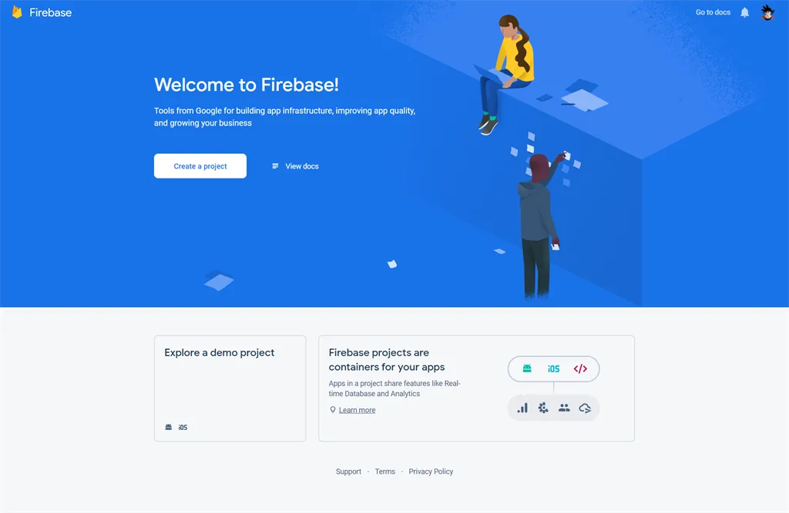

### 1.2 Create a new project

Click **Add project**. Provide a **Project name**, select your **Country/region**, and click **Create project**.

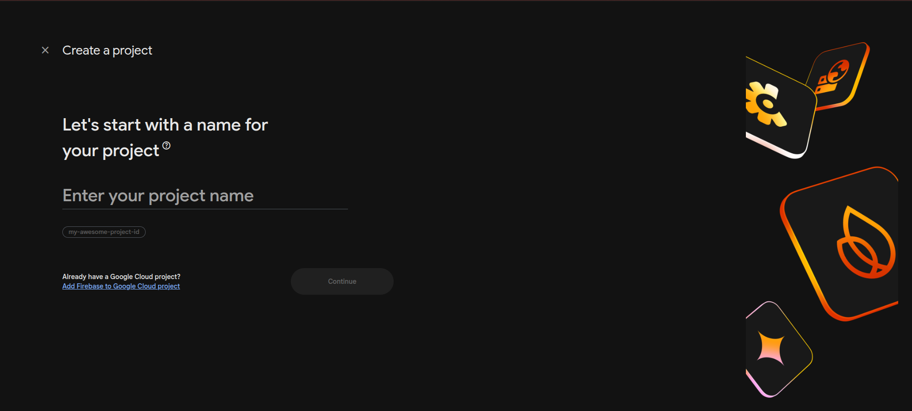
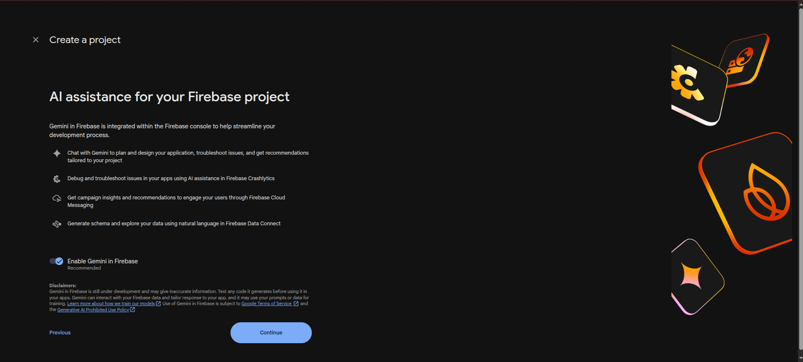
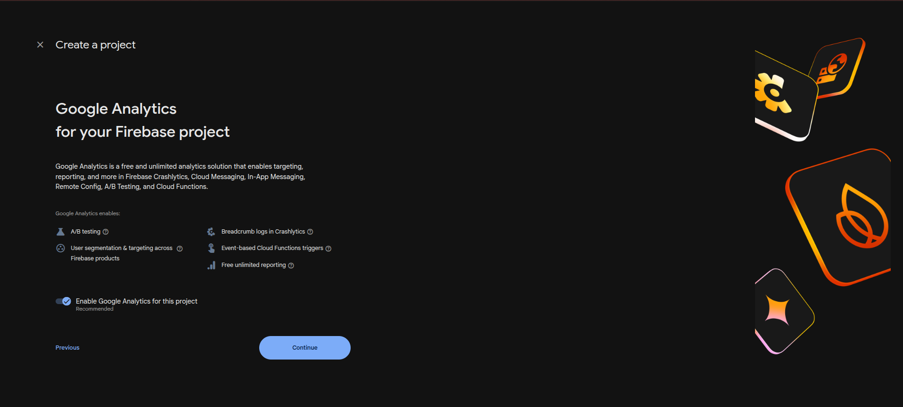
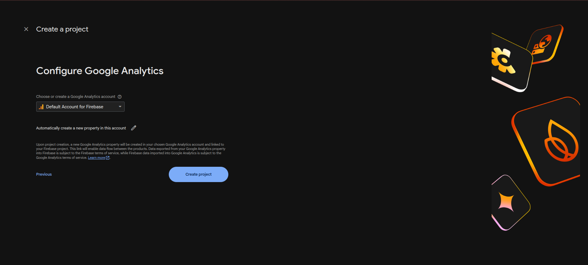

### 1.3 Access the project dashboard

Once created, you will be redirected to the **Firebase project dashboard**.

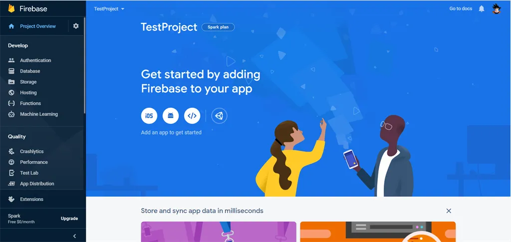

### 1.4 Add a Web app

Add a new **Web app** to this project (this connects to eDemand) and follow the steps shown in the Firebase UI.

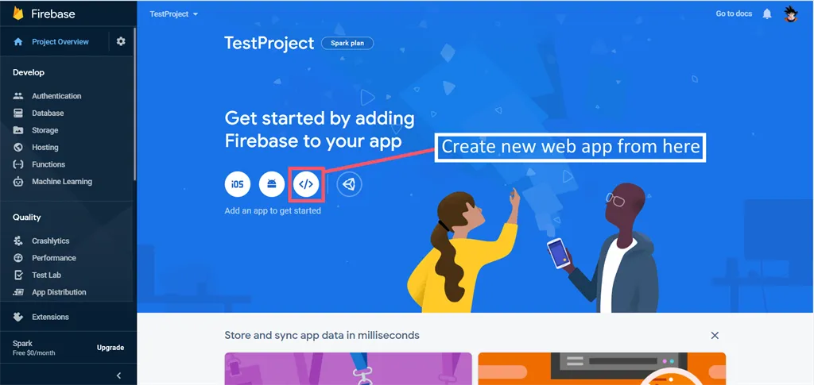

## Step 2: Enable authentication providers

### 2.1 Open Authentication

In the left sidebar, go to **Build** → **Authentication** and click **Get started**.

### 2.2 Enable sign-in providers

Open the **Sign-in method** tab and enable at least the **Phone** and **Google** sign-in providers.

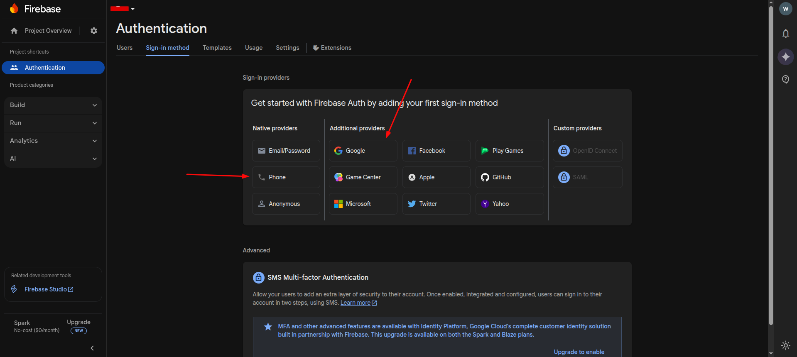

## Step 3: Configure authorized domains

### 3.1 Open Authentication Settings

Still under **Authentication**, open the **Settings** tab.

### 3.2 Add your domain

In the **Authorized domains** section:
- Confirm `localhost` and the Firebase default domain are listed.
- Click **Add domain** and enter your own domain (without `http://` or `https://`).

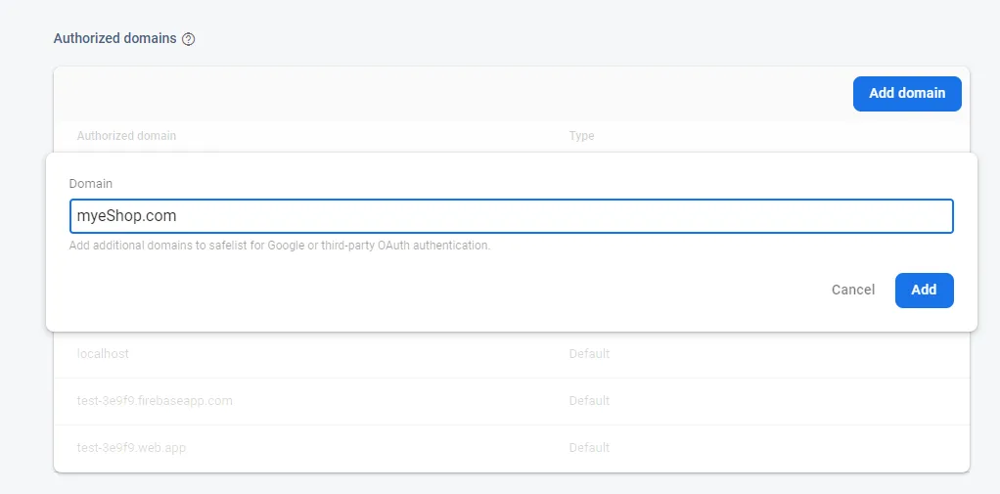

## Step 4: Get your web app config

### 4.1 Open Project Settings

Click the **gear icon** next to **Project overview** and select **Project settings**.

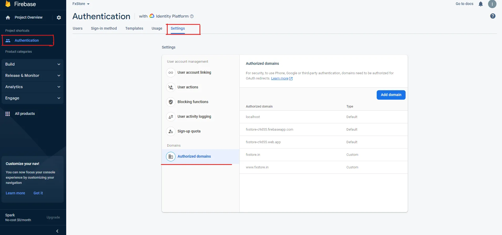

### 4.2 Copy SDK configuration values

On the **General** tab, scroll down to **Your apps**. Find your **Web app** and copy the **Firebase SDK configuration** values (API key, project ID, etc.).

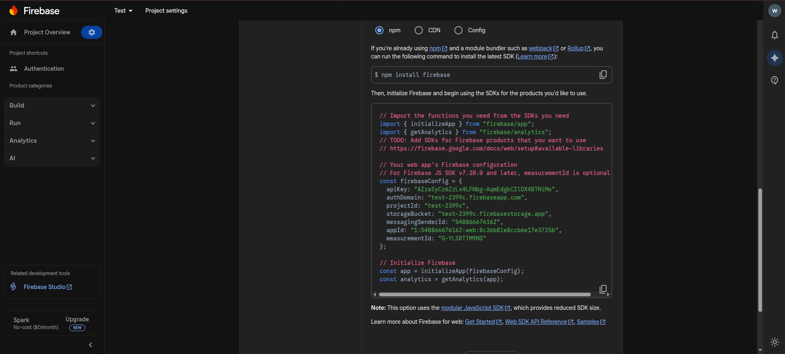

## Step 5: Generate Web Push (VAPID) key

### 5.1 Open Web Push certificates

Open the **Cloud Messaging** tab and scroll to the **Web Push certificates** section.

### 5.2 Generate key pair

Click **Generate key pair**. The key shown in the table is your **VAPID key**.

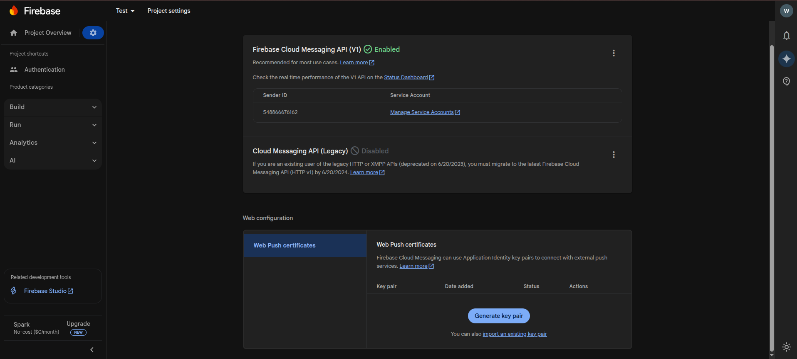

## Step 6: Generate service account key

### 6.1 Open Service Accounts

Open the **Service accounts** tab.

### 6.2 Download the private key

In the **Firebase Admin SDK** section, click **Generate new private key**. Save the downloaded JSON file — you will upload it in the eDemand admin panel.

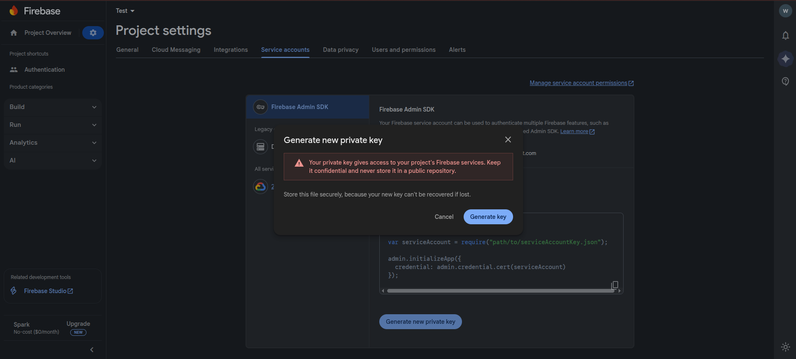

## Step 7: Connect Firebase to eDemand

### 7.1 Open Firebase Settings

In the eDemand admin panel, go to **Settings** → **Firebase Settings**.

### 7.2 Fill in SDK configuration fields

Enter the values copied in [Step 4](#step-4-get-your-web-app-config):

- **API Key**
- **Auth Domain**
- **Project ID**
- **Storage Bucket**
- **Messaging Sender ID**
- **App ID**

### 7.3 Enter the VAPID key

Paste the **VAPID Key** generated in [Step 5](#step-5-generate-web-push-vapid-key).

### 7.4 Upload the service account JSON

Upload the **service account JSON file** downloaded in [Step 6](#step-6-generate-service-account-key).

::::note
Make sure you upload the correct JSON file. Using the wrong file will prevent push notifications from working.
::::

### 7.5 Save the configuration

Click **Save** to apply all settings.

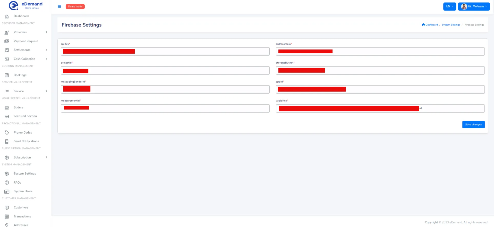
