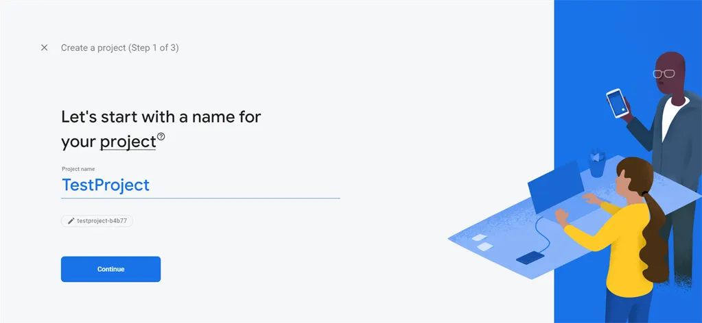
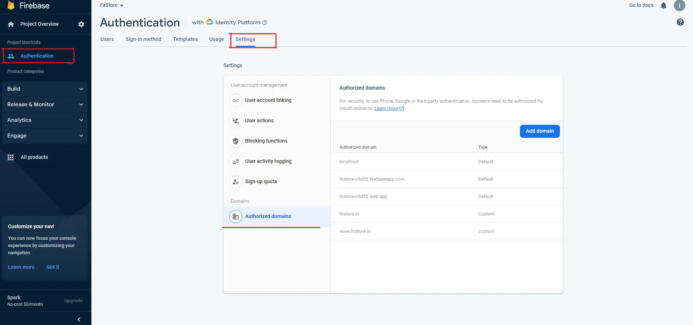
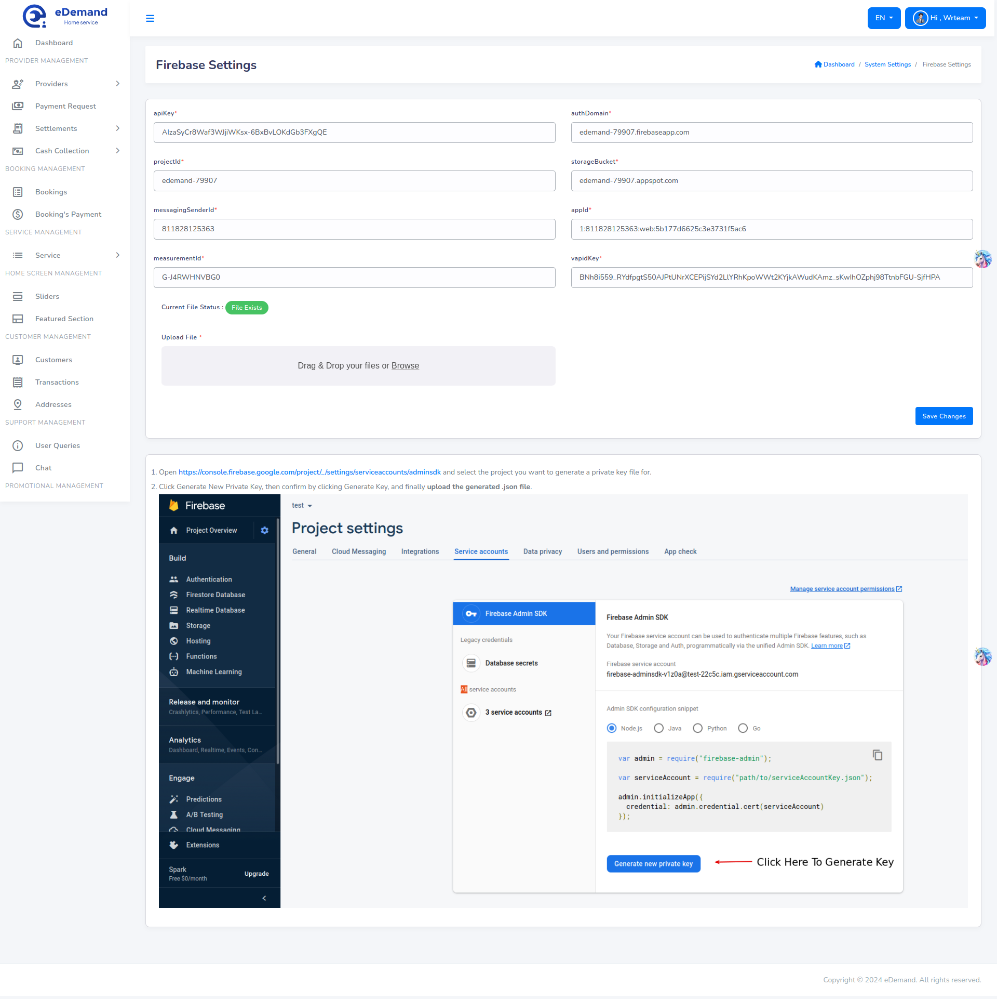

# Firebase Configuration

## Create Firebase Project

1. Goto >> Firebase console 
2. Register a new account or try to log in with existing google accout.

 

 3. Once logged in, you can see firebase console dashboard. Click on Add Project.Provide a project name, and then select country and then after that click on Create Project. For example, see the below image.

 
 
 
 

4. Once the project has been created, it will automatically redirect to Firebase dashboard screen.

 

5. Now you need to add web project/application to the firebase project. Follow the step given there

 

6. Now go to Authentication menu located under build menu. Then click on "Get started" and open "Sign-in method" Tab. Then select phone and Google sign-in providers.
 

7. Now go to Settings tab -> In "Authorized domains", add localhost, a Firebase domain, and web app are automatically added. -> Here you need to add your domain name without http:// and https://

 


8. Go to Project settings by clicking the gear icon near "Project overview" on the sidebar.


 


9. On general tab scroll down and you will find created web App in the "Your apps" section. There you shall find the config options that will have firebase settings.

 

10. Go to the Web configuration tab and scroll down to Web Push certificates section, and click Generate Key Pair. The key pair shown in the table after generating is the Vapid key.


11. Go to the Service accounts tab and on the Firebase Admin SDK section, click on Generate new private key. This shall create and download the file that you shall need to upload in firebase settings of admin panel firebase settings.


12. You need to set this details in eDemand admin panel -> Firebase Settings Page from Settings page

:::note
Upload json file In firebase configuration
:::


<!-- 11.  You need to set this details in firebase-messaging-sw.js file


:::note

If firebase-messaging-sw.js not exist inside your root folder then create a file with firebase-messaging-sw.js name inside your project folder.

:::

```javascript
// Replace the following with your app's Firebase project configuration
firebase.initializeApp
({
apiKey: "Your apiKey",
authDomain: "Your authDomain",
projectId: "Your projectId",
storageBucket: "Your storageBucket",
messagingSenderId: "Your messagingSenderId",
appId: "Your appId",
measurementId: "Your measurementId"
});
```

View firebase-messaging-sw.js and put content in file as below
```javascript
importScripts('https://www.gstatic.com/firebasejs/8.2.0/firebase.js');
importScripts('https://www.gstatic.com/firebasejs/8.2.0/firebase-app.js');
importScripts('https://www.gstatic.com/firebasejs/8.2.0/firebase-messaging.js');


// Initialize Firebase
var config = {
  apiKey:"Your apiKey" ,
  authDomain:"Your authDomain" ,
  projectId:"Your projectId" ,
  storageBucket:"Your storageBucket" ,
  messagingSenderId:"Your messagingSenderId" ,
  appId:"Your appId",
  measurementId:"Your measurementId" 
};


firebase.initializeApp(config);
const fcm=firebase.messaging();
fcm.getToken({
    vapidKey:"your vapidey"
}).then((token)=>{
    // console.log('getToken');
});


fcm.onBackgroundMessage((data)=>{
    // console.log('onBackgroundMessage - ',data);
})

```





 -->