# Installation

This guide shows how to install **eDemand** on a shared hosting server with **cPanel**.

:::info Prerequisites
- You have a working domain that points to your hosting.
- You can log in to your cPanel account.
- You have the product zip file downloaded to your computer.
:::

---

## Step 1 — Log in to cPanel

Log in to your hosting **cPanel**.

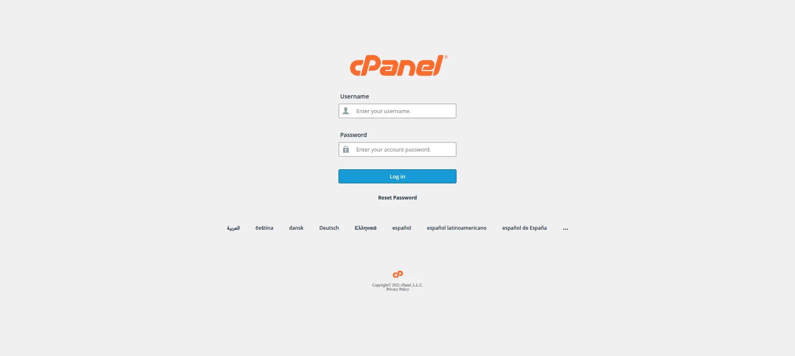

---

## Step 2 — Create the database

### 2.1 Open the database section

In cPanel, go to the **Database** section (for example, “MySQL Databases”).

 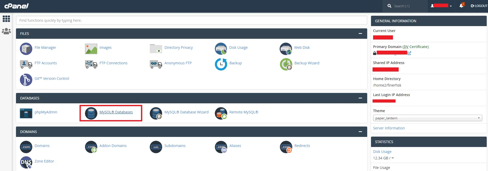

### 2.2 Create a new database

Enter a database name and click **Create Database**.

 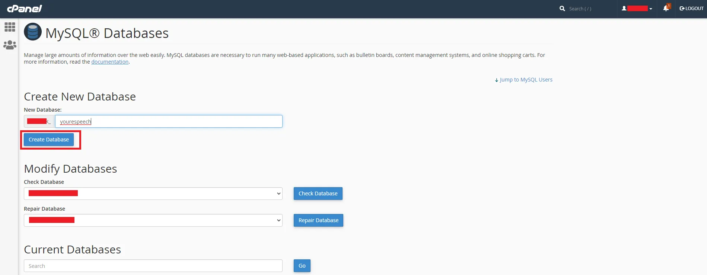

### 2.3 Create a database user

Create a **database user**.  
Choose a strong password and save it in a safe place.

 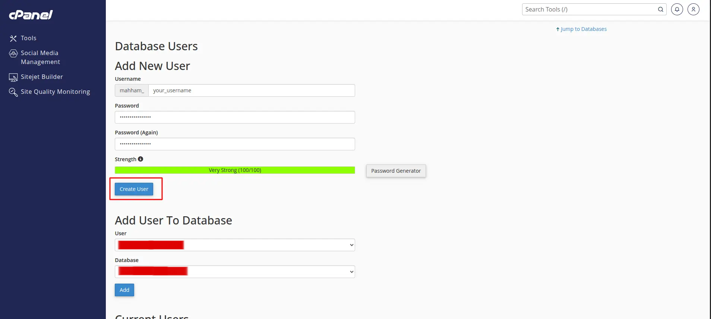

### 2.4 Assign the user to the database

Assign the new user to the new database.  
Give the user **All Privileges**.

 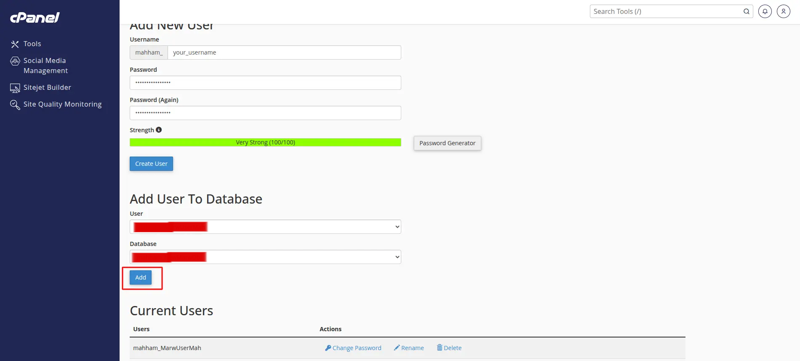

:::tip Keep this information
Write down the following:
- Database name
- Database user name
- Database user password

You will need these values in the installer.
:::

---

## Step 3 — Upload the application files

### 3.1 Open File Manager

In cPanel, open **File Manager**.
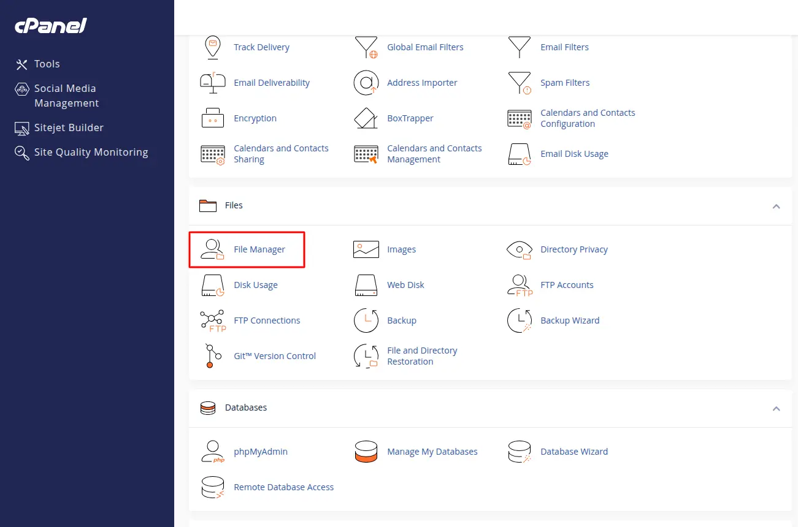

### 3.2 Go to your domain folder

Go to the folder where your domain points:

- Often this is `public_html`, or  
- `public_html/youreDemand.in`

 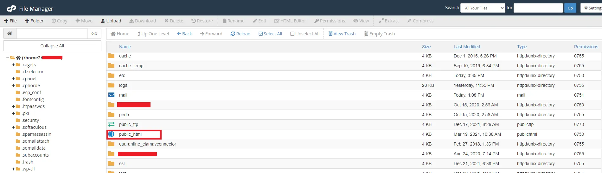

### 3.3 Upload the zip file

Upload the downloaded product zip file into this folder.

 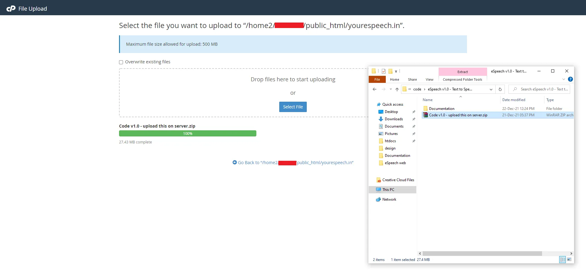

### 3.4 Extract the code

Unzip (extract) the file named  
**Code vX.X - upload this on server.zip**.

 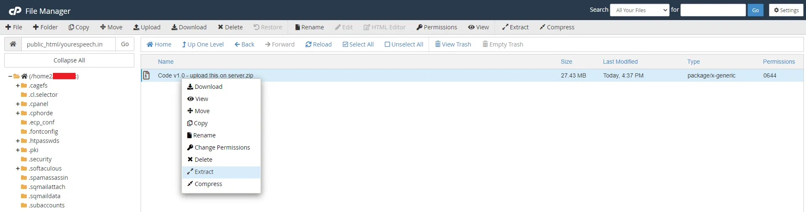

After extraction, confirm that all application files are in the same folder (`public_html` or `public_html/youreDemand.in`).

 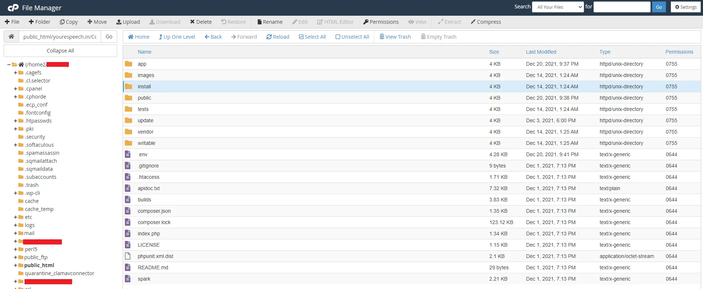

---

## Step 4 — Run the installer {#install-url-step}

Open your browser and go to:

`http://youreDemand.in/install`

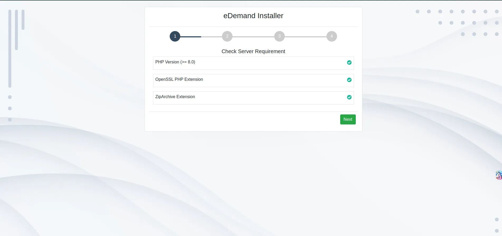

You will see the web installer.  
Follow the steps below in order.

### 4.1 Prerequisites check

The installer first checks your **server requirements**.

- PHP version  
- Required PHP extensions

If something fails here:

- Go back to the [Admin Panel Prerequisites](intro.md) page.  
- Fix the item on your server (for example in `php.ini` or hosting control panel).  
- Then refresh or reopen the installer URL.

### 4.2 Enter purchase code

Next, the installer asks for your **Envato purchase code**.

- Copy the purchase code from your Envato account.  
- Paste it into the **Purchase code** field in the installer.

To find your purchase code, use this link:  
[Where Is My Purchase code](https://help.market.envato.com/hc/en-us/articles/202822600-Where-Is-My-Purchase-Code)

### 4.3 Enter database details

After the purchase code step, you will see the **database** form.

You have already:
- Created a database.
- Created a user and given it access.
- Uploaded and extracted the application files.

Use that information here:

1. **Database Hostname** – Usually `localhost`. Use the value from your hosting provider.
2. **Database Username** – The database user that has access to the database.
3. **Database Password** – The password for that database user.
4. **Database Name** – The name of the database you created.

### 4.4 Enter admin details

In the next step, set your **admin login**.

1. **Admin Mobile** – The admin mobile number.  
   This number is used later for admin login and authentication.
2. **Admin Password** – The admin password.  
   This password is used later for admin login and authentication.

Keep these values in a safe place.  
You will need them to log in to the admin panel.

### 4.5 Start installation

When all fields are filled:

- Check that there are no red error messages.  
- Click **Install**.

:::tip After installation
If the installation is successful, your app is ready to use at:  
`http://youreDemand.in/`
:::
