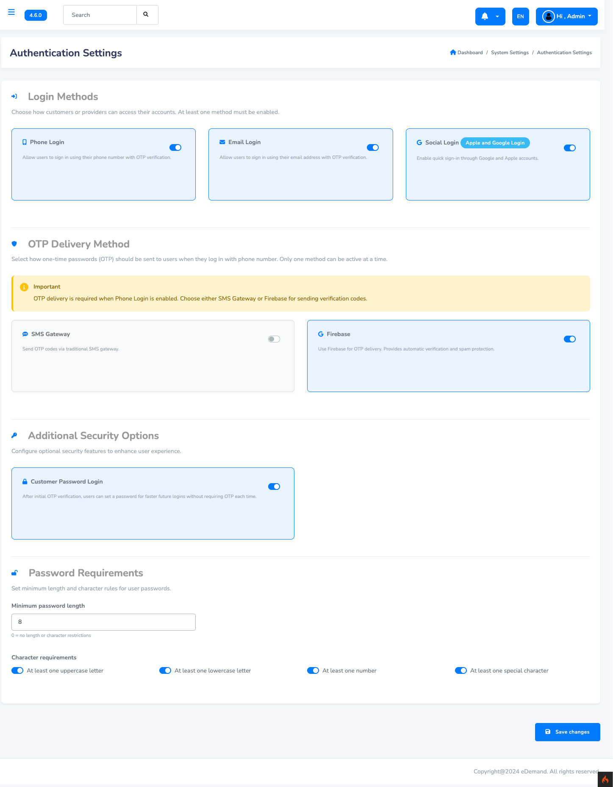

# Authentication Settings

::::note

Use this page to control **how users log in** to both the **app** and the **web**, and to **enforce password strength rules**.

For different **login types** (for example phone login vs email login), the system shall create and manage **separate user records**.  

::::

## What you can configure on this page

- **Login behaviour** – decide which login methods are available, for example:
  - **Phone + OTP** – OTP is delivered via your configured **SMS gateway** or **Firebase**.
  - **Phone + password** – users log in directly with phone and password (OTP not required every time).
  - **Email + OTP** – OTP is delivered using your **SMTP (Email) settings**.
  - **Email + password** – users log in directly with email and password.
- **Password rules** – set how strong user passwords must be (length, numbers, symbols, etc.).

Once you save, the new rules apply immediately to all new logins.

## Step 1: Open Authentication Settings

1. Log in to the admin panel with your admin account.
2. Go to `Settings -> Authentication Settings`.
3. You will see a screen similar to the one below:

   

## Step 2: Configure Login Behaviour

From the **Authentication Settings** page you can control how users log in to the system.

- You can allow users to sign in using **phone and password** to bypass OTP verification on future logins.
- This makes repeat logins faster for trusted users while still keeping security in place.

### When OTP is still required

Even if you allow login using only phone and password, users must still verify themselves with OTP when:

- Registering or setting a password for the first time.
- Changing their existing password.

After you configure these options, click **Save**.  
The new login rules will immediately apply to both the **app** and the **web**.

## Step 3: Configure Password Rules

On the same **Authentication Settings** page you can also control **password validation rules**.
These rules let you enforce stronger or weaker passwords, depending on your security needs.

### Available options

Typical options you can manage here:

- **Minimum password length** – for example 6, 8, or 10 characters.
- **Require numbers** – force at least one digit in the password.
- **Require uppercase letters** – force at least one capital letter.
- **Require lowercase letters** – force at least one small letter.
- **Require special characters** – for example `@ # $ % &` etc.

You can change these values at any time.
After you save the settings, **new passwords** (for registration, password reset, and change password) must follow the rules you configured.

### Example setups

| Scenario                    | Suggested rules                                                                 |
|----------------------------|----------------------------------------------------------------------------------|
| Demo / low-security setup  | Length **6+**, at least **numbers**                                             |
| Typical production system  | Length **8+**, require **numbers + lowercase + uppercase**                      |
| High-security environment  | Length **10+**, require **numbers + lowercase + uppercase + special characters** |

Pick the level that matches your security requirements and click **Save** to apply.
