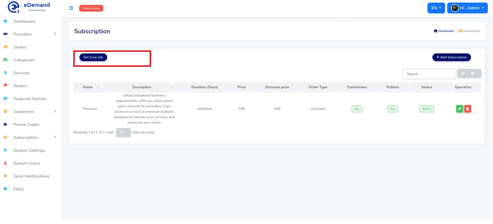
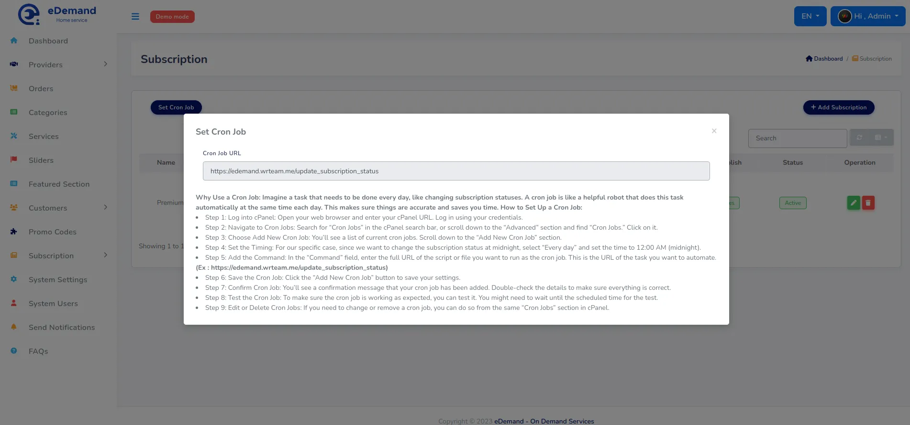

# Set Cron Job in your server

You can find your cron job url from admin panel

## Why Use a Cron Job:
Imagine a task that needs to be done every day, like changing subscription statuses. A cron job is like a helpful robot that does this task automatically at the same time each day. This makes sure things are accurate and saves you time.

## How to Set Up a Cron Job:

1. **Step 1: Log into cPanel:**
   Open your web browser and enter your cPanel URL. Log in using your credentials.

2. **Step 2: Navigate to Cron Jobs:**
   Search for "Cron Jobs" in the cPanel search bar, or scroll down to the "Advanced" section and find "Cron Jobs." Click on it.

3. **Step 3: Choose Add New Cron Job:**
   You'll see a list of current cron jobs. Scroll down to the "Add New Cron Job" section.

4. **Step 4: Set the Timing:**
   For our specific case, since we want to change the subscription status at midnight, select "Every day" and set the time to 12:00 AM (midnight).

5. **Step 5: Add the Command:**
   In the "Command" field, enter the full URL of the script or file you want to run as the cron job. This is the URL of the task you want to automate. **(Ex: https://edemand.wrteam.me/update_subscription_status)**

6. **Step 6: Save the Cron Job:**
   Click the "Add New Cron Job" button to save your settings.

7. **Step 7: Confirm Cron Job:**
   You'll see a confirmation message that your cron job has been added. Double-check the details to make sure everything is correct.

8. **Step 8: Test the Cron Job:**
   To make sure the cron job is working as expected, you can test it. You might need to wait until the scheduled time for the test.

9. **Step 9: Edit or Delete Cron Jobs:**
   If you need to change or remove a cron job, you can do so from the same "Cron Jobs" section in cPanel.
