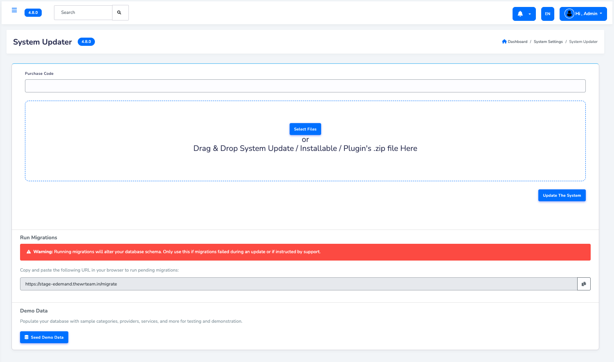

# Demo Database Setup

:::note
This step is **optional**. Only follow these instructions if you want to set up a demo database with sample data for testing or exploration.  
If you do **not** want demo data, you can skip this section.
:::

## Quick Setup Steps

Follow these main steps to set up the eDemand demo database:

1. **Take a Backup of Your Current Database**
   - Before making any changes, back up your existing database to prevent data loss.

2. **Import Demo Data from System Settings**
   - Navigate to: **System Settings → System Updater Settings**
   - Use the demo data import option available there.

   

   > **Note:**
   > You will see two options while importing demo data:
   > - **Clean Seed** → This will remove all existing data and replace it with demo data.
   > - **Keep Existing Data** → This will retain your current data and only add demo data on top of it.
   >
   > Choose carefully based on your use case.

---