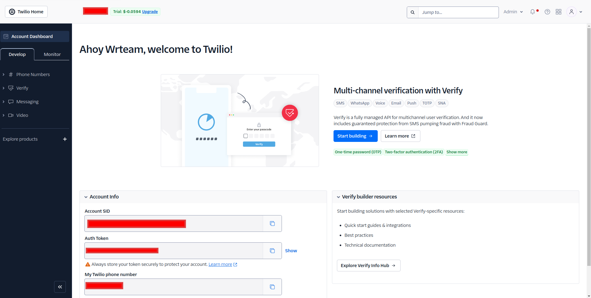
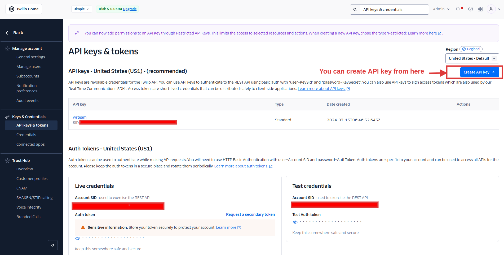
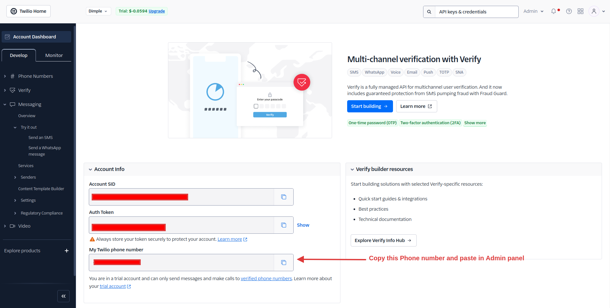
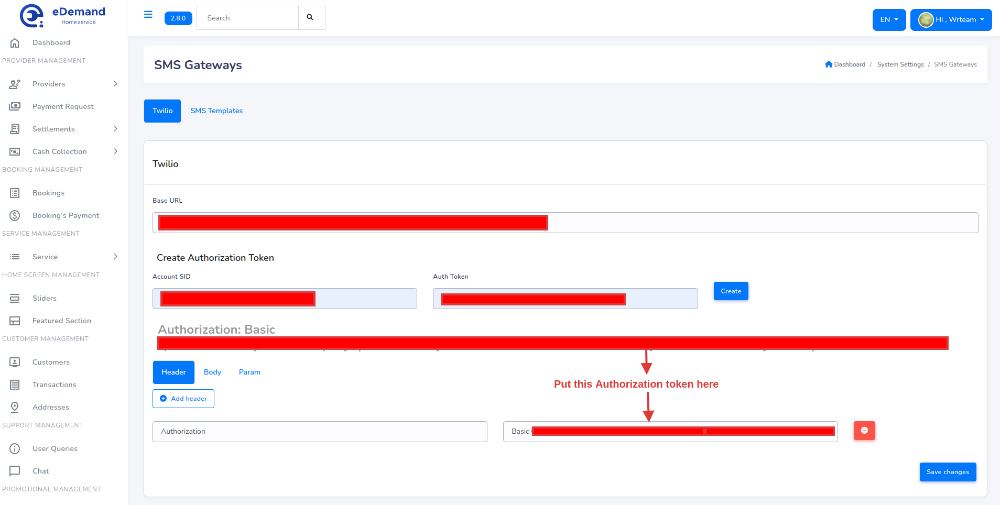

# SMS Gateway Settings

::::note

The **SMS gateway** is used to send **OTP codes** and **SMS notifications** to users (for example, for phone login or order updates). You must configure at least one provider for SMS to work.

::::

## What you will set up

- **Credentials** from your chosen SMS provider (e.g. Account SID, Auth Token for Twilio).
- **Admin panel configuration** so eDemand can send SMS through that provider.

The table below summarises what you need for each supported provider. Follow the section for your provider to get and enter these values.

| Provider | Credentials you need | Where to get them |
|----------|----------------------|-------------------|
| **Twilio** | Account SID, Auth Token | Twilio Console → API keys & credentials (or main account dashboard) |
| **2Factor.in (TSMS)** | API key, Sender ID | 2Factor.in dashboard → API key and Sender ID configuration |
| **Fast2SMS** | API key, Sender ID, DLT template IDs | Fast2SMS Dev API dashboard; Sender ID and templates from DLT portal |
| **MSG91** | Auth key, Flow template IDs | MSG91 Control Panel; Flow templates created in MSG91 dashboard |

---

## Common concepts (all SMS gateways)

Use this section as a quick reference. Each provider section only adds details that are specific to that gateway.

::::note
**Only one SMS gateway at a time.**  
eDemand uses **one active SMS gateway at a time**. When you switch the provider in **Settings → SMS Gateway Settings**, all OTPs and SMS notifications will go through the newly selected provider.
::::

### Where to configure SMS in eDemand

1. Open the eDemand admin panel.
2. Go to **Settings → SMS Gateway Settings**.
3. Choose your **SMS provider** by toggling on the status switch.
4. Enter the required fields for that provider (see table above and provider sections).
5. **Avoid mistakes:**  
   - Copy–paste keys exactly.  
   - Remove any **leading or trailing spaces**.  
   - Keep all keys and tokens **secret** (do not share or store them in code).

### Two types of gateways

- **Text-based gateway (no template IDs):**
  - **2Factor TSMS** and **Twilio** in eDemand works like this.
  - eDemand itself builds the final SMS text from its own templates.
  - The SMS gateway only receives the **full message text** (for example in a `Msg` field).

- **Template-based gateways (with template IDs and variables):**
  - **Fast2SMS** and **MSG91 Flow** work like this in eDemand.
  - You create and approve **templates** in the provider / DLT portal.
  - Each template gets a **template ID** (DLT Message ID, Flow ID, etc.).
  - In eDemand, each SMS template has:
    - a **Gateway template ID** field (where you put that provider’s template ID), and
    - a **parameters list** (this defines the **order** of variable values).

#### Matching variables to the provider template

For template-based gateways, the **variable order** must match between:

- the placeholders in your provider / DLT template (e.g. `{#var#}`, VAR1, VAR2)  
**and**
- the parameters list in the matching eDemand SMS template.

Example pattern (both Fast2SMS and MSG91 follow the same idea):

- Template text: *`"Your OTP is {#var#}. Valid for 10 min. – {#var#}"`* or *`"Your OTP is VAR1. Valid for 10 min. – VAR2"`*.
- First placeholder = OTP, second = company name.
- In eDemand, the **parameters** list for this template must be in the same order, for example: `["otp", "company_name"]`.
- The app sends values in that order to the gateway.  
If the order is wrong, your SMS will show wrong values (for example, company name where the OTP should be).

### How to test that SMS is working

After configuring any gateway:

1. Make sure the credentials (keys, tokens, Sender ID) are correct and saved.
2. If you use **phone + OTP** login (see [Authentication Settings](./login_settings.md)):
   - Try logging in using an OTP.  
   - Confirm that the OTP SMS is received and the **text and variables** look correct.
3. If SMS does not arrive, check:
   - credentials and Sender ID,
   - template ID / Flow ID / Message ID,
   - variable order against the template text,
   - any DLT / provider restrictions.

---

## Twilio

Twilio is a popular SMS provider. You will get your **Account SID** and **Auth Token** from the Twilio Console, then enter them in the eDemand admin panel.

::::note
**Using a Twilio trial or test account?**  
With a trial account, you can only send SMS to **verified** phone numbers. Add every phone number that should receive OTP or SMS (e.g. test users, support numbers) to your [Verified Caller IDs](https://www.twilio.com/console/phone-numbers/verified) list in the Twilio Console.  
For full details, see Twilio’s guide: [Get started with your Twilio free trial account](https://www.twilio.com/docs/messaging/guides/how-to-use-your-free-trial-account#use-additional-recipient-phone-numbers) (section “Use additional recipient phone numbers”).
::::

### Step 1: Open the Twilio Console

1. Log in at [Twilio Console](https://console.twilio.com/).
2. You will use either your **main account credentials** (Account SID and Auth Token from the dashboard) or a **new API key** (recommended for production). Both work for eDemand.

### Step 2: Get your Account SID and Auth Token

**Option A – Use main account credentials**

- In the Twilio Console dashboard you can find **Account SID** and **Auth Token**.
- Auth Token is hidden by default; click **Show** to reveal it.

  

**Option B – Create an API key (recommended)**

1. In the Twilio Console go to **Account → API keys & credentials**.
2. Click **Create API key** and give it a name (e.g. "eDemand").
3. After creating the key, you will see the **SID** and **Secret** (this Secret is your Auth Token for this key).
4. **Copy the Secret immediately** — Twilio shows it only once. If you lose it, you must create a new API key.

  

Use the **Account SID** from the same screen (or from your main account) and the **Auth Token** (main account token or the Secret from the new API key).

### Step 3: Enter credentials in the eDemand admin panel

1. In the eDemand admin panel go to **Settings → SMS Gateway Settings**.
2. Choose **Twilio** as the SMS provider.
3. Enter the **Account SID** and **Auth Token** exactly as shown in Twilio (no extra spaces).
4. Save the settings. See **Common concepts → Where to configure SMS in eDemand** if you need a reminder.

Reference screens from the admin panel:

- 
- 

### Step 4: Verify

Follow **Common concepts → How to test that SMS is working** and send a test OTP / SMS using a real or verified number.

---

## 2Factor.in (Transactional SMS – TSMS)

2Factor.in provides a **Transactional SMS (TSMS)** API that sends SMS using the **full message text** that eDemand builds from its own SMS templates. Unlike **Fast2SMS** and **MSG91** in this project, 2Factor is **not used as a template-based gateway** here — there is **no DLT/template ID** or variable list sent to 2Factor. The app sends the final SMS text directly in the **Msg** field.

:::::note
**Raw message, no gateway template IDs.**  
For 2Factor, you configure only the **API key** and **Sender ID** in eDemand. The app uses its own SMS templates (inside eDemand) to build the complete message text and sends that text to 2Factor as **Msg**. You do **not** configure any "Gateway template IDs" or DLT Message IDs for 2Factor in this app.
:::::

### What you need for 2Factor

| Item | What it is | Where you get it |
|------|------------|------------------|
| **API key** | 2Factor API key used in the request URL path. | 2Factor.in dashboard → API keys / account settings. |
| **Sender ID** | Sender ID shown to the recipient (e.g. 2FACTOR). | 2Factor.in dashboard → Sender / sender ID settings. |

eDemand sends SMS to 2Factor using a **POST** request to the **TSMS endpoint** with JSON body: **From** (Sender ID), **To** (recipient phone), **Msg** (full message text). The optional **SendAt** parameter for scheduling is supported by 2Factor but is **not used** by this app; SMS are sent immediately.

---

### Step 1: Get your 2Factor API key and Sender ID

1. Log in to your [2Factor.in dashboard](https://2factor.in).
2. Find your **API key** in the account or API section.
3. Note your **Sender ID** (for example, `2FACTOR`) that will appear as the sender of SMS. Follow 2Factor’s own rules and any local regulations (for example, DLT in India) when choosing and approving a Sender ID.

:::::note
Keep your **API key** secret. Do not share it or commit it in code. Store it only in the eDemand admin panel (**Settings → SMS Gateway Settings**).
:::::

---

### Step 2: Enter 2Factor credentials in the eDemand admin panel

1. In the eDemand admin panel go to **Settings → SMS Gateway Settings**.
2. Choose **2Factor** (or **2Factor.in / 2factor**) as the SMS provider.
3. Enter:
   - **API key** — the 2Factor API key from your 2Factor dashboard.  
   - **Sender ID** — the Sender ID you configured in 2Factor (for example, `2FACTOR`).
4. Save the settings, making sure there are **no leading or trailing spaces** in either field.

---

### Step 3: Verify

Follow **Common concepts → How to test that SMS is working** and verify that the OTP or notification text looks correct.  
For more details on the 2Factor TSMS API itself (parameters, optional fields, and responses), see the official 2Factor docs: `https://2factor.in/API/DOCS/ADDON_SRV_SEND_TSMS.html`.

---

## Fast2SMS

Fast2SMS is an SMS provider commonly used in **India**. In India, SMS must follow **DLT (Distributed Ledger Technology)** rules. This means you cannot send free-form text; you must use **pre-approved Sender ID**, **pre-approved message templates** (with a DLT Message ID), and **variable values** in a fixed order. eDemand is built to work with Fast2SMS in this DLT-compliant way.

::::note
**India only.** Fast2SMS with DLT is intended for sending SMS in India. You need an approved **Sender ID** and **templates** on the DLT portal before eDemand can send SMS via Fast2SMS.
::::

### What you need for Fast2SMS

| Item | What it is | Where you get it |
|------|------------|------------------|
| **API key** | Your Fast2SMS authorization key. | Fast2SMS dashboard → **Dev API** section. |
| **Sender ID** | A 3–6 letter ID (e.g. FSTSMS). Must be **DLT-approved**. | Register and get approval in the **DLT portal**; then use the same ID in Fast2SMS. |
| **Template IDs (Message IDs)** | One DLT **Message ID** per SMS type (OTP, booking confirmation, etc.). | Create and approve **templates** on the DLT portal; each template gets a Message ID. You will enter these in eDemand per template. |

eDemand sends SMS using **template ID + variables** only. It does **not** send a custom message body to Fast2SMS. The **variable order** in eDemand must match the order of placeholders in your DLT template (see below).

::::danger **Important — read before configuring Fast2SMS**
**Match eDemand templates with DLT.**

eDemand has its own **SMS templates** (e.g. for OTP, booking confirmation). For SMS to work with Fast2SMS, your **DLT templates must match these eDemand templates** (or you create DLT templates that correspond to them).

When you register a template on the DLT portal, create it for the **same event and content** as the template in eDemand.

Only SMS types that exist as **templates in eDemand** will send notifications. If there is no matching template in eDemand for an event, no SMS is sent.

SMS is sent only when certain **events** occur (e.g. login OTP, order update). Each event uses a specific template. So when registering on DLT, create one approved template per such event and match it to the corresponding template in eDemand (same placeholders and order).
::::

---

### Step 1: Get your API key and Sender ID

1. Log in to the [Fast2SMS dashboard](https://fast2sms.com/dashboard/dev-api).
2. Open the **Dev API** section.
3. Copy your **Authorization Key** (API key). You will enter this in eDemand as the Fast2SMS API key.
4. Your **Sender ID** must be **DLT-approved** (registered in the DLT portal with the same 3–6 letter ID). If you do not have one yet, register and get it approved on the DLT portal first, then use that exact Sender ID in Fast2SMS and in eDemand.

::::note
Keep your API key secret. Do not share it or commit it in code. Store it only in the eDemand admin panel (Settings → SMS Gateway Settings).
::::

---

### Step 2: Register DLT templates and get Message IDs

For each kind of SMS you will send (e.g. OTP, booking confirmation), you need a **DLT-approved template**. Create a DLT template **for each SMS template that exists in eDemand** for the events you use (e.g. OTP login, booking confirmation). Only those events that have a matching template in eDemand’s SMS templates will trigger an SMS.

1. In the **DLT portal**, create a template with the text you want to send (matching the content and variables of the corresponding eDemand template).
2. Use placeholders where values will change (usually written as **`{#var#}`**). **Order matters** — this order must match the parameters list in the corresponding eDemand template (see **Common concepts → Matching variables to the provider template**).
3. Submit the template for approval and note the **Message ID** (template ID) assigned to it.

You will enter each template’s **Message ID** in eDemand when configuring that SMS template (see Step 4).

---

### Step 3: Enter Fast2SMS credentials in the eDemand admin panel

1. In the eDemand admin panel go to **Settings → SMS Gateway Settings**.
2. Choose **Fast2SMS** as the SMS provider.
3. Enter:
   - **API key** — the Authorization Key from the Fast2SMS Dev API dashboard.
   - **Sender ID** — your DLT-approved 3–6 letter Sender ID (e.g. FSTSMS).
4. Save the settings.

Ensure there are **no leading or trailing spaces** in the fields.

---

### Step 4: Add the DLT template ID for each SMS template

eDemand has built-in SMS templates (e.g. for OTP, booking notifications). For each one you use with Fast2SMS, set the **Gateway template ID** (Fast2SMS) to the **DLT Message ID** of the matching template.

1. In the admin panel, open where **SMS templates** or **Gateway template IDs** are configured (usually under notification or SMS template settings).
2. For each SMS type (e.g. OTP, booking confirmation), find the **Fast2SMS** or **Gateway template ID** field.
3. Enter the **Message ID** from the DLT portal for that template.
4. Save.

The app sends this Message ID to Fast2SMS as the **message** parameter (template identifier). It does **not** send the raw SMS text.

---

### Step 5: Match variable order (parameters) with your DLT template

Each DLT template has placeholders `{#var#}` in a fixed order. eDemand sends the values for these placeholders as **pipe-separated** values in the **same order**.

- In eDemand, each SMS template has a **parameters** list (e.g. `["otp", "company_name"]`). This defines the **order** of values sent to Fast2SMS.
- The **first** parameter in the list is the value for the **first** `{#var#}` in the DLT template; the **second** parameter is the value for the **second** `{#var#}`, and so on.
- Example:
  - DLT template: *`"Your OTP is {#var#}. Valid for 10 min. – {#var#}"`* (first var = OTP, second = company name).
  - In eDemand, parameters should be in the same order, e.g. **otp**, **company_name**.
  - Values sent to Fast2SMS: `variables_values` = `6695|MyStore` (OTP|company name).

If the order in eDemand does **not** match the order of `{#var#}` in the DLT template, the SMS will show wrong values. Check your DLT template and the template configuration in eDemand so the orders match.

---

### Step 6: Verify

1. Ensure **API key** and **Sender ID** are correct and have no extra spaces.
2. For each SMS type you use, ensure the **Gateway template ID** (Fast2SMS) equals the **DLT Message ID** of the approved template and that the parameter order is correct.
3. Follow **Common concepts → How to test that SMS is working** (for example, by testing phone + OTP login).

For more on the Fast2SMS DLT API, see the [Fast2SMS API reference](https://docs.fast2sms.com/reference/new-endpoint) (DLT SMS GET API).

---

## MSG91

MSG91 is an SMS provider that supports the **Flow API**: you send SMS using **pre-defined templates** and **variables** (VAR1, VAR2, VAR3, …) instead of free-form message text. eDemand uses this template-based flow so that OTP and other notifications are sent via your MSG91 Flow templates.

::::note
**Template-based sending.** With MSG91, eDemand does **not** send raw message text. It sends a **template ID** and **variable values** in a fixed order. Your MSG91 Flow template placeholders (VAR1, VAR2, …) must match the order of parameters in eDemand’s SMS templates.
::::

::::danger **India: DLT approval required for Flow templates**
If you send SMS **in India** via MSG91, your Flow templates must comply with **DLT (Distributed Ledger Technology)** rules. You must:

- Register your entity (Principal Entity) and get your **Sender ID (header)** approved on the DLT platform.
- Create and get **content templates approved** on the DLT platform (same as for other Indian SMS gateways).
- In the **MSG91 panel**, **map each approved DLT Template ID** to the corresponding **Flow ID** for that template.

SMS will not be delivered in India until DLT approval is in place and the DLT Template ID is mapped to your Flow template on MSG91. See MSG91’s help: [Map approved DLT Template Id with Flow Id](https://msg91.com/help/dlt-registration-in-india/map-approved-dlt-template-id-with-respective-flow-id-on-msg91-panel) and [DLT FAQs](https://msg91.com/help/dlt-faqs).
::::

### What you need for MSG91

| Item | What it is | Where you get it |
|------|------------|-------------------|
| **Auth key** | Your MSG91 authentication key. | MSG91 **Control Panel** ([control.msg91.com](https://control.msg91.com)) — used as the `authkey` header when sending. |
| **Flow template ID** | One template ID per SMS type (OTP, booking confirmation, etc.). | Create a **Flow template** in the MSG91 dashboard; each template gets an ID. You enter this ID in eDemand per SMS template (Gateway template IDs → MSG91). |

eDemand sends SMS using **template_id + recipients** (phone + VAR1, VAR2, …). The **order** of variables in eDemand must match the order of placeholders (VAR1, VAR2, VAR3, …) in your MSG91 Flow template.

::::danger **Important — read before configuring MSG91**
**Match eDemand templates with MSG91 Flow templates.**

eDemand has built-in **SMS templates** (e.g. for OTP, booking confirmation). For SMS to work with MSG91, you must create **Flow templates** in MSG91 that correspond to these events and set the **Gateway template ID** (MSG91) in eDemand to the Flow template ID.

The **variable order** in the app (template `parameters`) is mapped to **VAR1**, **VAR2**, **VAR3**, … in the API. So the first parameter in eDemand = VAR1, the second = VAR2, and so on. Your MSG91 Flow template placeholders must be in the same order.
::::

---

### Step 1: Get your Auth key

1. Log in to the [MSG91 Control Panel](https://control.msg91.com).
2. Find your **Auth Key** (authentication key) in the dashboard or API section.
3. Copy the key. You will enter it in eDemand under **Settings → SMS Gateway Settings** as the MSG91 **Auth Key**.

::::note
Keep your Auth key secret. Do not share it or commit it in code. Store it only in the eDemand admin panel (Settings → SMS Gateway Settings).
::::

---

### Step 2: Create Flow templates in MSG91 and get template IDs

For each kind of SMS you will send (e.g. OTP, booking confirmation), you need a **Flow template** in MSG91. Create one Flow template **for each SMS template that exists in eDemand** for the events you use.

1. In the **MSG91 dashboard**, create a **Flow** template with the text and placeholders you need.
2. Use MSG91’s placeholders **VAR1**, **VAR2**, **VAR3**, … in the order you want. **Order matters**: VAR1 = first value from eDemand, VAR2 = second, etc.

::::note
**Variable names must be in capital letters.** Use **VAR1**, **VAR2**, **VAR3** (uppercase) in your Flow template. Lowercase names (e.g. var1, var2) may not be replaced correctly by the API. Match the exact naming used in MSG91’s Flow template editor for variable replacement to work.
::::
3. Note the **template ID** assigned to the Flow template. You will enter this in eDemand as the Gateway template ID for that SMS type (Step 4).

**Example:**  
- Flow template text: *"Your OTP is VAR1. Valid for 10 min. – VAR2"* (VAR1 = OTP, VAR2 = company name).  
- In eDemand, the **parameters** for this template must be in the **same order**: e.g. `otp`, then `company_name`, so that the app sends VAR1 = OTP, VAR2 = company name.

---

### Step 3: Enter MSG91 credentials in the eDemand admin panel

1. In the eDemand admin panel go to **Settings → SMS Gateway Settings**.
2. Choose **MSG91** as the SMS provider.
3. Enter the **Auth Key** — the authentication key from the MSG91 Control Panel.
4. Save the settings.

Ensure there are **no leading or trailing spaces** in the Auth Key field.

---

### Step 4: Add the Flow template ID for each SMS template

eDemand has built-in SMS templates (e.g. for OTP, booking notifications). For each one you use with MSG91, you must set the **Gateway template ID** for MSG91 to the **Flow template ID** from your MSG91 dashboard.

1. In the admin panel, open the place where **SMS templates** or **Gateway template IDs** are configured (usually under notification or SMS template settings).
2. For each SMS type (e.g. OTP, booking confirmation), find the **MSG91** or **Gateway template ID** field.
3. Enter the **Flow template ID** from the MSG91 dashboard for that template.
4. Save.

The app sends this template ID to MSG91 in the request body as `template_id`, along with `recipients` (phone and VAR1, VAR2, …).

---

### Step 5: Match variable order (parameters) with your MSG91 Flow template

Each MSG91 Flow template has placeholders VAR1, VAR2, VAR3, … in a fixed order. eDemand sends values as **VAR1**, **VAR2**, **VAR3**, … in the **same order** as the template’s **parameters** in eDemand.

- In eDemand, each SMS template has a **parameters** list (e.g. `["otp", "company_name"]`). The **first** parameter is sent as **VAR1**, the **second** as **VAR2**, and so on.
- **Example:**
  - MSG91 Flow template: *"Your OTP is VAR1. Valid for 10 min. – VAR2"* (VAR1 = OTP, VAR2 = company name).
  - In eDemand, parameters should be in the same order: **otp**, **company_name**.
  - The app sends: `recipients` = `[{ "mobiles": "919876543210", "VAR1": "6695", "VAR2": "MyStore" }]`.

If the order in eDemand does **not** match the order of VAR1, VAR2, … in the MSG91 Flow template, the SMS will show wrong values. Check your Flow template and the template configuration in eDemand so the orders match.

---

### Step 6: Verify

1. Ensure the **Auth Key** is correct and has no extra spaces.
2. For each SMS type you use, ensure the **Gateway template ID** (MSG91) equals the **Flow template ID** from the MSG91 dashboard.
3. Confirm that **template parameters** in eDemand are in the **same order** as VAR1, VAR2, VAR3, … in the MSG91 Flow template.
4. If you use **phone + OTP** login (see [Authentication Settings](./login_settings.md)), try logging in using the OTP sent via the MSG91 SMS gateway to confirm SMS is delivered.

For more on the MSG91 Flow API (endpoint, request body, and response), see the [MSG91 Flow API documentation](https://docs.msg91.com/p/flow-api).
