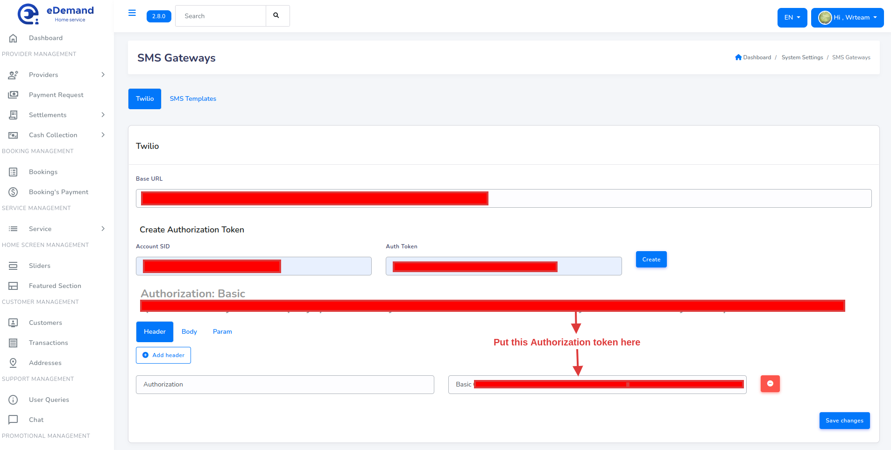

# SMS Gateway Settings

## Twilio

1. Login to [Twilio](https://console.twilio.com/)
2. Firstly open your sms gateway account. You can find api keys in your account -> API keys & credentials -> create api key

   

3. After you create key you can see here Account sid and auth token

   

4. Check this for admin panel settings
   - 
   - 

5. Make sure you entered valid data as per instructions before proceeding
