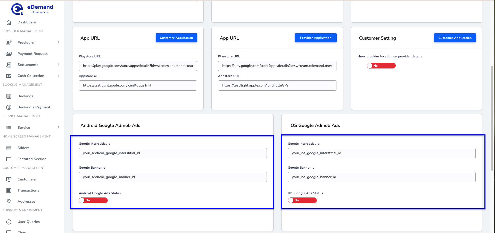
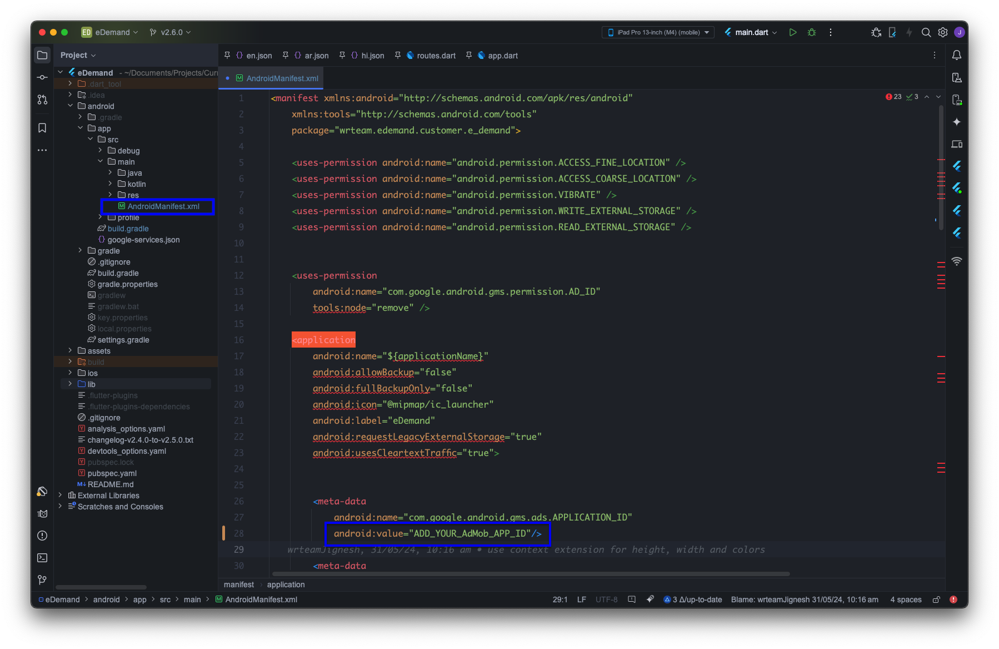
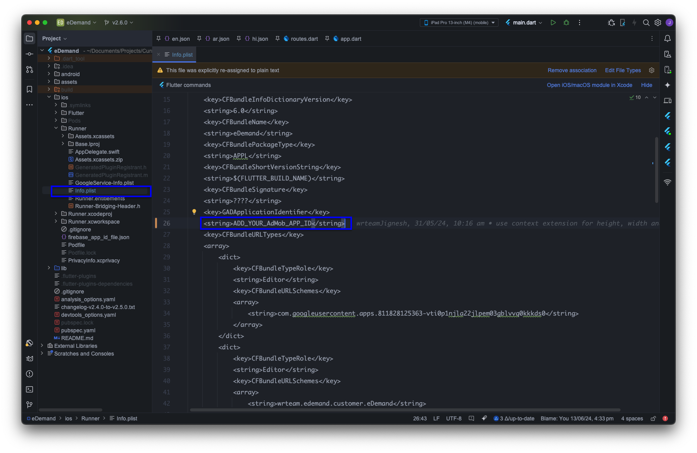

# Google Ad Mob

# 📢 How to Set Up Google AdMob  

This guide explains how to **integrate Google AdMob** for displaying ads in your application.  

---

## 🚫 **Disabling AdMob (Optional)**  

If you want to **disable Google AdMob**, follow these steps:  

1️⃣ Go to the **Admin Panel**.  
2️⃣ Navigate to **Settings > App Settings**.  
3️⃣ Locate the **Google AdMob** option.  
4️⃣ Toggle the option to **Disable** ads.  

✅ **AdMob will now be disabled in your app.**  

---

## 🛠️ **Step 1: Create an AdMob Account & App**  

1️⃣ Sign up or log in to **[Google AdMob](https://admob.google.com)**.  
2️⃣ Create a new **AdMob App** for **Android & iOS**.  
3️⃣ Generate the required **Ad Unit IDs** for:  
   - **Banner Ads** 📢  
   - **Interstitial Ads** 📺  

4️⃣ Copy the generated **Ad Unit IDs** for later use.  

---

## ⚙️ **Step 2: Configure AdMob in the Admin Panel**  

1️⃣ Open the **Admin Panel**.  
2️⃣ Navigate to **Settings > App Settings**.  
3️⃣ Paste the copied **Ad Unit IDs** into the respective fields.  
4️⃣ Click **Save** to apply changes.  



✅ AdMob is now configured in the Admin Panel.  

---

## 📲 **Step 3: Add AdMob Ad ID in the App**  

### **For Android**  

1️⃣ Open your Flutter project.  
2️⃣ Go to:  **android/app/src/main/AndroidManifest.xml**          
3️⃣ Add the following **meta-data** inside the `<application>` tag:  
```xml
<meta-data
    android:name="com.google.android.gms.ads.APPLICATION_ID"
    android:value="YOUR_ANDROID_ADMOB_APP_ID"/>
```

4️⃣ Replace YOUR_ANDROID_ADMOB_APP_ID with your actual Android AdMob App ID.             



---

### **For iOS**
1️⃣ Open your Flutter project.
2️⃣ Go to:
```swift
ios/Runner/Info.plist
```
3️⃣ Add the following **key-value pair** inside the `<dict>` tag:
```xml
<key>GADApplicationIdentifier</key>
<string>YOUR_IOS_ADMOB_APP_ID</string>
```
4️⃣ Replace YOUR_IOS_ADMOB_APP_ID with your actual iOS AdMob App ID.



## 🔄 Step 4: Verify AdMob Integration

1️⃣ Run your app and test the ads visibility.         
2️⃣ If ads do not appear, check:                    

 - AdMob Account Verification ✅
 - App & Ad Unit ID Configuration 🔍
 - Google AdMob Policies 📜

---

🎉 **AdMob Setup is Now Complete!** 🚀
