# App Setup Locally

## How to Change AppName

### 📌 App Label Customization Guide (Android & iOS)

This guide provides step-by-step instructions on how to change the **app label** displayed below the app icon for both **Android** and **iOS** applications.

---

#### 🛠 Step 1: Update Constants in `constant.dart`
Before modifying platform-specific files, check if the app label is defined in your Flutter project’s constants file.  

1. Open your Flutter project.  
2. Navigate to the following file:  **lib/utils/constant.dart**

    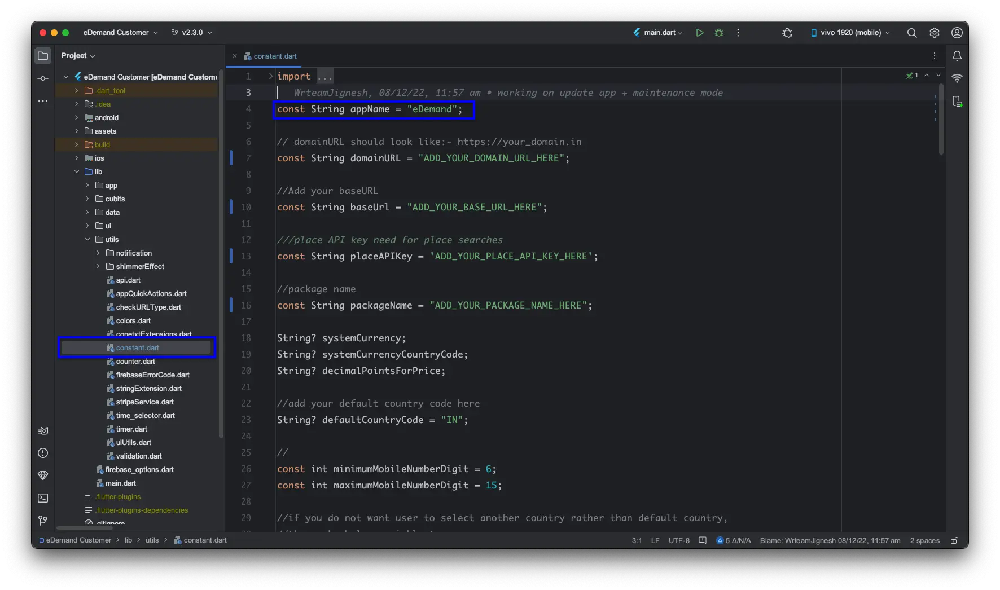

3. Look for any variables storing the app name (e.g., `eDemand`) and update them if necessary.  
4. Save the file.

---

<!-- change appname name -->
#### 🤖 Step 2: Change the App Label in Android  

To modify the app label for **Android**, follow these steps:  

1. Open **Android Studio**.  
2. Navigate to your **Flutter project folder**.  
3. Locate and open the following path:  **android/app/src/main/AndroidManifest.xml**


4. Inside `AndroidManifest.xml`, find the following line:  

```xml
<application
    android:label="eDemand"
    ... > 
```

    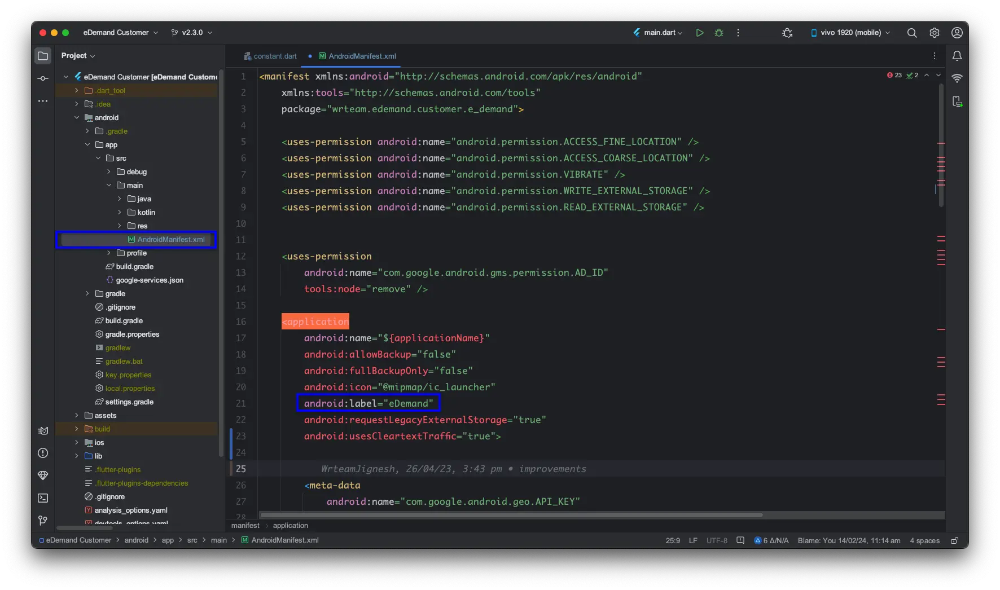

5. Replace "eDemand" with your desired app name.

6. Save the changes.

7. Rebuild the Android app by running the following commands in the terminal:

#### 🍏 Step 3: Change the App Label in iOS

To modify the app label for **iOS**, follow these steps:

1. Navigate to your Flutter project folder.
2. Open the following file: **ios/Runner/Info.plist**
3. Find the following entries in **Info.plist**:

```xml
<key>CFBundleDisplayName</key>
<string>eDemand</string>
<key>CFBundleName</key>
<string>eDemand</string>
```

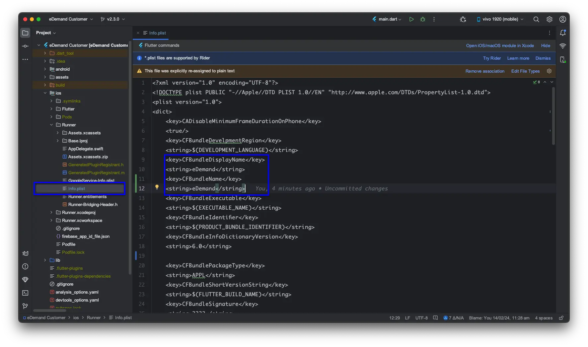

4. Replace **"eDemand"** with your desired app name.
5. Save the changes.
6. **Rebuild the iOS** app by running the following commands:

    ```bash
    flutter clean
    flutter pub get
    flutter build ios
    ```


<!-- chane app version -->

## 📱 How to Change App Version

Updating the app version in Flutter is an essential step before releasing your app. Follow these simple steps to modify the version for both **Android** and **iOS**.

---

### 🛠 Updating App Version in Flutter

#### 📌 Step 1: Modify `pubspec.yaml`

  1. Open the file named **`pubspec.yaml`**.  
  2. Locate the `version` field and update it in the following format:

     ```
     version: A.B.C+X
     ```

     -   **A.B.C** → Represents the version name (e.g., `1.0.0`).  
     -   **X** → Represents the version code (e.g., `1`, `2`, `3`, etc.). 

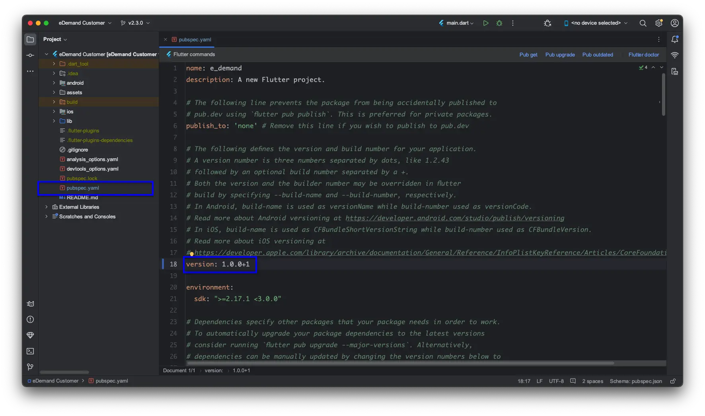

3. After making the changes, **run the following command** to apply them:

```sh
flutter pub get
```

#### 🍏 Updating App Version for iOS
##### 📌 Step 1: Update Version in Xcode

  1. Open your **iOS project** in **Xcode**.  
  2. Select **"Runner"** from the targets.  
  3. Navigate to **"General"**.  
  4. Locate the **Version** and **Build** fields:  

     -   **Version** (e.g., `1.0.0`).  
     -   **Build** (e.g., `1`, `2`, `3`, etc.). 

    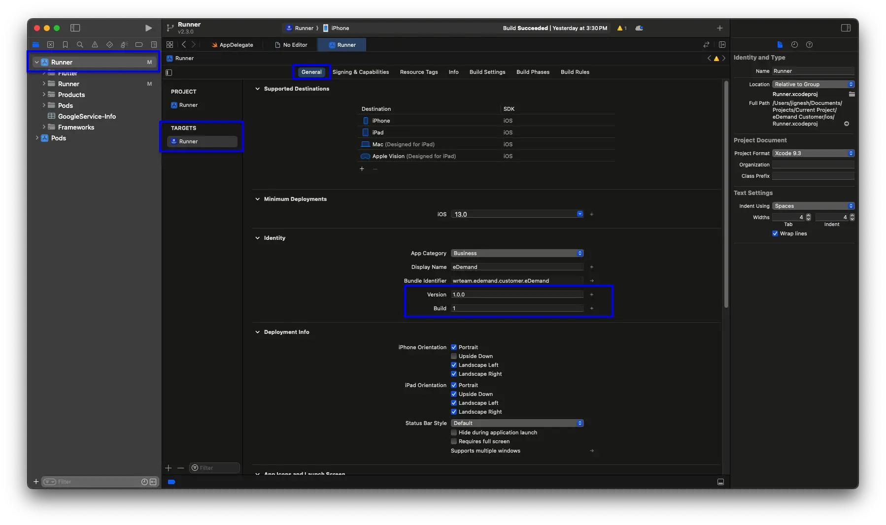

##### 📌 Step 2: Update `FLUTTER_BUILD_NAME` and `FLUTTER_BUILD_NUMBER`

  1. In **Xcode**, select **"Runner"** from the targets.  
  2. Go to **"Build Settings"**.  
  3. Locate and modify the following fields:  

     -   **FLUTTER_BUILD_NAME** → Represents the version name (e.g., `1.0.0`).  
     -   **FLUTTER_BUILD_NUMBER** → Represents the version code (e.g., `1`, `2`, `3`, etc.).  

 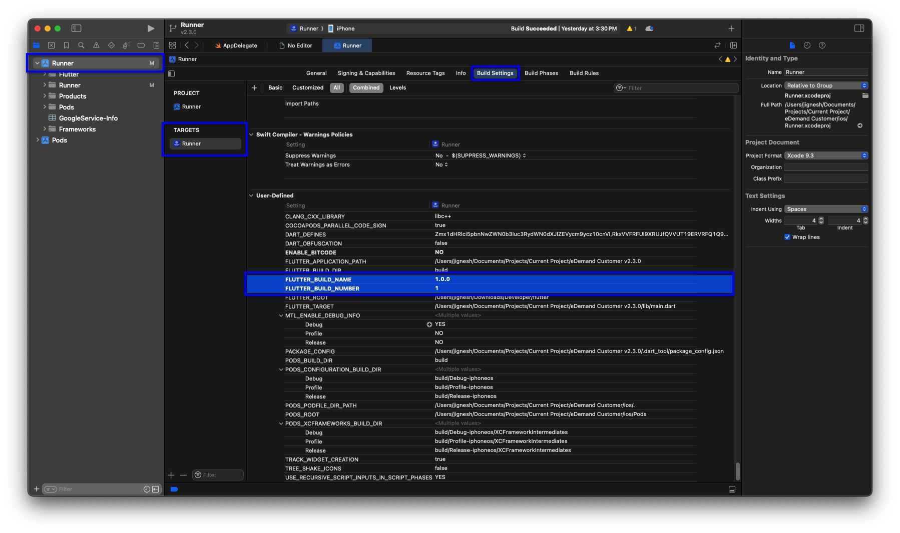

✅ **You're all set!** Now, your app version is updated for both Android and iOS. 🚀  

<!-- How to Change App Logo -->


## 🖼️ How to Change App Icon

Updating your app's logo is crucial for branding and a professional look. Follow these steps to set the app icon for **Android** and **iOS**.

---

### 🤖 Updating App Icon for Android

  1. Navigate to the following directory in your Flutter project:  

     ```
     android > app > src > main > res > mipmap
     ```

  2. Place your **logo** inside the `mipmap` folder.  
  3. Ensure that the icon **fits different screen sizes** for various devices.  

   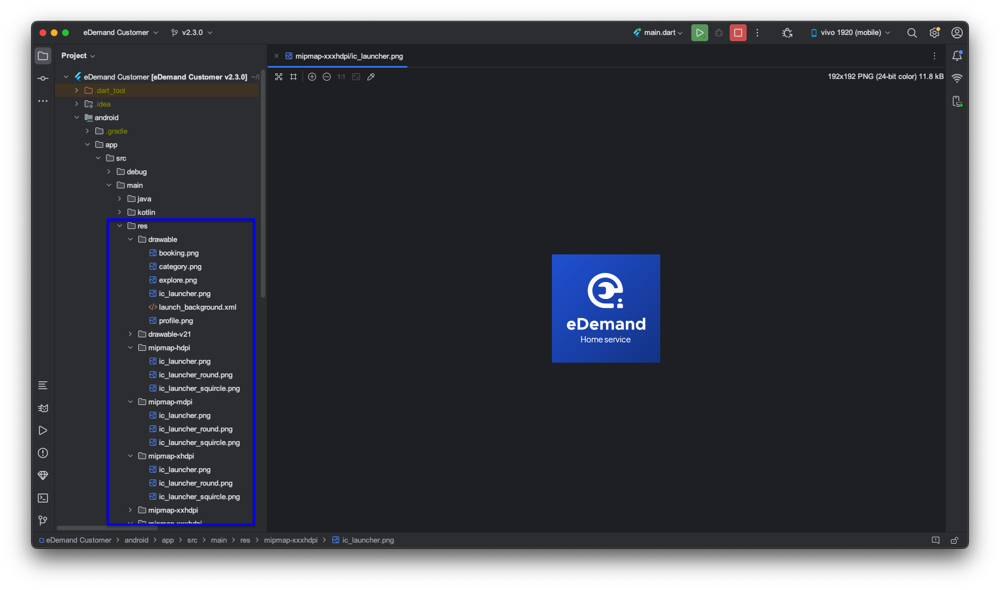


---

### 🍏 Updating App Icon for iOS

  1. Navigate to the following directory in your Flutter project:  

     ```
     ios > Runner > Assets.xcassets > AppIcon.appiconset
     ```

  2. Replace the existing icons with your **app logo**.  
  3. Make sure to include the **logo in multiple sizes** to meet iOS requirements. 
     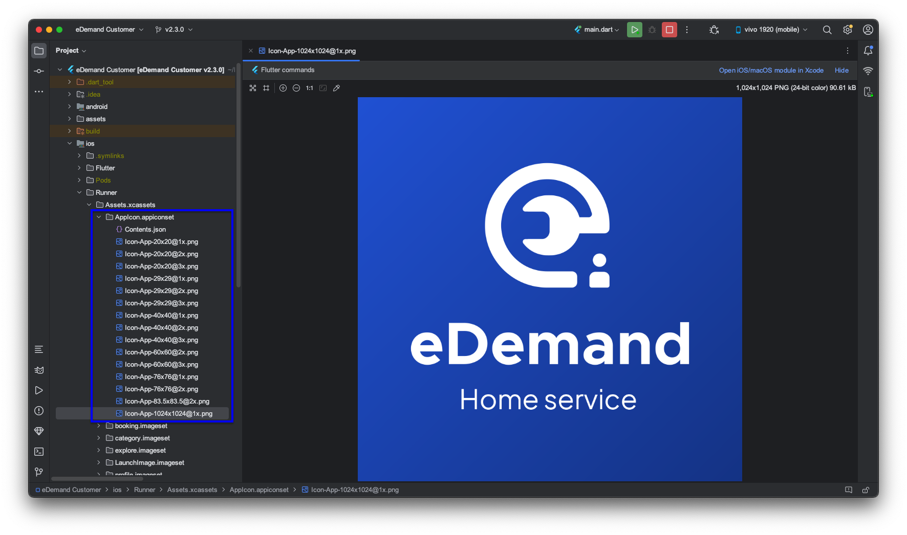


✅ **Your new app icon is now set!** 🚀  

---

<!-- Change App Color -->

## 🎨 How to Change App Color  

Customizing your app's colors enhances branding and improves the user experience. Follow these steps to update your app's theme colors in Flutter.  

---

### 🌈 Updating App Colors in Flutter  

  1. Navigate to the following directory in your Flutter project:  

     ```
     lib > utils > colors.dart
     ```

  2. Open the **`colors.dart`** file.  
  3. Add or modify your color codes using **hexadecimal values**.  
  4. In Flutter, colors follow this format:  

     ```dart
     Color myPrimaryColor = Color(0xff123456); // Replace with your hex code
     ```

     -   `0xff` → **Mandatory prefix** for hexadecimal color codes.  
     -   `123456` → Replace with your desired **hex color code**.  

  5. Update colors for **primary, secondary, accent, and subheading** elements.  
  6. Apply changes to both **light and dark themes** for a consistent UI.  

    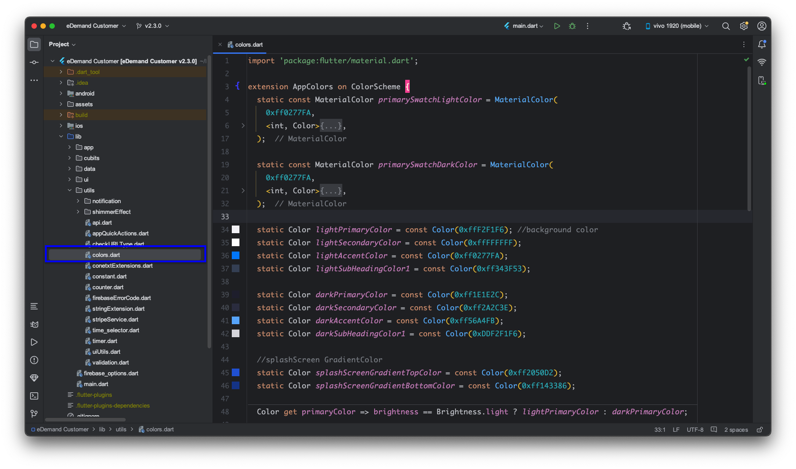


✅ **Your app's colors are now updated!** 🎉  

---

<!-- How to change package name -->

## 🔄 How to Change Package Name in Flutter  

Changing the package name in Flutter is crucial when rebranding your app or preparing for release. Follow these steps carefully to update your package name correctly.  

---

### 🛠 Changing Package Name  

#### 🔍 Step 1: Search and Replace Existing Package Name  

  1. Press **`Ctrl + Shift + F`** (Find in Files) in your IDE.  
  2. Enter your **existing package name** in the search bar.  
  3. Replace all occurrences with your **new package name**.  

  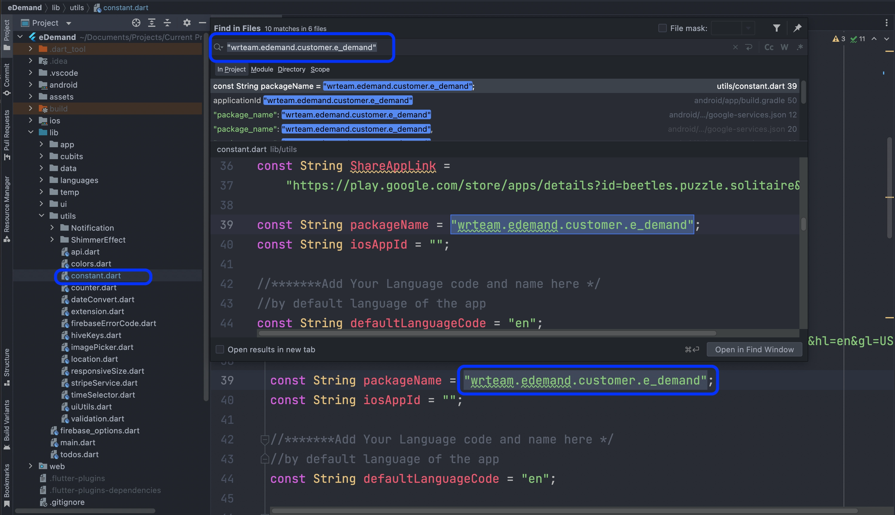

  4. If any result is missed, you may need to **manually replace it** in the following files:  

     -   `android/app/src/debug/AndroidManifest.xml`  

     
  
     -   `android/app/src/main/kotlin/wrteam/edemand/customer/e_demand/MainActivity.kt` 

     
   

---

#### 📂 Step 2: Update Folder Structure  

  -   Navigate to:  

      ```
      android/app/src/main/kotlin/
      ```

  -   Rename the folders **to match your new package name**.  

  -   Example:  
      -   If your package name is **`eDemand.multivendor.customer`**, the folder structure should be:  

          ```
          eDemand/multivendor/customer/
          ```

      -   If your new package name is **`wrteam.eDemand.customer`**, update it as follows:  

          ```
          wrteam/eDemand/customer/
          ```
:::note
  -   📌  Sometimes you may face issues due to incorrect folder renaming. Double-check the structure!  
:::

---

### ❓ Common Questions  

#### 🔹 **Q1: What if my package name is `eDemand.wrteam.multivendor.customer`?**  

✅ **Answer:**  
-   You need to create **4 folders** inside the `kotlin` directory as per your package name:  

    ```
    eDemand/wrteam/multivendor/customer/
    ```

---

### 📜 Files That Need to Be Updated  

Make sure to update the package name in these files:  

  -   `android/app/src/main/AndroidManifest.xml` 

  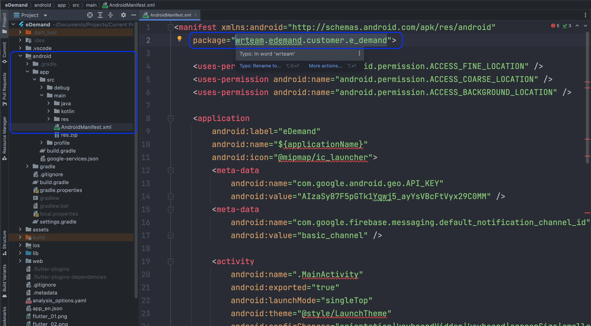
  
  -   `android/app/src/profile/AndroidManifest.xml`  

  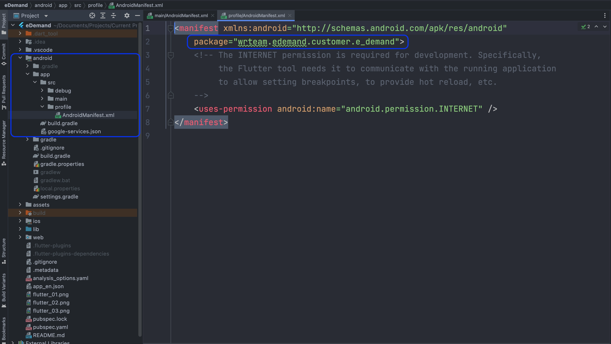
  
  -   `android/app/build.gradle`  

  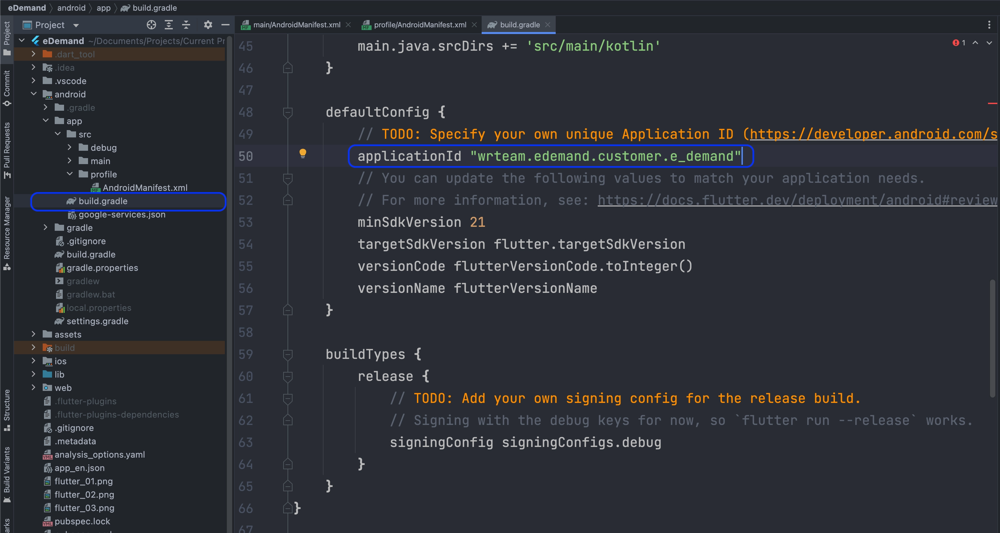
  

✅ **Your package name has now been successfully updated!** 🚀  

---

<!-- How to Change Images in app -->

## 🖼️ How to Change Images in the App  

Updating images in your Flutter app is simple. Follow these steps to replace existing images with new ones.  

---

#### 📂 Step 1: Locate the Images Folder  

  1. Navigate to the following directory in your project:  

     ```
     assets/images/
     ```

  2. Find the image file you want to replace.  
  
  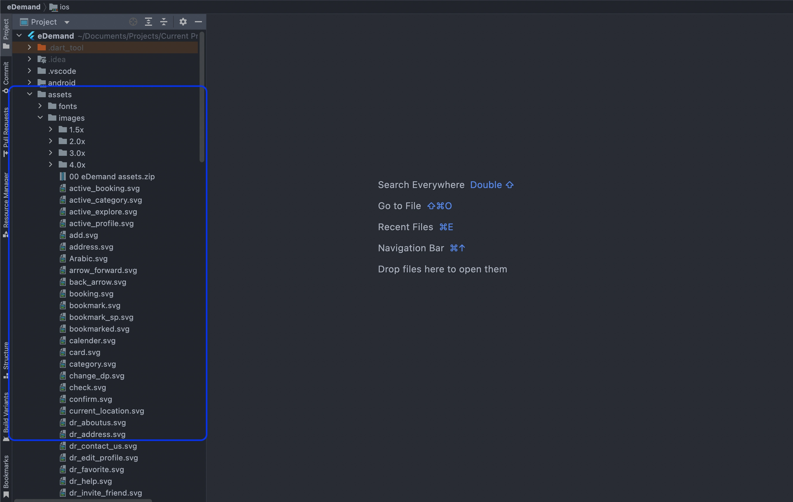

  
---

#### 🔄 Step 2: Replace the Image  

  1. **Use the same filename** as the existing image to avoid updating multiple references.  
  2. Ensure that the **new image has the correct format** (e.g., `.png`, `.jpg`, `.svg`).  
  3. If you add a **new image with a different name**, update the references in your code accordingly.  

---

#### ⚡ Step 3: Apply Changes  

  1. Run the following command to refresh the assets:  

     ```sh
     flutter pub get
     ```

  2. Restart the app to see the updated images.  


✅ **Your images are now successfully updated!** 🎉 

---
<!-- How to Change language String value -->

## 🌍 How to Change Language String Values  

Customizing language strings in your Flutter app allows you to modify text as per your requirements. Follow these steps to update the language strings.  

---

#### 📂 Step 1: Locate the Language Files  

  1. Navigate to the following directory in your project:  

     ```
     assets/languages/
     ```

     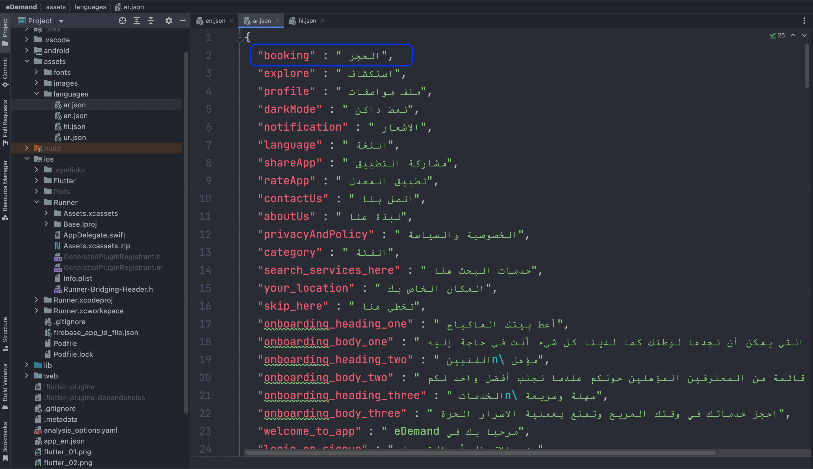

  2. Open the file corresponding to your **language code** (e.g., `en.json`, `fr.json`, `es.json`).  

   
---

#### ✏️ Step 2: Modify String Values  

  -   Find the **string key** you want to update.  
  -   Change its **value** while keeping the key unchanged.  

  **Example (`en.json`):**  

  ```json
  {
    "welcome_message": "Hello, Welcome!",
    "logout": "Sign Out"
  }
  ```


<!-- remove Language -->

## 🌍 How to Add/Remove a Language  

Managing languages in your Flutter app allows users to switch between different languages seamlessly. Follow these steps to **add** or **remove** a language properly.  

---

### ➕ How to Add a New Language  

#### 📂 Step 1: Create a New Language File  

  1. Navigate to the following directory:  

     ```
     assets/languages/
     ```

  2. Copy an **existing JSON file** (e.g., `en.json`).  
  3. Paste it into the **same folder** and rename it using the new **language code** (e.g., `fr.json` for French).  

  

---

#### ✏️ Step 2: Update the Language Strings  

  1. Open the newly created JSON file (`fr.json`).  
  2. Translate all the values into the new language.  
  3. **Important:** Ensure all keys remain the same, only update the values.  

  **Example (`fr.json` for French):**  

  ```json
  {
    "welcome_message": "Bonjour, Bienvenue!",
    "logout": "Déconnexion"
  }
  ```
#### 🔗 Step 3: Register the New Language
1. Locate the language list in your project.

2. Add the language name, code, and flag image in the following list:

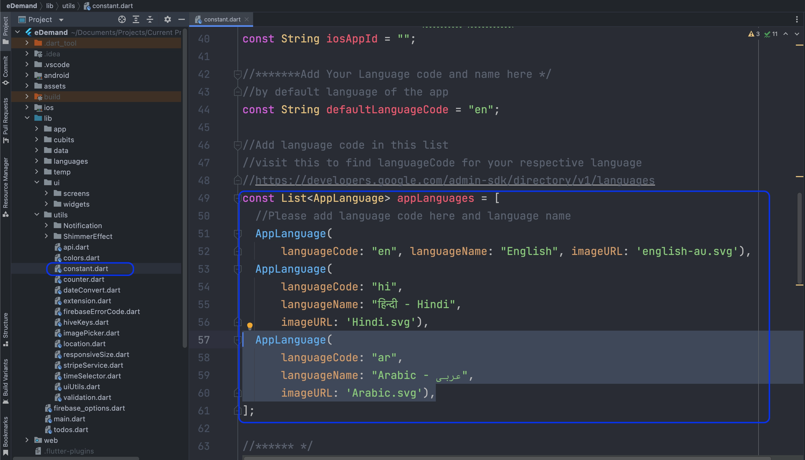

### ❌ How to Remove a Language
1. Remove the JSON file from **assets/languages/**.
2. Delete the language entry from the language list.


✅ **✅ Your language settings are now updated!** 🌎🚀 

---


## 🌍 How to Change the Default Language of the App  

By default, the app loads a specific language when it starts. You can change this default language by following these steps.  

---

#### 📝 Step 1: Locate the Default Language Setting  

  1. Navigate to the following file in your project:  

     ```
     lib/utils/constant.dart
     ```

  2. Open the file and find the variable:  

     ```dart
     const String defaultLanguageCode = "en";
     ```

---

#### 🔄 Step 2: Change the Default Language  

  - Replace `"en"` with your desired **language code** (e.g., `"fr"` for French, `"es"` for Spanish).  

  **Example:** Changing the default language to French:  

  ```dart
  const String defaultLanguageCode = "en";
  ```
  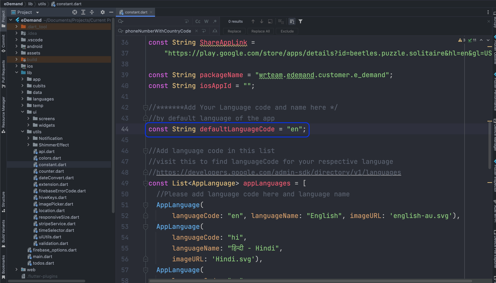
  

✅ **Your default language is now updated!** 🌎🚀

---

<!-- How to Change App Font  -->


 ## 🔤 How to Change App Font  

Customizing the font in your Flutter app enhances the user experience. Follow these steps to change the app font.  

---

#### 📂 Step 1: Add Your Font File  

  1. Navigate to the following directory in your project:  

     ```
     assets/fonts/
     ```

  2. Copy and paste your new font files (`.ttf` or `.otf`) into this folder.  

---

#### 📝 Step 2: Update `pubspec.yaml`  

  1. Open the `pubspec.yaml` file.  
  2. Locate the **fonts section** and update it as follows:  

     ```yaml
     flutter:
       fonts:
         - family: CustomFont
           fonts:
             - asset: assets/fonts/MyCustomFont.ttf
     ```

  - Replace **`CustomFont`** with your desired font family name.  
  - Replace **`MyCustomFont.ttf`** with the actual font file name.  

---

#### 🎨 Step 3: Apply the Font in Your Theme  

  1. Open your **theme configuration file** (e.g., `theme.dart`).  
  2. Set the **new font family** in `TextTheme`:  

     ```dart
     ThemeData(
       fontFamily: 'CustomFont',
     );
     ```

---

#### ⚡ Step 4: Apply Changes  

  1. Save the changes.  
  2. Run the following command to apply the changes:  

     ```sh
     flutter pub get
     ```

  3. Restart the app to see the new font in action.  
  
  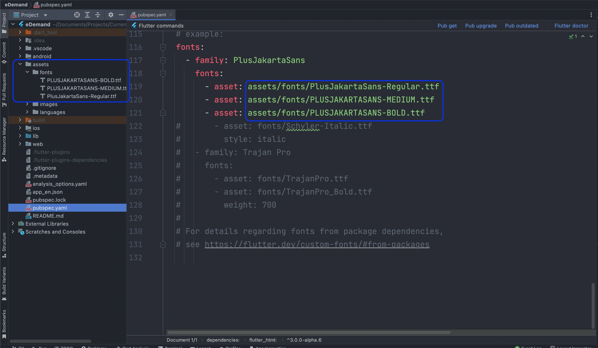

✅ **Your app now has a new font!** 🎨🚀 

---

<!-- How to Change Server URL   -->

## 🌐 How to Change Server URL  

If you need to update the server URL in your Flutter app, follow these steps to ensure proper connectivity.  

---

#### 🔑 Step 1: Get the API Base URL  

  1. Open your **Admin Panel**.  
  2. Navigate to:  

     ```
     Settings -> API Key Settings
     ```

  3. Copy the API link for your app.  

  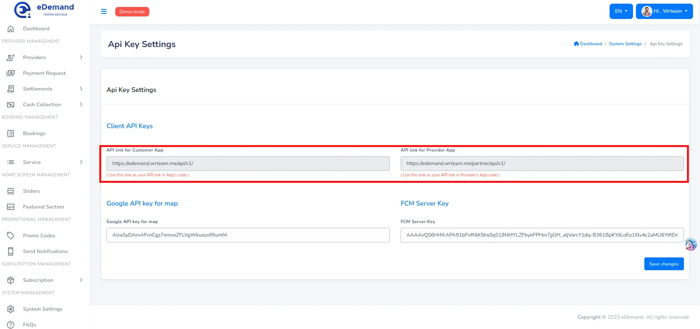

:::note
   Ensure you copy the **correct base URL**.  
:::
---

#### 📝 Step 2: Update the URL in Your App  

  1. Navigate to the following file:  

     ```
     lib/helper/constant.dart
     ```

  2. Locate the `baseURL` variable and update it with the new API URL.  

     ```dart
     const String baseURL = "https://your-server.com/api/";
     ```
    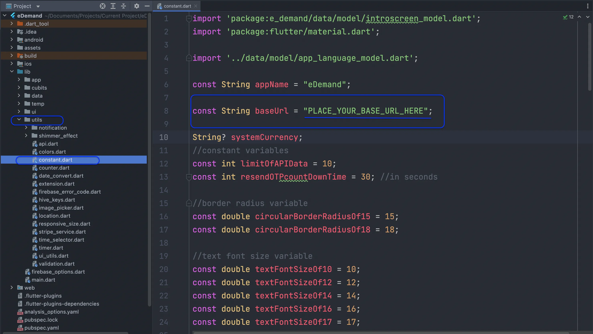
:::note
  **⚠️ Don't forget:** Add a **slash (`/`) after `api`** to avoid errors.  
:::
---

#### ⚡ Step 3: Apply Changes  

  1. Save the file.  
  2. Restart the app to apply the new settings.  

---

✅ **Your server URL is now updated!** 🚀🌍  


