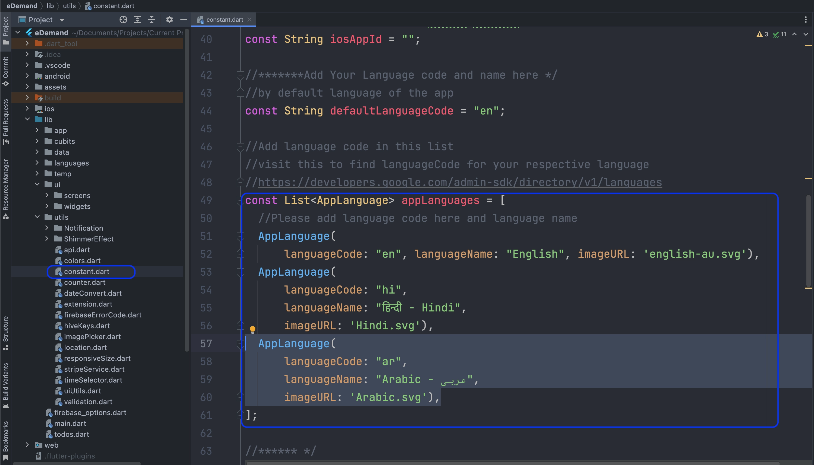

# How to Add/Remove a Language

Managing languages in your Flutter app allows users to switch between different languages seamlessly. Follow these steps to **add** or **remove** a language properly.  

---

## ➕ How to Add a New Language  

### 📂 Step 1: Create a New Language File  

  1. Navigate to the following directory:  

     ```
     assets/languages/
     ```

  2. Copy an **existing JSON file** (e.g., `en.json`).  
  3. Paste it into the **same folder** and rename it using the new **language code** (e.g., `fr.json` for French).  

  

---

### ✏️ Step 2: Update the Language Strings  

  1. Open the newly created JSON file (`fr.json`).  
  2. Translate all the values into the new language.  
  3. **Important:** Ensure all keys remain the same, only update the values.  

  **Example (`fr.json` for French):**  

  ```json
  {
    "welcome_message": "Bonjour, Bienvenue!",
    "logout": "Déconnexion"
  }
  ```
### 🔗 Step 3: Register the New Language
1. Locate the language list in your project.

2. Add the language name, code, and flag image in the following list:


## ❌ How to Remove a Language
1. Remove the JSON file from **assets/languages/**.
2. Delete the language entry from the language list.




✅ **Your language settings are now updated!** 🌎🚀 