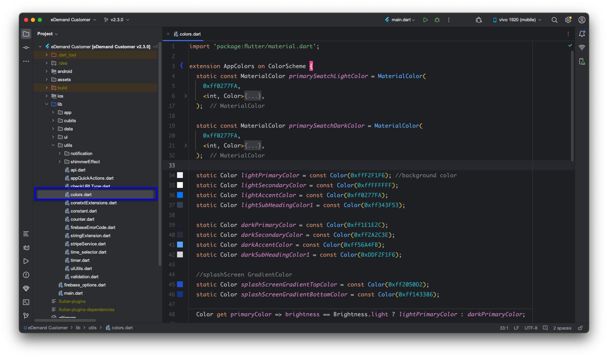

# How to Change App Color

Customizing your app's colors enhances branding and improves the user experience. Steps differ by app.

---

## 🎨 Customer App — Theme Setting (Admin Panel)

Customer app color change via **Admin Panel → Settings → Theme Setting**. No code change need.

  1. Login Admin Panel.
  2. Go to **Settings → Theme Setting**.
  3. Update color values as need.
  4. Save. Customer app pick new theme color.

  

---

## 🌈 Provider App — Update Colors in Flutter

Provider app color change use current Flutter method (edit code directly).

  1. Navigate to the following directory in your Flutter project:  

     ```
     lib > utils > colors.dart
     ```

  2. Open the **`colors.dart`** file.  
  3. Add or modify your color codes using **hexadecimal values**.  
  4. In Flutter, colors follow this format:  

     ```dart
     Color myPrimaryColor = Color(0xff123456); // Replace with your hex code
     ```

     -   `0xff` → **Mandatory prefix** for hexadecimal color codes.  
     -   `123456` → Replace with your desired **hex color code**.  

  5. Update colors for **primary, secondary, accent, and subheading** elements.  
  6. Apply changes to both **light and dark themes** for a consistent UI.  

    


✅ **Your app's colors are now updated!** 🎉 