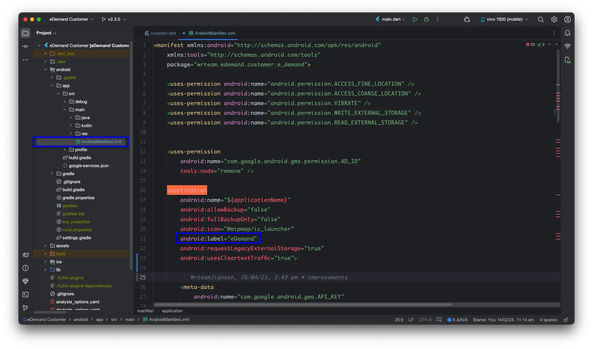
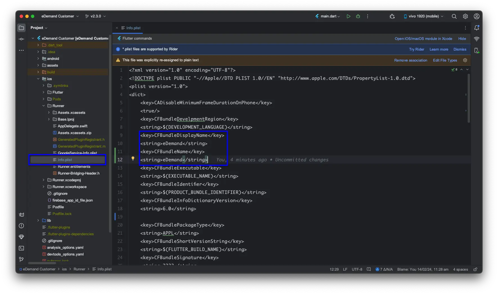

# How to Change App Name

## 📌 App Label Customization Guide (Android & iOS)

This guide provides step-by-step instructions on how to change the **app label** displayed below the app icon for both **Android** and **iOS** applications.

---

### 🛠 Step 1: Update Constants in `constant.dart`
Before modifying platform-specific files, check if the app label is defined in your Flutter project's constants file.  

1. Open your Flutter project.  
2. Navigate to the following file:  **lib/utils/constant.dart**

    

3. Look for any variables storing the app name (e.g., `eDemand`) and update them if necessary.  
4. Save the file.

---

### 🤖 Step 2: Change the App Label in Android  

To modify the app label for **Android**, follow these steps:  

1. Open **Android Studio**.  
2. Navigate to your **Flutter project folder**.  
3. Locate and open the following path:  **android/app/src/main/AndroidManifest.xml**


4. Inside `AndroidManifest.xml`, find the following line:  

```xml
<application
    android:label="eDemand"
    ... > 
```

    

5. Replace "eDemand" with your desired app name.

6. Save the changes.

7. Rebuild the Android app by running the following commands in the terminal:

### 🍏 Step 3: Change the App Label in iOS

To modify the app label for **iOS**, follow these steps:

1. Navigate to your Flutter project folder.
2. Open the following file: **ios/Runner/Info.plist**
3. Find the following entries in **Info.plist**:

```xml
<key>CFBundleDisplayName</key>
<string>eDemand</string>
<key>CFBundleName</key>
<string>eDemand</string>
```



4. Replace **"eDemand"** with your desired app name.
5. Save the changes.
6. **Rebuild the iOS** app by running the following commands:

    ```bash
    flutter clean
    flutter pub get
    flutter build ios
    ``` 