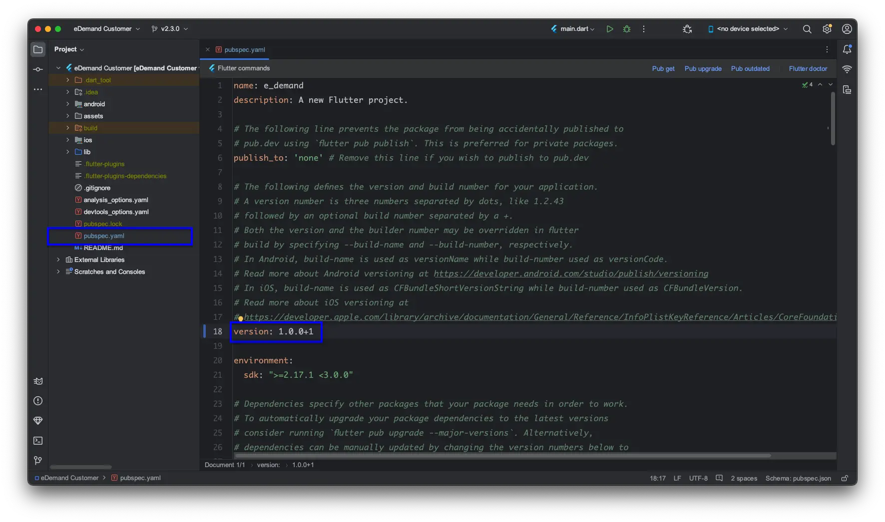
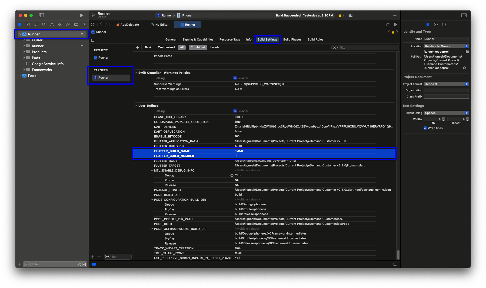

# How to Change App Version

Updating the app version in Flutter is an essential step before releasing your app. Follow these simple steps to modify the version for both **Android** and **iOS**.

---

## 🛠 Updating App Version in Flutter

### 📌 Step 1: Modify `pubspec.yaml`

  1. Open the file named **`pubspec.yaml`**.  
  2. Locate the `version` field and update it in the following format:

     ```
     version: A.B.C+X
     ```

     -   **A.B.C** → Represents the version name (e.g., `1.0.0`).  
     -   **X** → Represents the version code (e.g., `1`, `2`, `3`, etc.). 



3. After making the changes, **run the following command** to apply them:

```sh
flutter pub get
```

## 🍏 Updating App Version for iOS
### 📌 Step 1: Update Version in Xcode

  1. Open your **iOS project** in **Xcode**.  
  2. Select **"Runner"** from the targets.  
  3. Navigate to **"General"**.  
  4. Locate the **Version** and **Build** fields:  

     -   **Version** (e.g., `1.0.0`).  
     -   **Build** (e.g., `1`, `2`, `3`, etc.). 

    

### 📌 Step 2: Update `FLUTTER_BUILD_NAME` and `FLUTTER_BUILD_NUMBER`

  1. In **Xcode**, select **"Runner"** from the targets.  
  2. Go to **"Build Settings"**.  
  3. Locate and modify the following fields:  

     -   **FLUTTER_BUILD_NAME** → Represents the version name (e.g., `1.0.0`).  
     -   **FLUTTER_BUILD_NUMBER** → Represents the version code (e.g., `1`, `2`, `3`, etc.).  

 

✅ **You're all set!** Now, your app version is updated for both Android and iOS. 🚀 