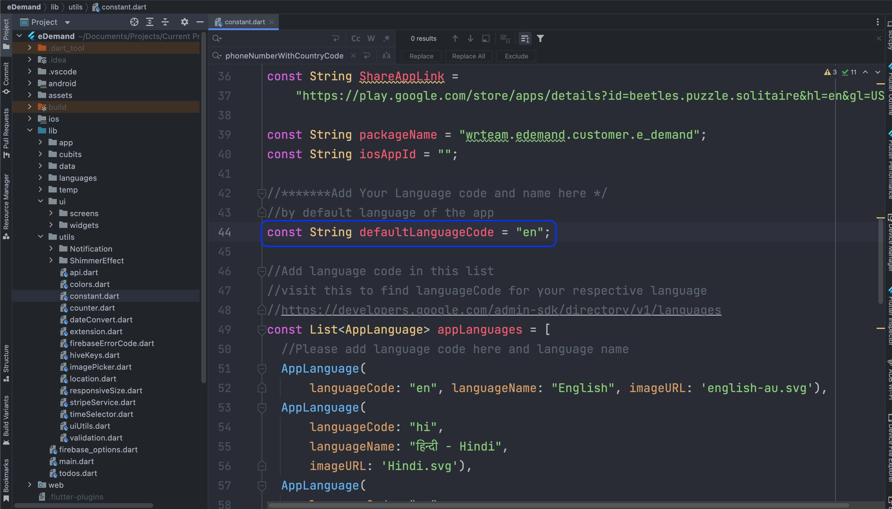

# How to Change the Default Language of the App

By default, the app loads a specific language when it starts. You can change this default language by following these steps.  

---

## 📝 Step 1: Locate the Default Language Setting  

  1. Navigate to the following file in your project:  

     ```
     lib/utils/constant.dart
     ```

  2. Open the file and find the variable:  

     ```dart
     const String defaultLanguageCode = "en";
     ```

---

## 🔄 Step 2: Change the Default Language  

  - Replace `"en"` with your desired **language code** (e.g., `"fr"` for French, `"es"` for Spanish).  

  **Example:** Changing the default language to French:  

  ```dart
  const String defaultLanguageCode = "fr";
  ```
  
  

✅ **Your default language is now updated!** 🌎🚀 