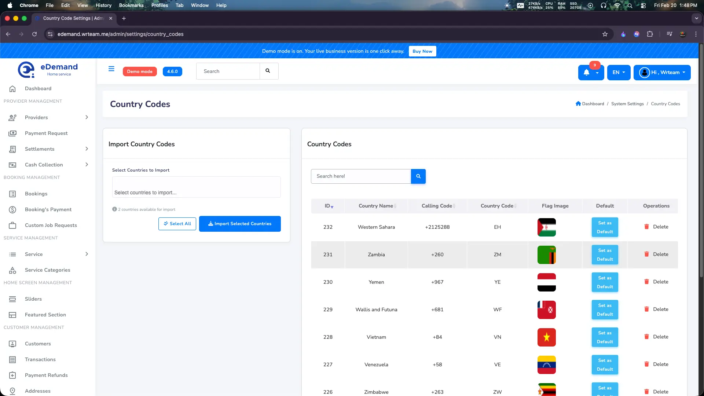

# How to Manage Country Codes

This guide explains how to set and manage the available country codes and the default country code for phone number login in your eDemand application. All country code configurations are completely managed through the admin panel, and there are no app-side code changes required.

## Admin Panel Configuration

You can easily add more country codes and set a default one directly from the admin panel:

1. Log in to your Admin Panel
2. Navigate to **System Settings > Country code**
3. From here, you can import the countries you want to support by clicking on those.
4. You can make any one of the imported countries the default country code.

:::tip
This method allows you to change the default country code and manage supported countries dynamically without modifying any app code.
:::