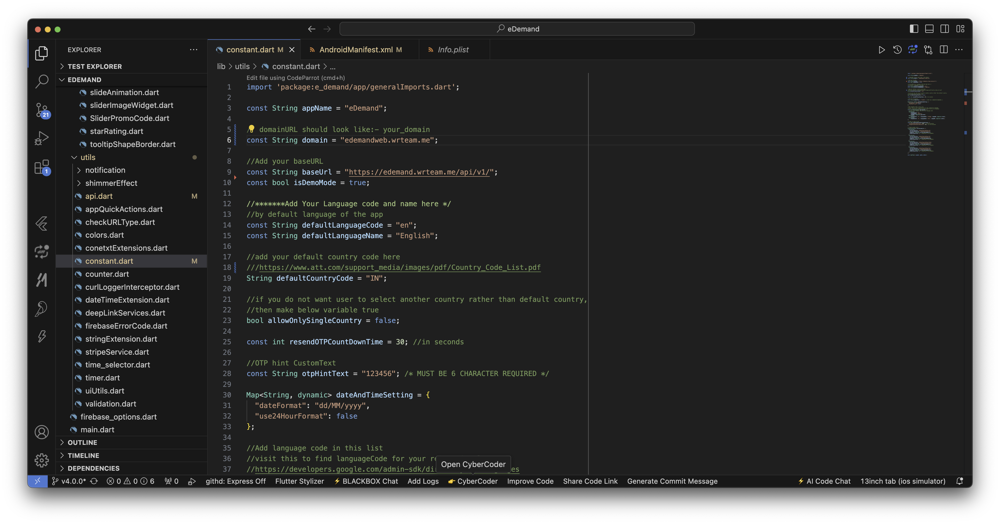
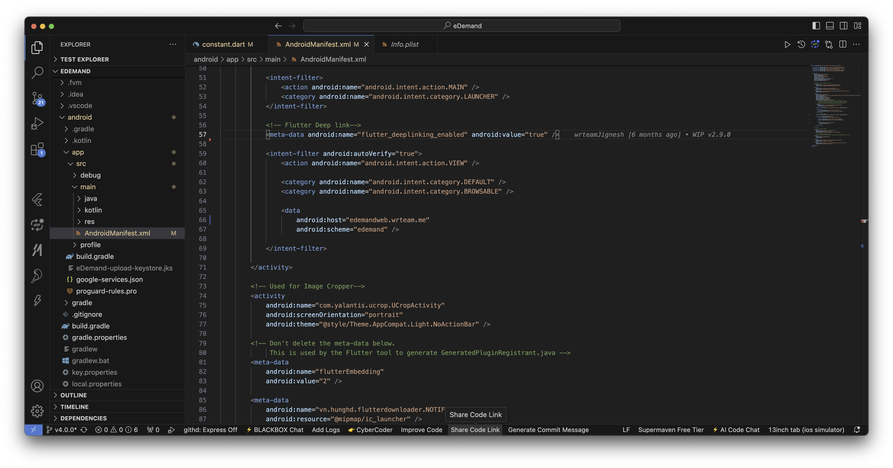
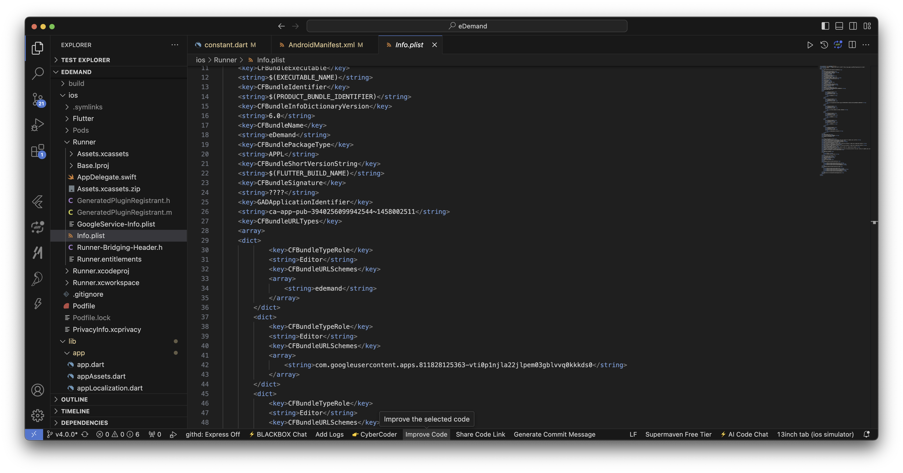
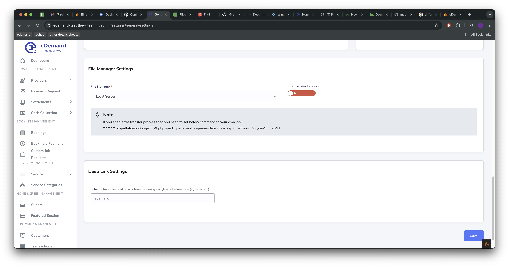
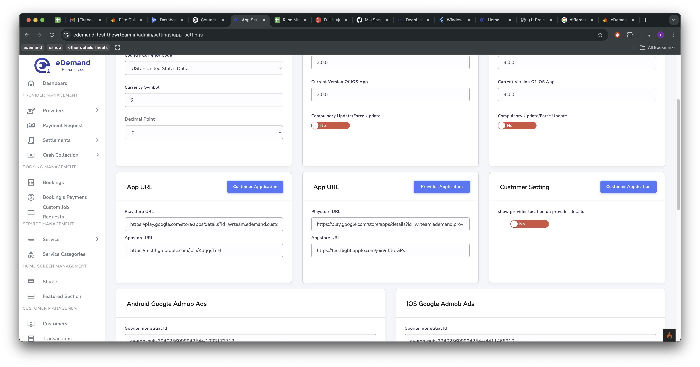

# DeepLink Setup

# 📌 DeepLink Setup 🚀

Setting up deep links ensures seamless navigation between your web, mobile, and panel applications. Follow these steps carefully to configure deep linking in your Flutter project.

---

## 1️⃣ Add Domain 🌐
- Choose the appropriate domain based on your usage:
  - If using a **web domain**, add the web domain. (If you want to use web for redirect)
  - If using a **panel domain**, add the panel domain.
- Update the necessary files:
  - `lib/utils/constant.dart`

    

  - `android/app/src/main/AndroidManifest.xml`

    

- 🔍 **Ensure correctness:** The domain should match across all configurations.

---

## 2️⃣ Configure Deep Link Scheme 🔗
- Modify the required files:
  - `android/app/src/main/AndroidManifest.xml`

    

  - `ios/Runner/Info.plist`

    

  - **Panel Settings:** Navigate to `System Setting > General Setting > Deep Link Settings` to add scheme for deep linking.
  - Save the changes.

    

:::note
    Please add your scheme here using a single word in lowercase (e.g., edemand), 
:::

- 🚀 **Why?** This step ensures that links open correctly in the respective apps.

---

## 3️⃣ Add Play Store & App Store URLs 📲
- Navigate to `System Setting > App Setting > App URL`
- Add the correct Play Store and App Store links for your app.
- Save the changes.
    
- 🔗 **Why?** These links enable users to be redirected correctly when opening the app from external sources.

---

✅ **Final Check:**
- Ensure all URLs and domains match across different configurations.
- Test the deep linking functionality on both **Android** and **iOS**.
- Verify the app opens correctly from web links and external redirects.

🚀 You're all set! Enjoy seamless deep linking in your app. Happy coding! 🎉