# Firebase Setup

To set up Firebase for your project, please follow the step-by-step instructions provided in the guide below:

### 📘 Firebase Setup Guide

 - ***[Click here to view the Firebase Setup Guide](https://www.marketplace.wrteam.in/docs/flutter-common-doc/GeneralSettings/firebase)***

:::note
Please read through the guide carefully to ensure a successful setup.
:::

Please review this carefully and enjoy your work.


<!-- # 🔥 How to Set Up Firebase in Your Flutter App  

:::caution

You must use the **same Firebase project** for the **app, web, and panels** to ensure seamless integration.

<!-- ### 🚀 Already Have a Firebase Project?  
If you have already created a Firebase project, **skip steps 1-5** and start from **Step 6**.   -->


<!-- :::

---

### ⚙️ Step 1: Install Firebase CLI  

Before creating a Firebase app from Flutter, you must install **Firebase CLI**.  

📌 **Follow the official guide to install Firebase CLI:**  
🔗 [Firebase CLI Installation Guide](https://firebase.google.com/docs/cli)  

---

### 🏗️ Step 2: Create a Firebase Project  

1️⃣ Open **Firebase Console** and click **Create a Project**.  

   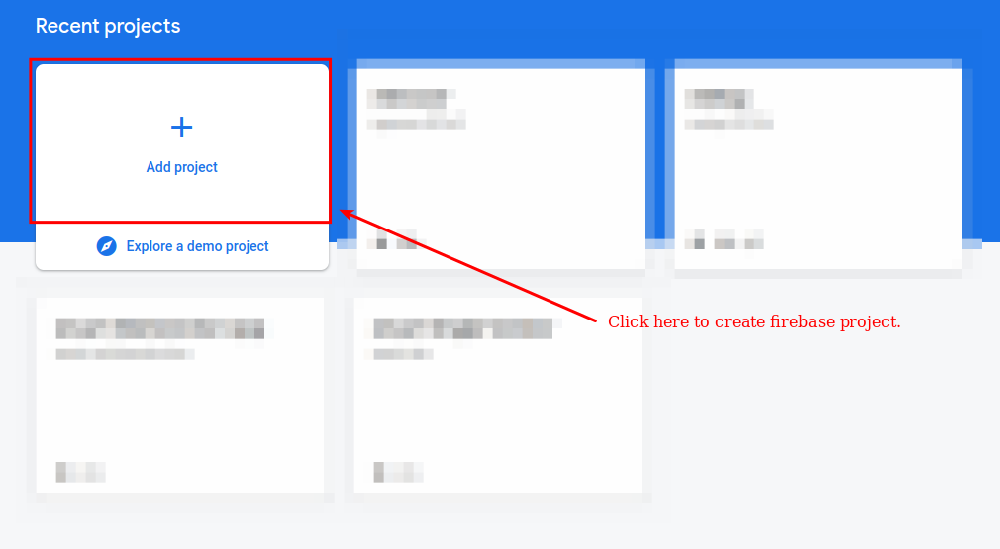 

2️⃣ Enter your **project name** and press **Continue**.    

   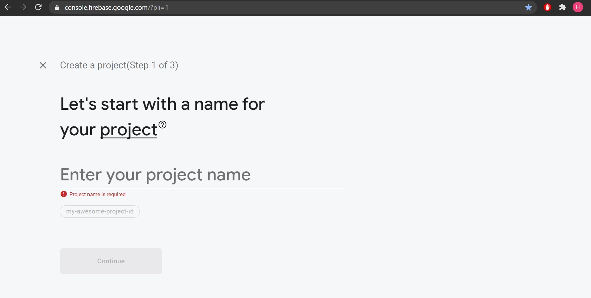    

3️⃣ Press **Continue** on the next screen. 

   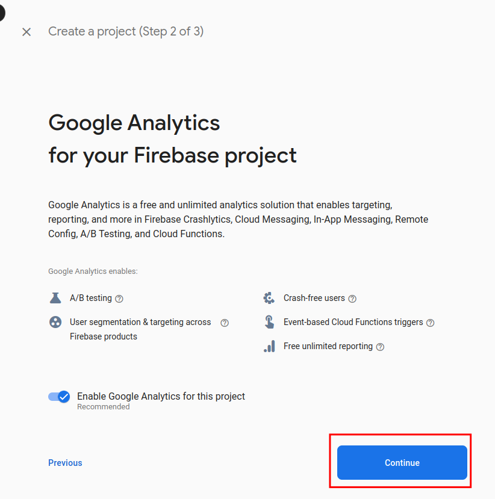    

4️⃣ Click **Create Project** and wait for the setup to complete.  

   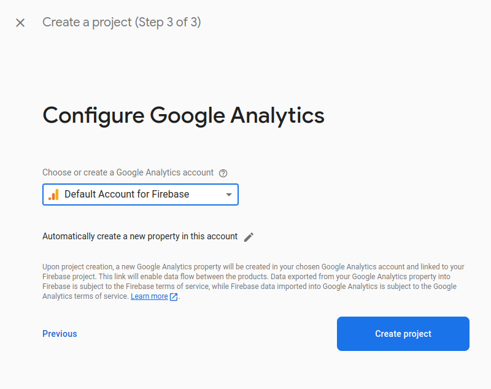 

5️⃣ Once done, press **Continue**.  

   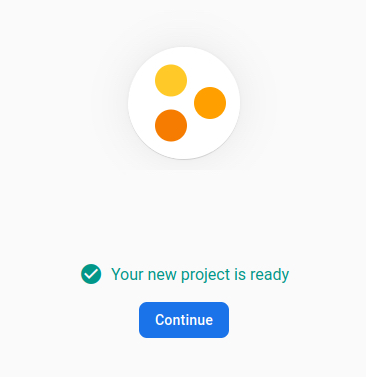

---

### 📱 Step 3: Create a Firebase App for Flutter  

1️⃣ Select **Flutter** as the app type (refer to the image below).  

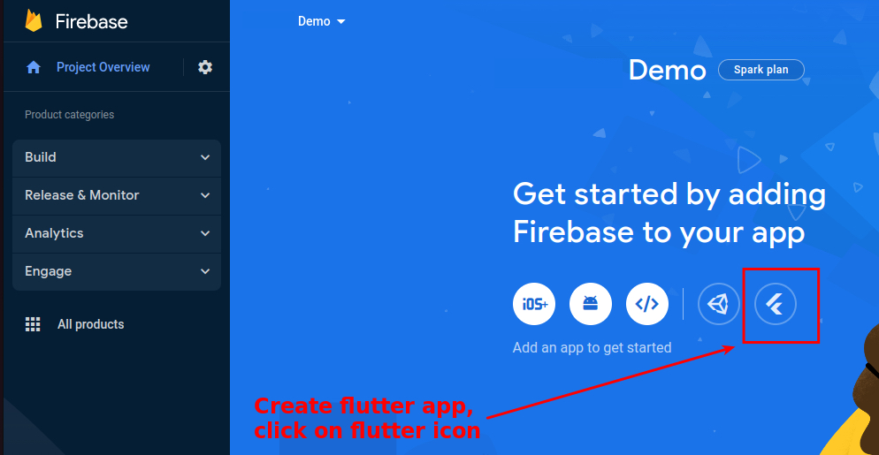

2️⃣ Press **Next** to continue.  

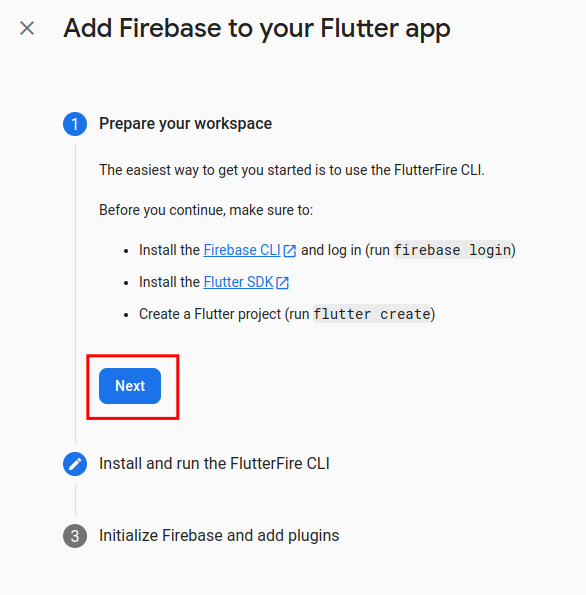

---

### 🖥️ Step 4: Log in to Firebase via Terminal  

1️⃣ Open **Android Studio** terminal.  
2️⃣ Run the following command to log in:  

   ```sh
   firebase login
   ```
   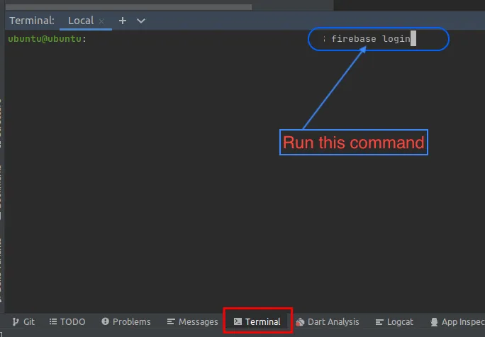       

3️⃣ A browser window will open—log in to your Firebase account.        
4️⃣ When prompted, allow Firebase to collect CLI usage data by entering YES and pressing Enter.


### 🛠️ Step 5: Run Firebase Initialization Commands

1️⃣ In Android Studio Terminal, run the first Firebase setup command (as per the provided image).

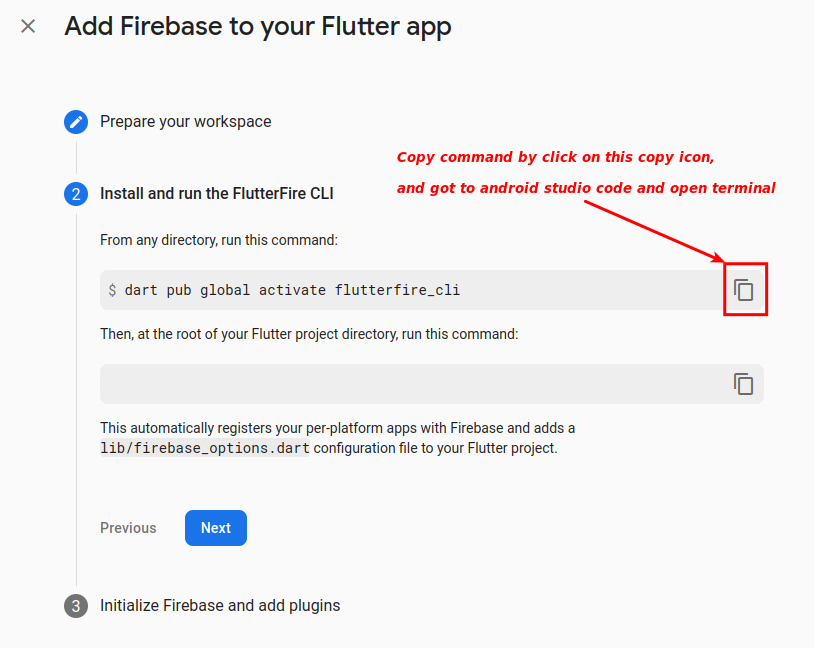

2️⃣ Run the second Firebase setup command in the terminal. 

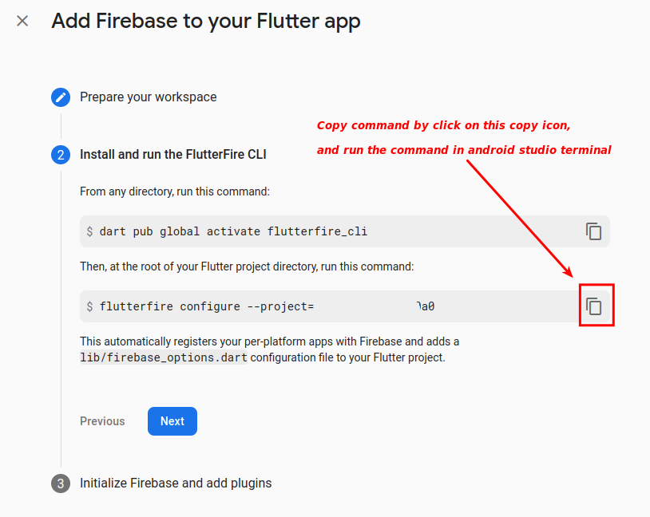

3️⃣ When the terminal asks for confirmation, press Enter.    

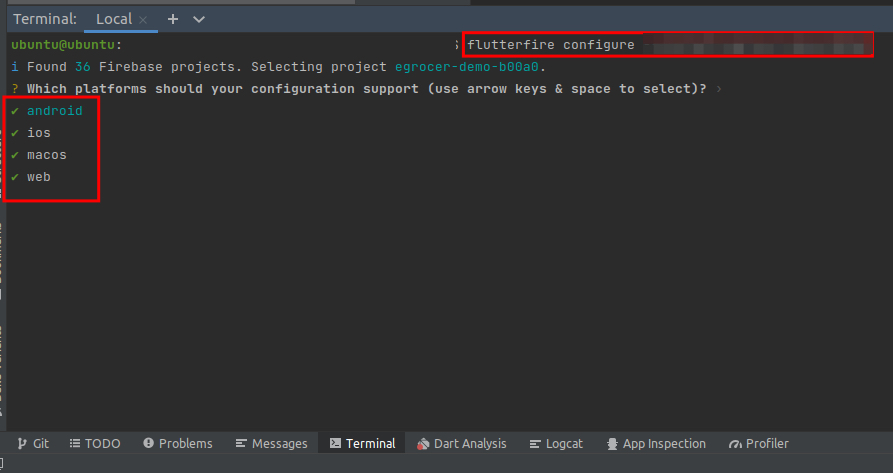

4️⃣ If prompted again, press Y to confirm.

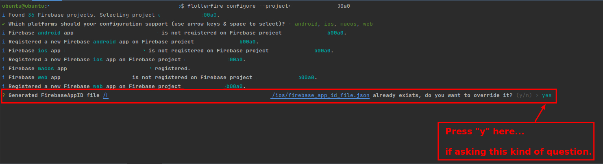


### 🎉 Step 6: Finalizing Firebase Setup

1️⃣ Press Continue when prompted.     

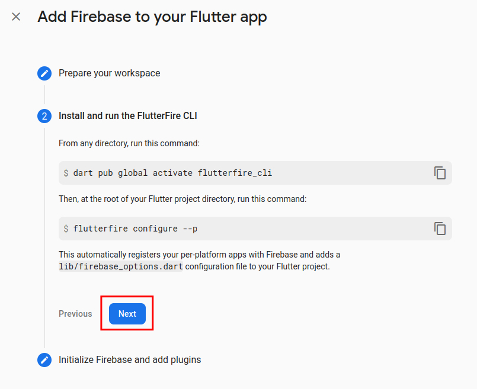

2️⃣ Click Continue to Console.

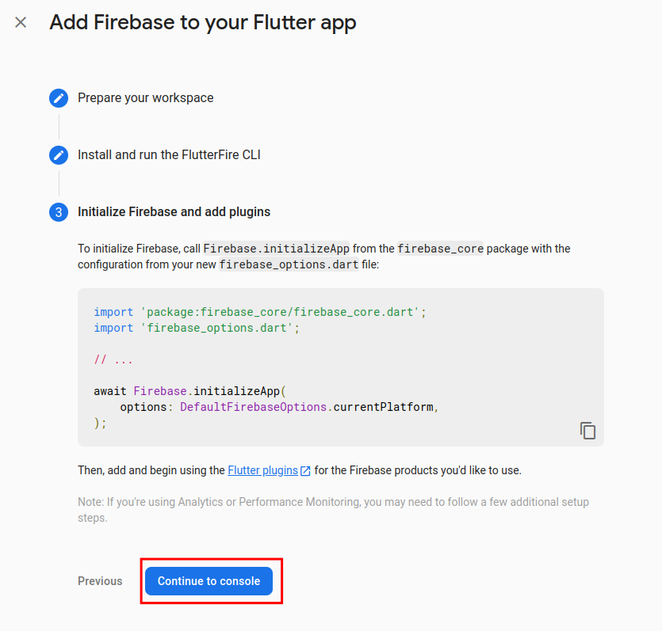


<!-- How to enable Firebase Authentications. -->

<!-- # 🔥 Firebase Authentication 

This document provides step-by-step instructions to enable **Firebase Authentication** in your Flutter app.  

---

## 🔑 **Enable Firebase Authentication**  

1️⃣ **Open Firebase Console**  
   - Go to [Firebase Console](https://console.firebase.google.com/)  
   - Select your project  

2️⃣ **Enable Authentication Methods**  
   - Go to **Authentication** > **Sign-in method**  
   - Click **Add New Provider**  
   - Enable the required sign-in methods (e.g., Apple, Phone, Google)  

   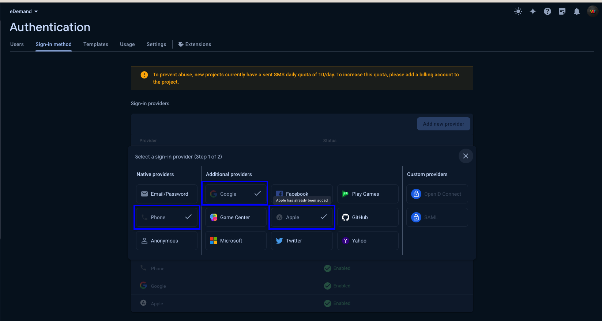

---

## 🔒 **Add SHA1 & SHA256 Keys in Firebase**  

### 🔹 **For Android**  

1️⃣ Open **Android Studio**  
2️⃣ Go to **android** folder in your project  
3️⃣ Right-click on `gradlew` file > **Open in Terminal**  

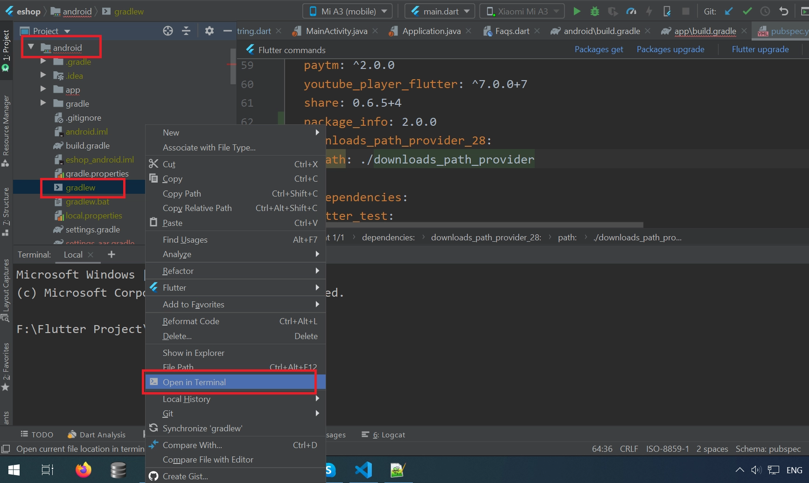

4️⃣ Run the following command:  

   ```sh
   ./gradlew signingReport   # For Mac/Linux
   gradlew signingReport     # For Windows
```

5️⃣ Copy the SHA1 and SHA256 keys from the output     

   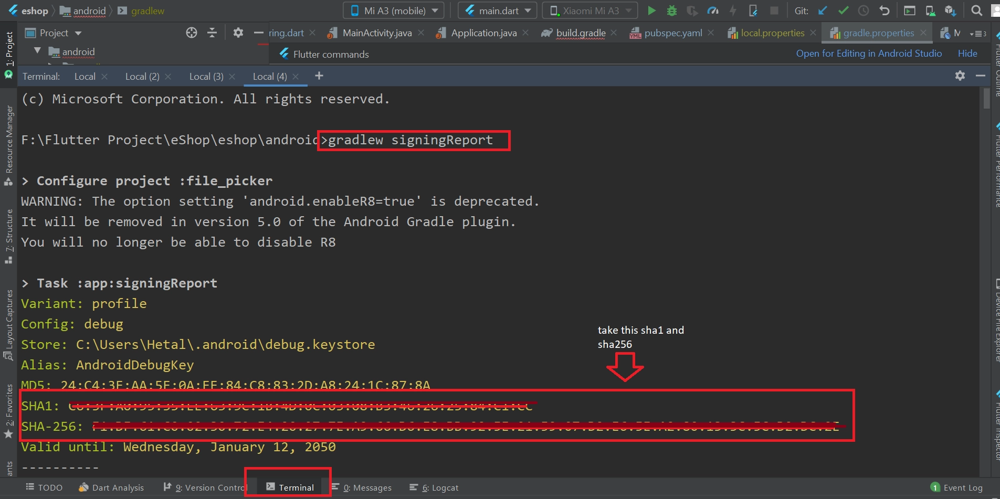

6️⃣ Open Firebase Console     
7️⃣ Go to Project Settings > General > Android App    
8️⃣ Add the copied SHA1 and SHA256 keys   

   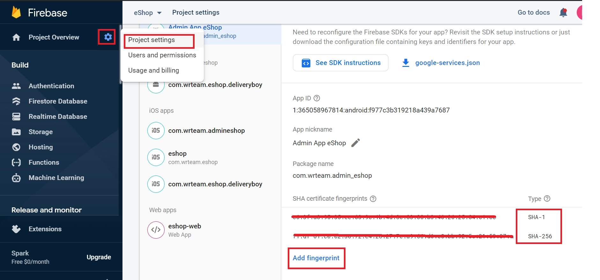

:::note
   For Release Build (After App Release)
:::

  -   You need to add the release SHA key to Firebase
  -   Get the release SHA key using Play Console or by running:

  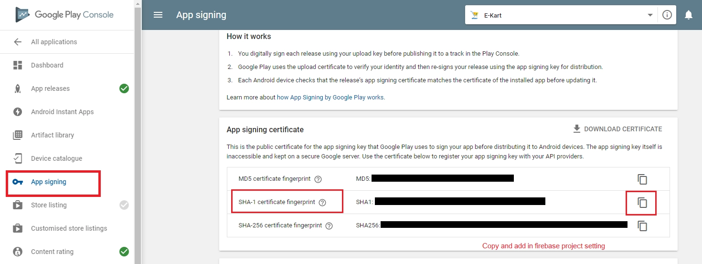

    ```sh
    keytool -list -v -keystore "D:\keystore\eDemand.jks" -alias eDemand
    ```

    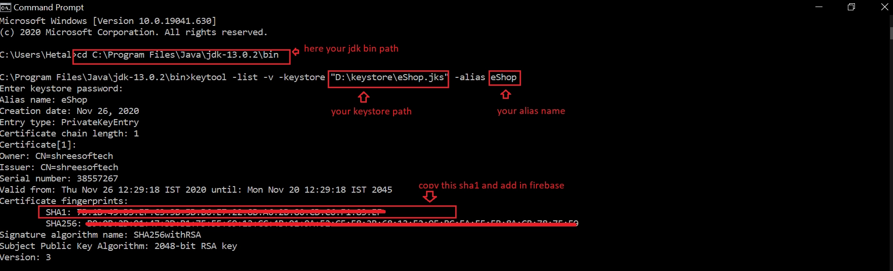

  -    Enter the keystore password when prompted

  -    Copy and paste the SHA key into Firebase Console


### 🍎 For iOS Authentication Setup

1️⃣ Open Xcode    
2️⃣ Go to Signing & Capabilities tab      
3️⃣ Add Sign In With Apple capability     
4️⃣ Select a Team in the Code Signing section   

   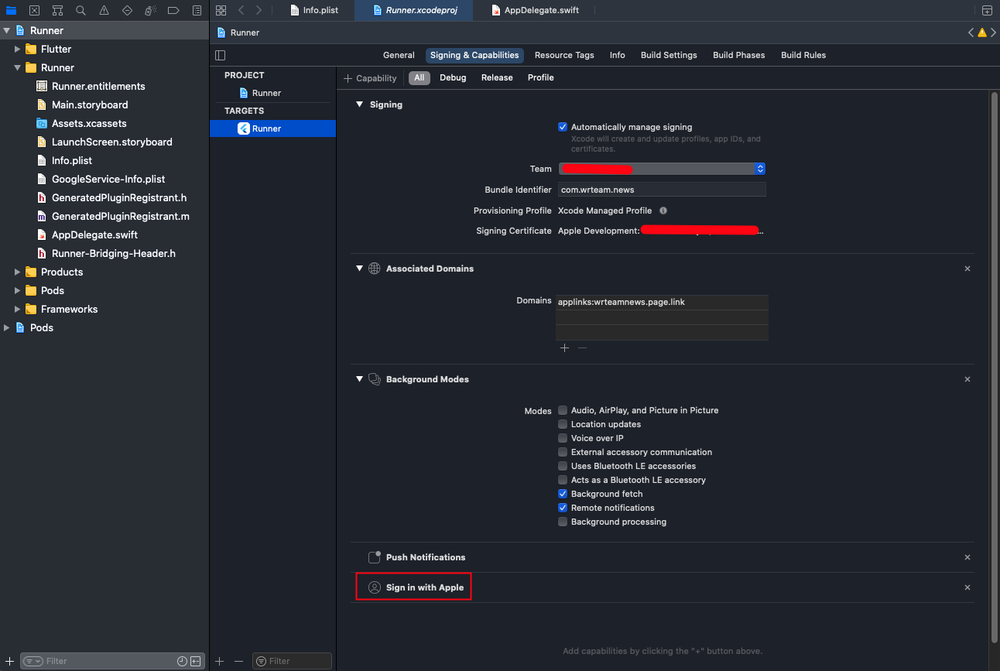

#### 🔹 Configure URL Schemes for Firebase Authentication 

1️⃣ Open Xcode        
2️⃣ Select the Info tab under your project    
3️⃣ Expand URL Types          
4️⃣ Click + and add a new URL scheme      
5️⃣ Find REVERSED_CLIENT_ID inside GoogleService-Info.plist       
6️⃣ Copy and paste it into the URL Schemes field      

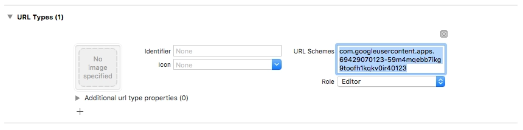

----
✅ **Firebase Authentication**🎉
 --> 
