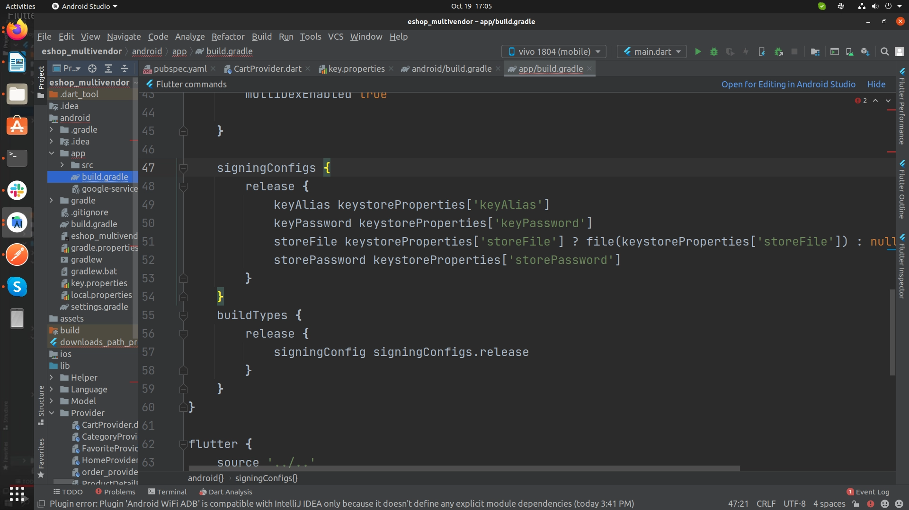

# Generate Release APKs

# 📦 How to Generate Release APKs in Flutter

Follow this guide to generate a **release APK** or **App Bundle (AAB)** for publishing your Flutter app.

---

## 🔑 Step 1: Create an Upload Keystore

Before building a release APK, you need to **create a keystore** for signing your app.

### **On Mac/Linux**  
Run the following command in the terminal:  

```sh
keytool -genkey -v -keystore ~/upload-keystore.jks -keyalg RSA -keysize 2048 -validity 10000 -alias upload
```

### On Windows

Run the following command in Command Prompt:
```sh
keytool -genkey -v -keystore c:\Users\USER_NAME\upload-keystore.jks -storetype JKS -keyalg RSA -keysize 2048 -validity 10000 -alias upload
```


:::caution
👉 Remember your keystore password, as you'll need it later.

:::

## 📌 Step 2: Reference the Keystore in Your Project
1️⃣ Navigate to your Flutter project android folder.      
2️⃣ Create a new file named:      
```bash
android/key.properties
```


3️⃣ Add the following content inside `key.properties` and update it with your details:

```properties
storePassword=YOUR_STORE_PASSWORD
keyPassword=YOUR_KEY_PASSWORD
keyAlias=upload
storeFile=YOUR_KEYSTORE_FILE_PATH
```
Example:

```properties
storePassword=mySecurePassword
keyPassword=mySecureKeyPassword
keyAlias=upload
storeFile=/Users/yourname/upload-keystore.jks
```


## ⚙️ Step 3: Configure Signing in build.gradle
1️⃣ Open android/app/build.gradle.        
2️⃣ Add the following keystore properties before the android {} block:        

```groovy
def keystoreProperties = new Properties()
def keystorePropertiesFile = rootProject.file('key.properties')
if (keystorePropertiesFile.exists()) {
    keystoreProperties.load(new FileInputStream(keystorePropertiesFile))
}
```


## 🔏 Step 4: Configure Signing in buildTypes Block
Find the `buildTypes` block in `android/app/build.gradle` and replace it with the following:
```groovy
android {
    ...
    signingConfigs {
        release {
            keyAlias keystoreProperties['keyAlias']
            keyPassword keystoreProperties['keyPassword']
            storeFile keystoreProperties['storeFile'] ? file(keystoreProperties['storeFile']) : null
            storePassword keystoreProperties['storePassword']
        }
    }
    buildTypes {
        release {
            signingConfig signingConfigs.release
            minifyEnabled true // Optional: Enables code shrinking
            proguardFiles getDefaultProguardFile('proguard-android-optimize.txt'), 'proguard-rules.pro'
        }
    }
}
```



## 🚀 Step 5: Build the Release APK
Now, run the following command in your terminal:

To generate an APK
```sh
flutter build apk
```

To generate an App Bundle (Recommended for Play Store)
```sh
flutter build appbundle
```


:::note
#### ✅ Final Steps: Test & Publish
 - Test the APK on a real device before publishing.
 - If you're uploading to the Google Play Store, use the App Bundle (AAB) instead of an APK.
 - Ensure your app follows Google Play policies before publishing.
:::

---

🎉 **Your release APK is ready!** 🚀

