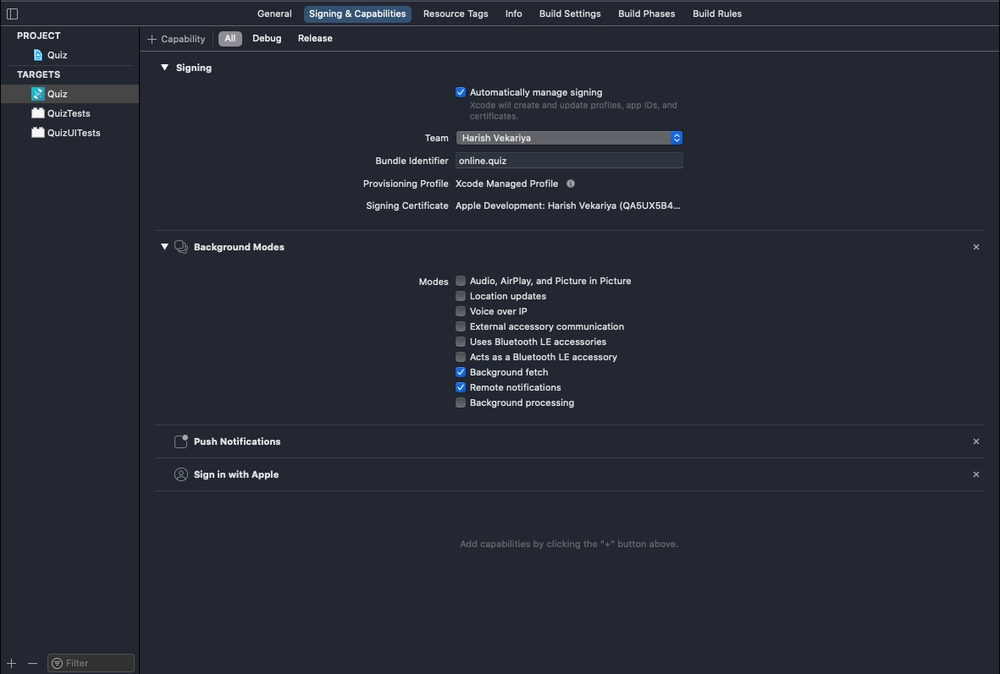
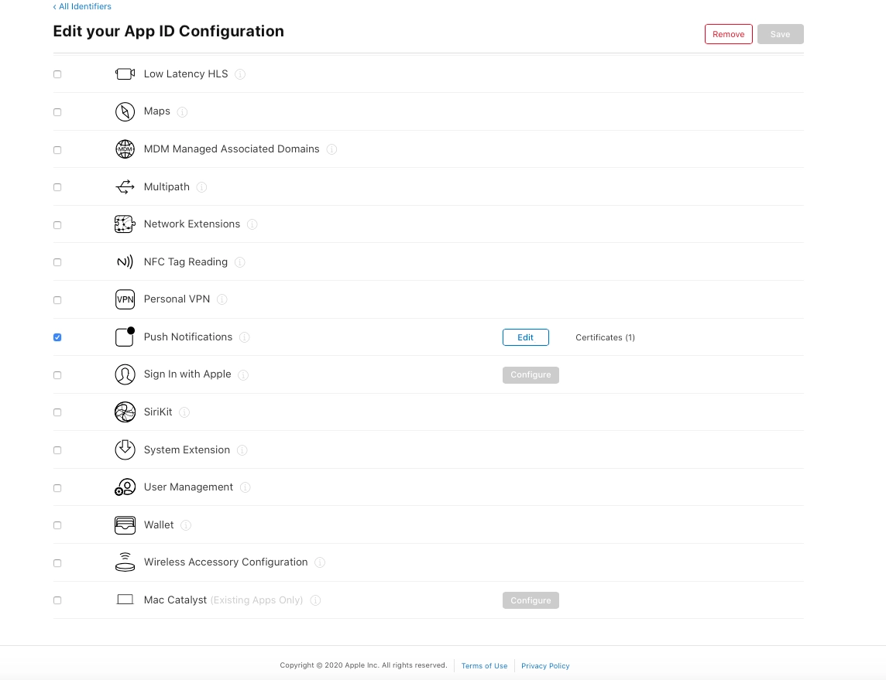
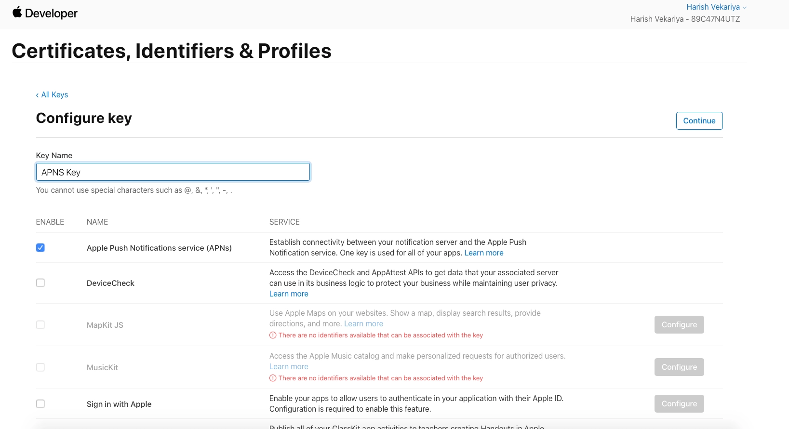
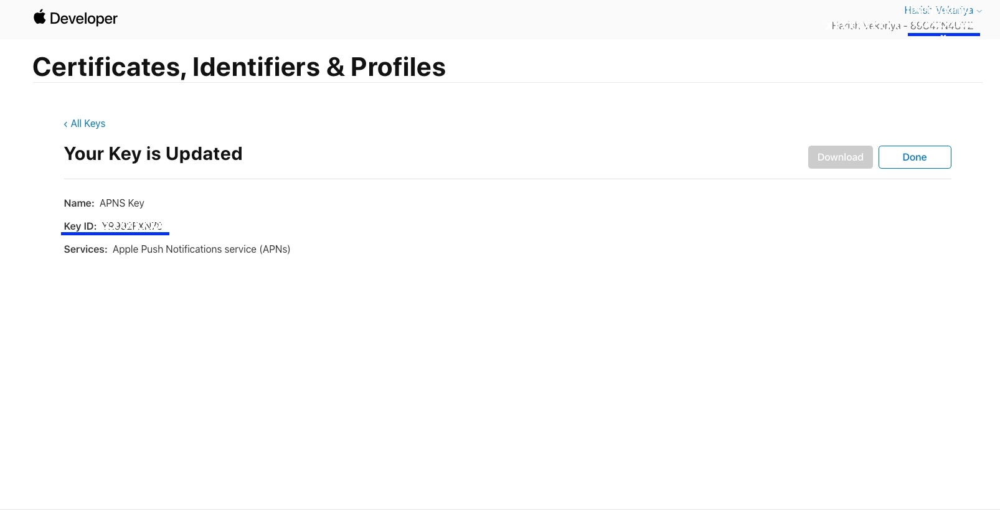
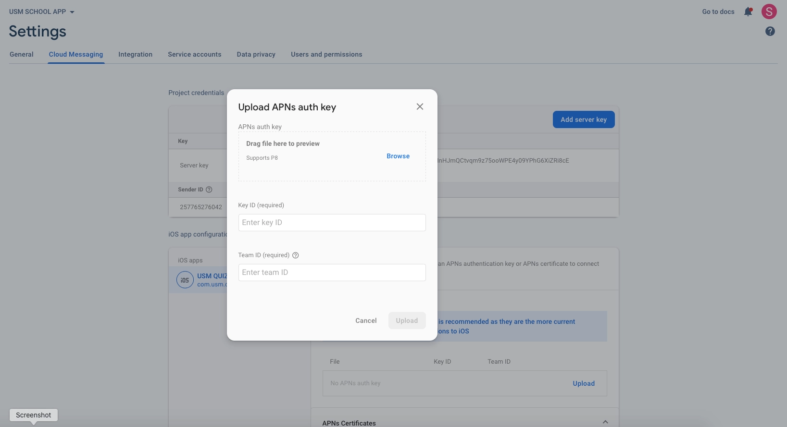
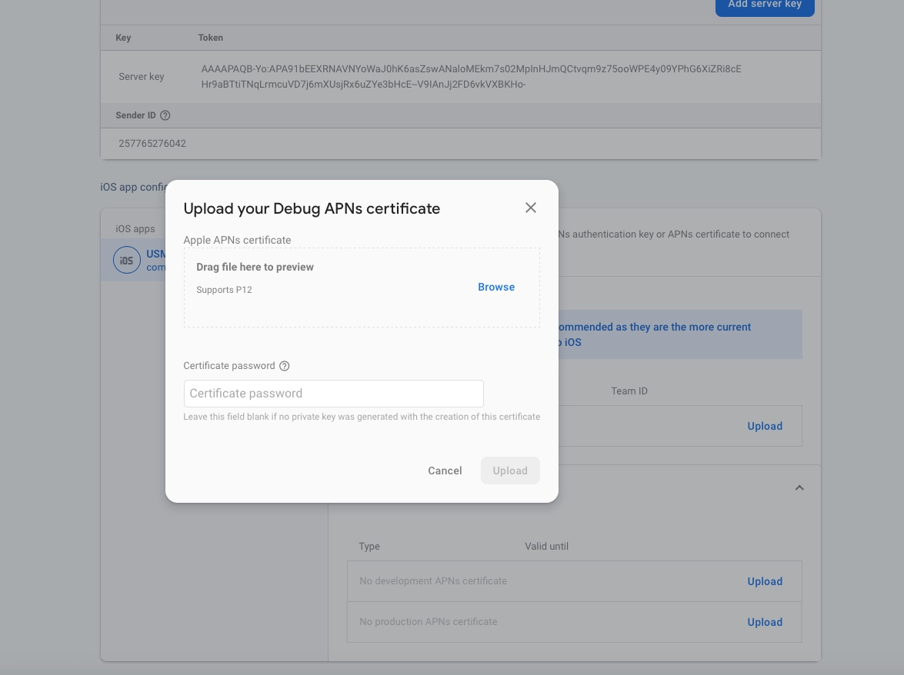
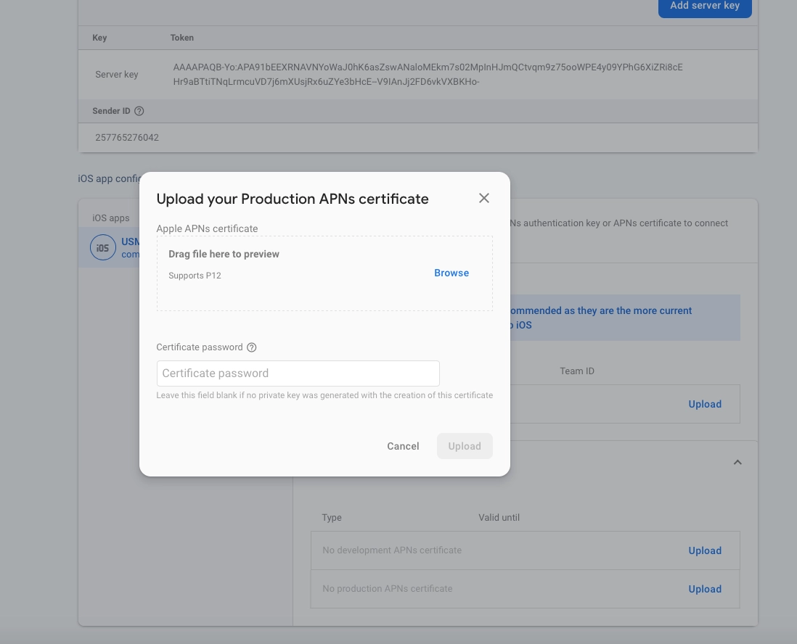

# Notification Setup

<!-- How to set Notification -->

## 📢 Setting Up Push Notifications for iOS  

This guide explains how to enable **Push Notifications** in your iOS app using **Firebase and Apple Push Notification Service (APNs).**  

---

## 🚀 **Enable Push Notifications in Xcode**  

1️⃣ Open **Xcode** and load your project.  
2️⃣ In the **Project Navigator** (left panel), select your project.  
3️⃣ In the right-hand panel, select your **App Target**.  
4️⃣ Navigate to the **Capabilities** tab.  
5️⃣ Enable **Push Notifications**.  
6️⃣ Enable **Remote Notifications** and **Background Fetch** under **Background Modes**.  

---

## 🔑 **APNs Authentication Methods**  

Apple Push Notification service (APNs) supports two authentication methods:  

1️⃣ **Token-based Authentication (.p8 file)**  
2️⃣ **Certificate-based Authentication (.p12 file)**  

---

## 🔹 **Option 1: Token-based Authentication (.p8 file)**  

1️⃣ **Log in** to the [Apple Developer Portal](https://developer.apple.com/account/).  
2️⃣ Go to **Certificates, IDs & Profiles > Identifiers > App IDs**.  
3️⃣ Select your **App ID** and click **Continue**.  
4️⃣ Enable **Push Notifications** in the **Capabilities** section.  

5️⃣ Navigate to **Certificates, IDs & Profiles > Keys**.  
6️⃣ Click **Add Key** and enable **APNs** for it.  

7️⃣ Save and **download the .p8 file** (this can be downloaded only once).  

🔹 **Upload .p8 File to Firebase**  
1️⃣ Open **Firebase Console**.  
2️⃣ Navigate to **Project Settings > Cloud Messaging**.  
3️⃣ Upload the **.p8 file** along with:  
   - **Key ID** (found in Apple Developer Portal under "Keys")  
   - **Team ID** (found under Apple Developer account settings) 

---

## 🔹 **Option 2: Certificate-based Authentication (.p12 file)**  

1️⃣ **Log in** to the [Apple Developer Portal](https://developer.apple.com/account/).  
2️⃣ Navigate to **Certificates, IDs & Profiles > Identifiers > App IDs**.  
3️⃣ Select your **App ID**, enable **Push Notifications**, and save changes.  
4️⃣ Click **Capabilities > Push Notifications > Configure**.  
5️⃣ Click **Create Certificate** under either:  
   - **Development SSL Certificate** (for testing)  
   - **Production SSL Certificate** (for live push notifications)  

6️⃣ Follow Apple's guide to **Create a Certificate Signing Request (CSR)**.  
7️⃣ Upload the CSR file and generate the certificate.  
8️⃣ Click **Download** to download the `.cer` file.  

🔹 **Convert .cer File to .p12 File**  
1️⃣ Open the `.cer` file in **Keychain Access** on your Mac.  
2️⃣ Go to **Category > Certificates**.  
3️⃣ Select your **Push Notification Certificate**.  
4️⃣ Click **File > Export Items**.  
5️⃣ Save the file as **.p12 format**.  

🔹 **Upload .p12 File to Firebase**  
1️⃣ Open **Firebase Console**.  
2️⃣ Navigate to **Project Settings > Cloud Messaging**.  
3️⃣ Upload the **.p12 file** and enter the password if prompted. 

---

## ✅ **Push Notifications Setup Completed! 🎉**  

Your iOS app is now configured to receive **Push Notifications** via **Firebase and APNs**. 🚀  
