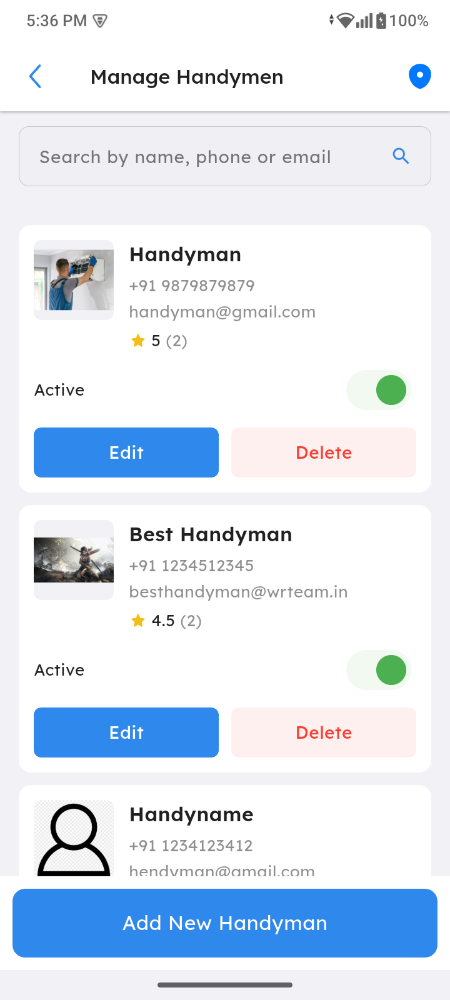
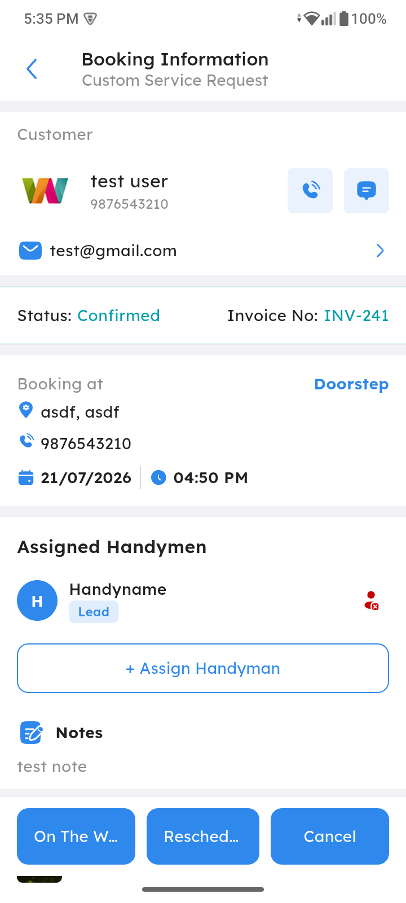
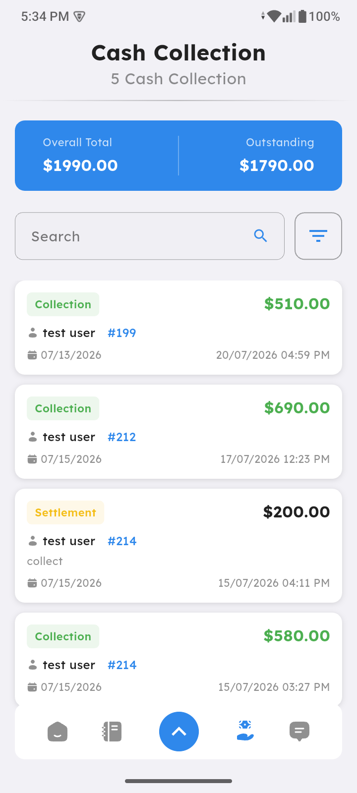

# Handyman

Providers can add and manage handymen under their account. Handymen get their own panel/app to operate bookings, and providers can collect cash payments from handymen for completed jobs.

## How It Works

### 1. Handyman Management (Provider Panel & App)

- Provider can add, edit, and manage handymen from the Provider Panel and Provider App

- Assign bookings to a specific handyman

### 2. Cash Collection from Handyman

- Provider can collect cash payments from handymen for the bookings they completed
- Track collected/pending cash per handyman

### 3. Handyman Panel/App

- Handyman gets a dedicated panel/app login
- Handyman can update booking status (accepted, started, completed, etc.)
