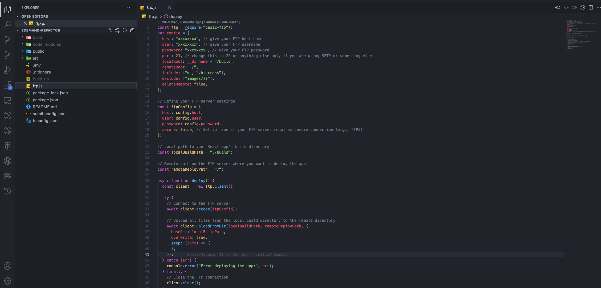

# Deploy your site

## Generate Build

To Generate Build Hit the below shown command.

   ```bash
   npm run export
   ```

:::note
Note: after above command once complete then one **out** folder created make zip and upload to server of web domain
:::

## Upload .htaccess file

Upload .htaccess file on your server which located in your web code folder.


<!-- 
## Another way to upload if you have ftp (optional)

1. **Generate Build And Deploy on live server** : To Generate Build Hit the below shown command.

   Set Your Deployment FTP details here go to file **ftp.js**

   

2. **Deploy on live server** : Hit the below shown command.

   ```bash
   npm run deploy
   ```

3. **Run your React Web App on Your Server** : first check .htaccess file is there on your server or not. If not then add .htaccess file on your server.

   ```markdown
   Options -MultiViews
   RewriteEngine On
   RewriteCond %{REQUEST_FILENAME} !-f
   RewriteRule ^ index.html [QSA,L]
   ```

4. **Add Build Zip File** : Upload Your Build Zip File On Your Server (if you have used npm run deploy to deploy then you can ignore this step).

5. **Your app is live** : You can finally browse your react eDemand app on your server. -->
