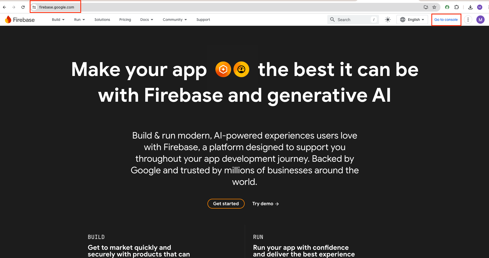
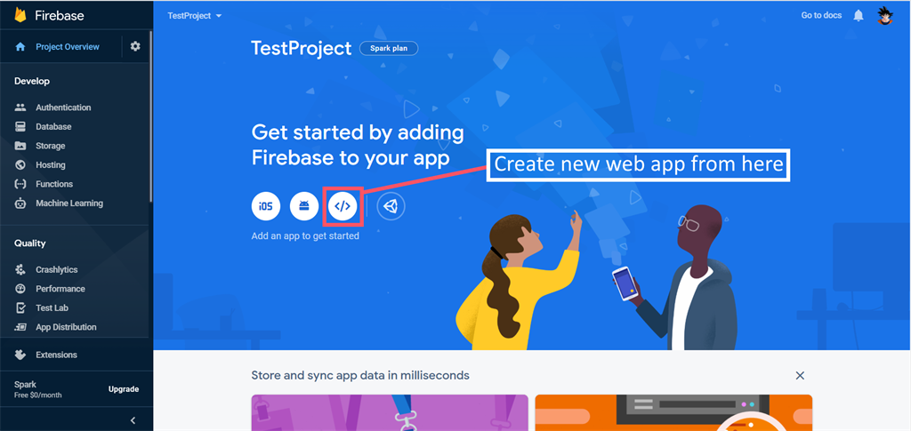
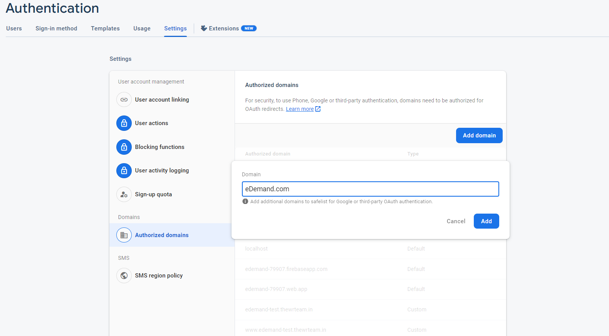
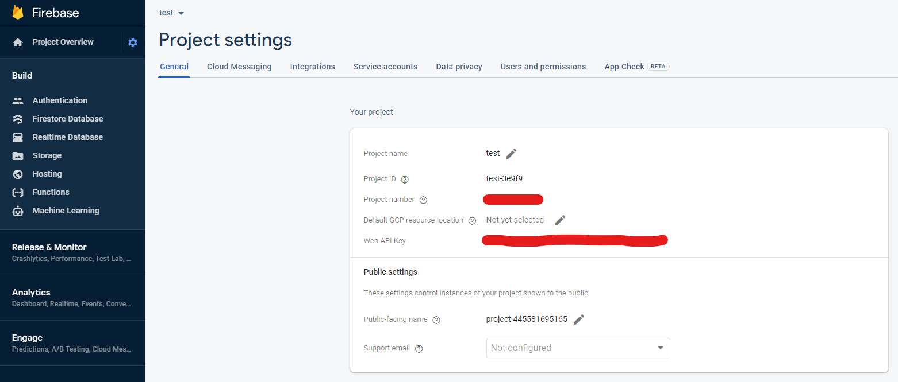
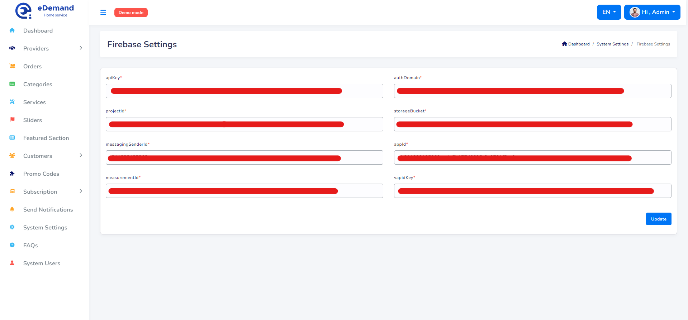
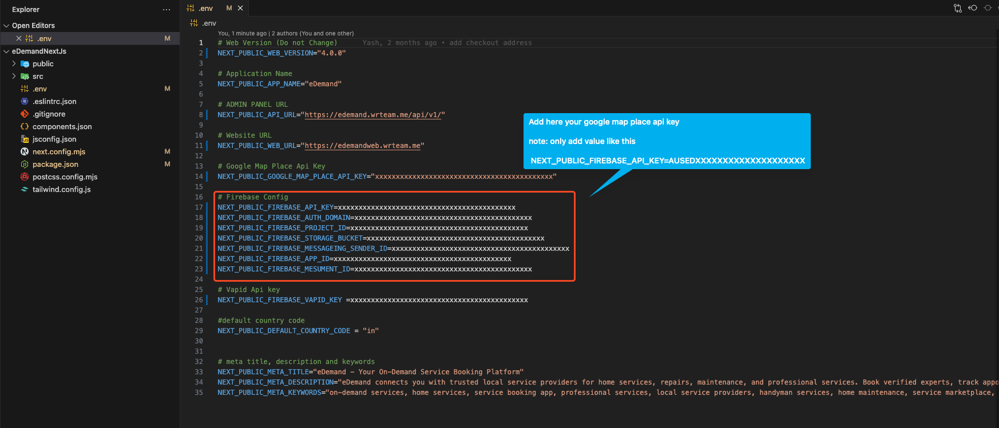
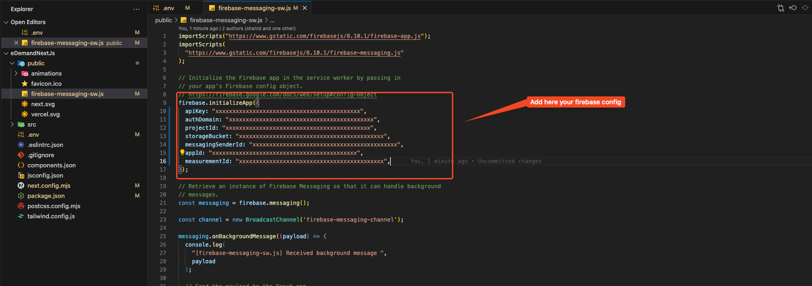

# Firebase Setup

:::caution

If you already created firebase project at that time then you can skip below firebase steps

:::

## Configure the firebase setup

1. Create a firebase project at [https://console.firebase.google.com/](https://console.firebase.google.com/)

   

2. Register a new account or try to log in with existing google accout.

   

3. Once logged in, you can see firebase console dashboard. Click on Add Project. Provide a project name, and then select country and then after that click on Create Project. For example, see the below image

   

   

4. Once the project has been created, it will automatically redirect to Firebase dashboard screen.

   

5. Go to Authentication and open **Sign-in method** tab and enable providers which is highlight below

   

6. Now at the bottom of the page, in **Authorized domains**, localhost and a Firebase domain are automatically added. Here we've to add domain name without **http://** or **https://**. You can add http:// and https:// whever eDemand Front End(Web Version) Website will get hosted. If you're using www as prefix of domain name then you must have to add that.

7. Now add your domain with www. as prefix like **www.myeDemand.com**

   

8. Go to Project settings in firebase dashboard option.

   

9. Go to Project settings and scroll down you will find created web App there you find config option that will have firebase settings for front end.

10. Add the below config to your **Firebase Console** > **Project settings** > **General**

    

11. You need to set this details in eDemand **Admin panel** -> **Web Settings** page from this Project settings page in firebase dashboard option

    

12. Also update firebase config value in web **.env** file and **public/firebase-messaging-sw.js** file

    

    