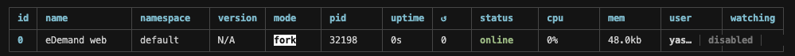
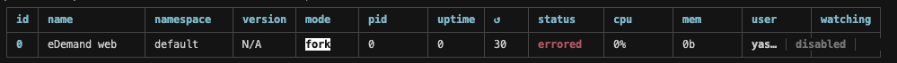

# Next.js Deployment

This guide explains how to deploy your eDemand web application with SEO support using Next.js on a VPS server.

:::warning
This is an advanced deployment option for users who have a VPS server and are familiar with Node.js, npm, and pm2. The instructions assume you're using a Debian-based Linux distribution.
:::

## Uploading Your Project

Before starting deployment, upload your project to the server:

1. Use an FTP client like [FileZilla](https://filezilla-project.org/download.php) to upload your project files to your server
2. Alternatively, use Git to clone your repository directly on the server

## Installing Node.js

Node.js can be installed using NVM (Node Version Manager) to easily manage multiple Node.js versions:

```bash
sudo apt install curl
curl https://raw.githubusercontent.com/creationix/nvm/master/install.sh | bash
source ~/.bashrc  # or restart your terminal
nvm install node 20.*
```

Verify the installation with:

```bash
node -v
```

For more information, refer to the [official Node.js documentation](https://nodejs.org/docs/latest/api/).

## Installing PM2

PM2 is a production process manager for Node.js applications. Install it globally with:

```bash
npm install pm2 -g
```

## Automated Deployment Script (Recommended)

:::tip Quick Deployment
For faster and easier deployment, use the included `deploy_vps.sh` script which automates all the steps below.
:::

The project includes an automated deployment script that handles the entire deployment process:

**Quick Start:**

```bash
# Navigate to your project directory
cd /var/www/html/edemand

# Make script executable
chmod +x deploy_vps.sh

# Run deployment
./deploy_vps.sh
```

**What the script does:**
- ✅ Verifies custom server setup
- ⚙️ Configures PM2 with `ecosystem.config.cjs`
- 🧹 Cleans old builds
- 📦 Installs dependencies
- 🗺️ Generates sitemap and service worker
- 🏗️ Builds the application
- 🔧 Generates `.htaccess` for Apache
- 🚀 Starts/restarts PM2 process
- 🔄 Reloads Apache

**Port Configuration:**

During deployment, you'll be prompted to configure the port:

```
Current Port: 8001
➜ Enter Port (Press Enter to keep 8001):
```

The script automatically updates the `ecosystem.config.cjs` file with your chosen port.

**PM2 Configuration (ecosystem.config.cjs):**

The project uses `ecosystem.config.cjs` for PM2 process management:

```javascript
module.exports = {
  apps: [{
    name: 'edemand-web',
    script: './server.js',
    instances: 1,
    exec_mode: 'cluster',
    env: {
      NODE_ENV: 'production',
      NODE_PORT: 8001,  // Automatically updated by deploy script
    }
  }]
}
```

To start with ecosystem config:

```bash
pm2 start ecosystem.config.cjs
pm2 save
```

---

## Manual Deployment

If you prefer to deploy manually, follow these steps:
<!-- 
## Configuring Apache Proxy

Before configuring Apache, enable the necessary modules:

```bash
sudo a2enmod proxy_ajp
sudo a2enmod rewrite
sudo a2enmod deflate
sudo a2enmod proxy_balancer
sudo a2enmod proxy_connect
sudo a2enmod proxy_html
```

Create a reverse proxy for the Node.js server in your Apache server settings:

```apache
<Location />
ProxyPass http://localhost:8001/
</Location>
```

 -->

## Setting Up the Project

Make sure you have all the dependencies installed:

```bash
npm install
```

Build the production application:

```bash
npm run build
```

## Running with PM2

**Option 1: Using ecosystem.config.cjs (Recommended)**

Start your application using the ecosystem configuration file:

```bash
pm2 start ecosystem.config.cjs
pm2 save
```

This method uses the pre-configured settings including app name, port, and environment variables.

**Option 2: Manual PM2 Start**

Alternatively, start with a manual command:

```bash
pm2 start "npm start" -n "YOUR_PROJECT_NAME"
```

Check if the PM2 process is running correctly:

```bash
pm2 ls
```

You should see your application in the list of running processes:



If you see errors:



Run `pm2 logs` to see detailed error messages.

## Managing PM2 Processes

To restart a PM2 process:

```bash
pm2 restart [id]
```

Replace `[id]` with your process ID (e.g., `pm2 restart 0`).

To delete a PM2 process:

```bash
pm2 delete "YOUR_PROJECT_NAME"
```

For more information, refer to the [official PM2 documentation](https://pm2.keymetrics.io/docs/usage/quick-start/).

## Testing Your Deployment

After completing all steps:

1. Visit your website using your domain name
2. Verify that all pages load correctly with proper SEO metadata
3. Check that server-side rendering is working by viewing the page source
4. Test all functionality to ensure everything works as expected
