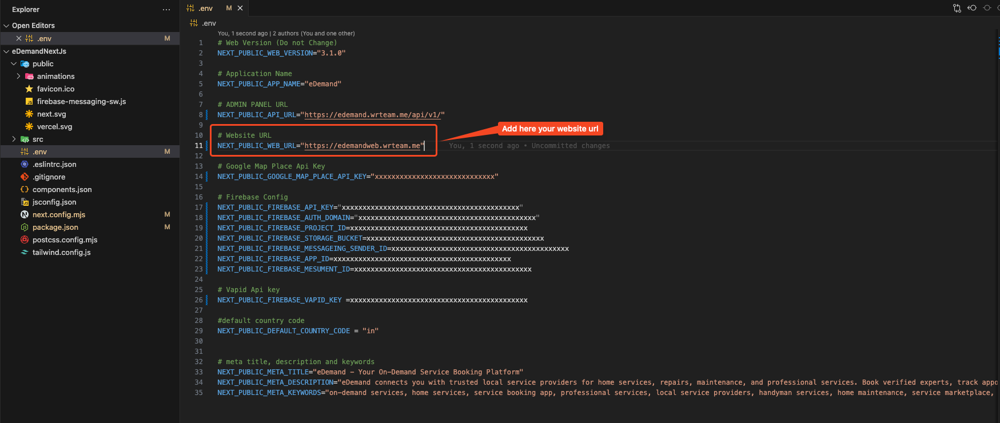

# Sitemap Setup

A sitemap helps search engines discover and index all the pages on your website efficiently. This guide explains how to set up a sitemap for your eDemand web application.

## Configuring Your Domain for Sitemap

1. Open the `.env` file in your project's root directory
2. Add your web domain or subdomain URL to the appropriate variable



## Generating the Sitemap

Choose one of the following options based on your hosting setup.

### 1) Shared hosting without SEO (static export)

- Build your site (this creates the `out` folder):

```bash
npm run export
```

- During the build, the sitemap will be generated and saved to the `public` directory.
- Deploy the contents of the `out` folder to your hosting. Ensure the generated sitemap is included.

### 2) VPS (build on server; auto-generate sitemap)

- Build the project on your VPS. During the build, the sitemap is generated automatically and added to the `public` folder.

Example:

```bash
npm run build
```

- After the build, verify the file exists at `public/sitemap.xml`.

### 3) Generate manually (only sitemap)

- Run the sitemap generation script:

```bash
npm run generat-sitemap
```

- This will generate/update `public/sitemap.xml` without starting the app.

## Customizing the Sitemap

If you want to customize the sitemap manually:

1. Navigate to the `public` directory
2. Open the `sitemap.xml` file
3. Modify the file according to your needs

<!--  -->

## Sitemap Structure

A typical sitemap follows this XML structure:

```xml
<?xml version="1.0" encoding="UTF-8"?>
<urlset xmlns="http://www.sitemaps.org/schemas/sitemap/0.9">
  <url>
    <loc>https://yourdomain.com/</loc>
    <lastmod>2023-04-01</lastmod>
    <changefreq>daily</changefreq>
    <priority>1.0</priority>
  </url>
  <url>
    <loc>https://yourdomain.com/properties</loc>
    <lastmod>2023-04-01</lastmod>
    <changefreq>daily</changefreq>
    <priority>0.8</priority>
  </url>
  <!-- Additional URLs -->
</urlset>
```

## Submitting Your Sitemap to Search Engines

After creating your sitemap:

1. Deploy your website with the sitemap.xml file
2. Submit your sitemap URL to search engines through their webmaster tools:
   - Google Search Console: https://search.google.com/search-console
   - Bing Webmaster Tools: https://www.bing.com/webmasters
   - Yandex Webmaster: https://webmaster.yandex.com

## Best Practices

For an effective sitemap:

- Keep it up to date with your latest content
- Include all important pages you want indexed
- Set appropriate priority and change frequency values
- Keep the file size under 50MB and fewer than 50,000 URLs (create multiple sitemaps if needed)
- Make sure the URLs in your sitemap actually exist and return 200 status codes
