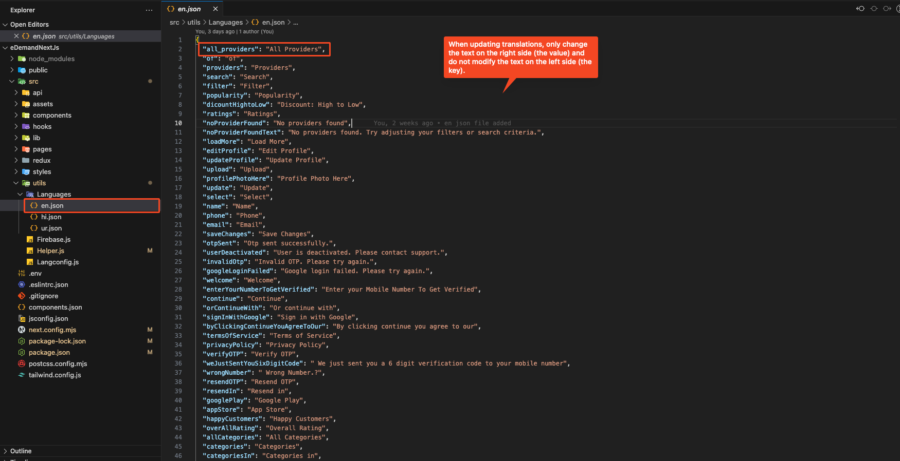
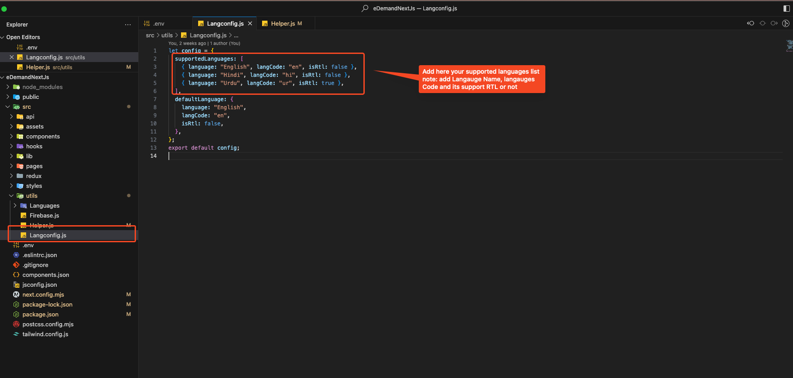
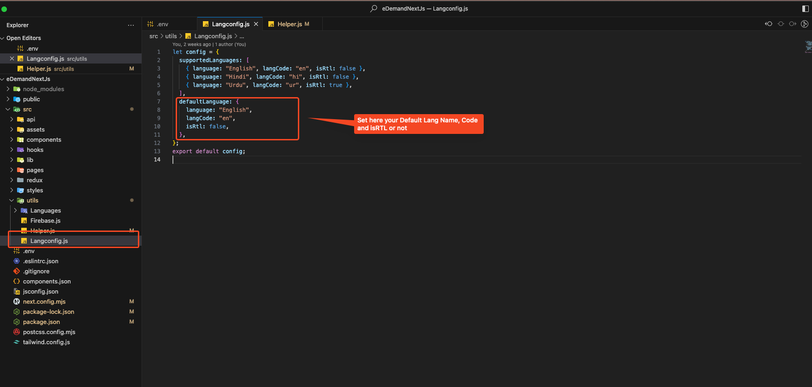
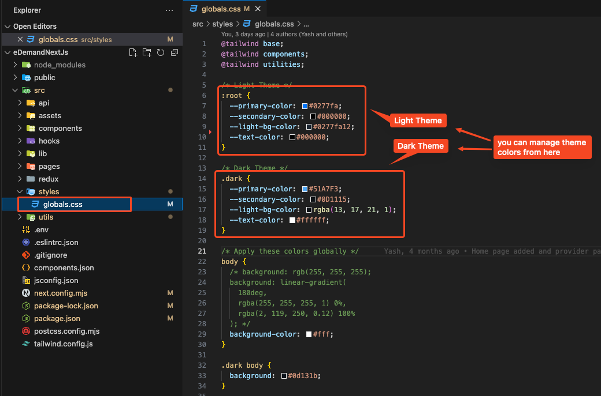
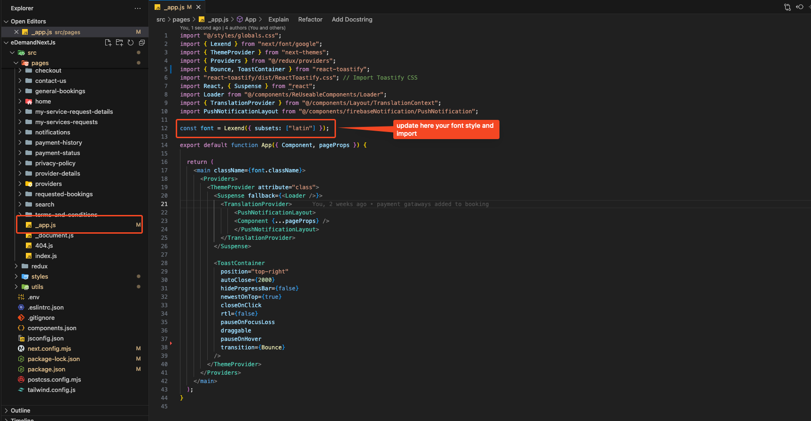

# System Configuration

## Language Configuration

:::tip  
Get Your Language Codes → [Get language codes](https://developers.google.com/admin-sdk/directory/v1/languages)  
:::

### Add a New Language

:::warning  
File name **must** be the same as the language code.  
:::

To add a new language file, place your file in the following directory:  
**`src/utils/Languages/`**

**Example:**  
**`src/utils/Languages/en.json`**

:::caution  
When updating translations, **only change the text on the right side (the value)** and do **not** modify the text on the left side (the key).

✅ **Correct way to update:**

<pre>
"all_providers": "All Providers"
</pre>

❌ **Incorrect way (Do NOT change the key):**

<pre>
"all_providers_updated": "All Providers"  // ❌ Incorrect!
</pre>

:::



---

### Add Supported Languages List & Default Language

To configure supported languages, update the `supportedLanguages` array & `defaultLanguage` object in the `Langconfig.js` file located in the `src/utils` folder.

#### **Example Configuration:**

```javascript
let config = {
  supportedLanguages: [
    { language: "English", langCode: "en", isRtl: false },
    { language: "Hindi", langCode: "hi", isRtl: false },
    { language: "Urdu", langCode: "ur", isRtl: true },
    // Add your new language here
  ],
  defaultLanguage: {
    language: "English",
    langCode: "en",
    isRtl: false,
  },
};
export default config;
```




## Change theme color

- Go to: **src -> styles -> globals.css**

   

## Change Font style

- Go to: **src -> pages -> app.js**

   