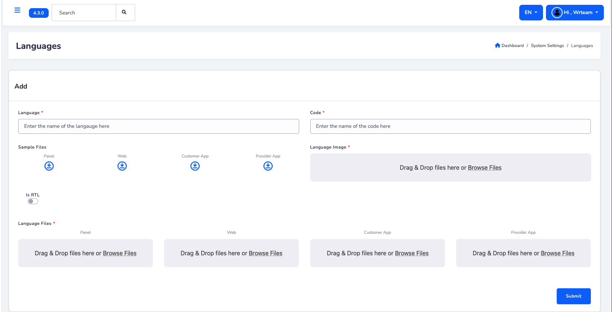
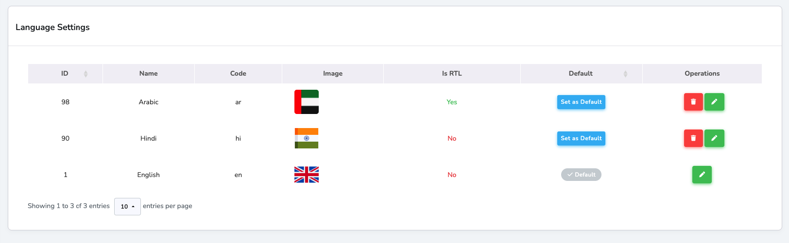
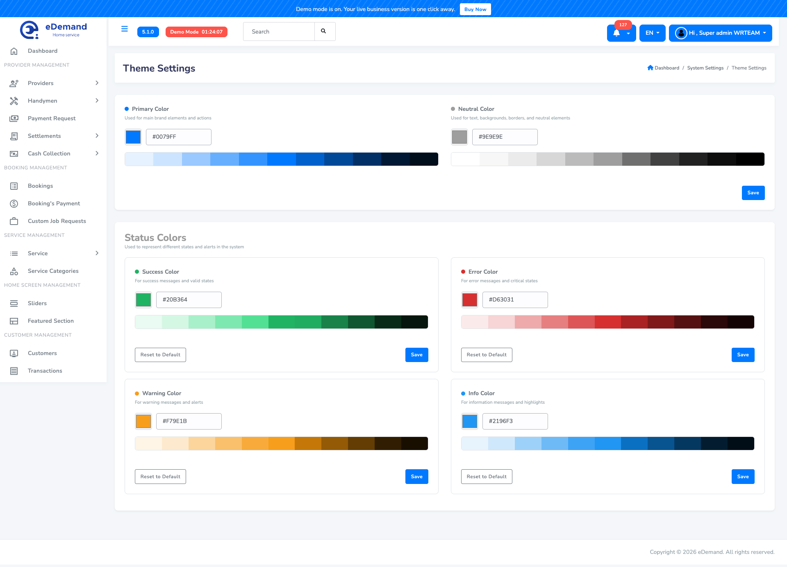

# System Configuration

## Language Configuration

:::tip  
Get Your Language Codes → [Get language codes](https://developers.google.com/admin-sdk/directory/v1/languages)
:::

### Add a New Language

Language management is now handled through the admin panel. Follow these simple steps:

#### Step 1: Access Language Settings
1. **Login to Admin Panel**: Go to your admin panel dashboard
2. **Navigate to Languages**: Click on **System Settings > Language Settings**



#### Step 2: Fill Language Details
In the "Add" section, complete the following fields:

1. **Language Name**: Enter the full name (e.g., "Spanish", "French", "German")
2. **Language Code**: Enter the 2-letter code (e.g., "es", "fr", "de")
3. **RTL Support**: Toggle "Is RTL" if the language reads right-to-left (like Arabic, Hebrew)
4. **Language Flag**: Upload a flag image for the language

#### Step 3: Upload Translation Files
Upload the translation files for each platform:

1. **Panel**: Upload admin panel translation file
2. **Web**: Upload website translation file  
3. **Customer App**: Upload customer app translation file
4. **Provider App**: Upload provider app translation file

:::tip
You can download sample files first to understand the format, then create your own translation files.
:::

:::note
The web app's own default/fallback translation file lives in the codebase at `src/dictionaries/en.json` — useful as a reference for every key the site expects when preparing your **Web** translation file for upload.
:::

#### Step 4: Submit
Click the **Submit** button to add the new language.

#### Step 5: Set as Default (Optional)
From the language list below, you can set any language as the default:



1. Find your language in the table
2. Click **"Set as Default"** button in the Default column
3. The language will be marked with ✓ Default

:::caution  
When updating translations, **only change the text on the right side (the value)** and do **not** modify the text on the left side (the key).

✅ **Correct way to update:**

<pre>
"all_providers": "All Providers"
</pre>

❌ **Incorrect way (Do NOT change the key):**

<pre>
"all_providers_updated": "All Providers"  // ❌ Incorrect!
</pre>

:::

---

## Change Theme Color

Theme colors are configured directly from the **Admin Panel** — no code changes required. This applies to both the web app and the panel itself.

### Steps to Update Theme Colors

1. Log in to the **Admin Panel**
2. Navigate to **System Settings > Theme Settings**
3. You'll see two cards:
   - **Primary Color** and **Neutral Color** — brand color and text/background/border neutral, each shown with a full auto-generated shade scale
   - **Status Colors** — four separate cards: **Success**, **Error**, **Warning**, **Info**
4. Click a color swatch (or type a hex value directly) to pick a new color
5. Use each card's own **Reset to Default** button to revert just that color
6. Click **Save** on a card to apply its changes



:::tip
Each card saves independently — updating Primary/Neutral color doesn't require re-saving the Status Colors, and vice versa. Reload the website to see the updated theme colors applied.
:::

## Change Font style

The web app still uses the **Pages Router** — font setup lives across two files, not one. It's loaded as a plain Google Fonts `<link>` (not `next/font`) so the font variable is visible at true `:root` scope, reaching both the normal page tree and Radix's portal-rendered components (Dialog, DropdownMenu, etc.).

### Step 1: Swap the Google Fonts link

Open **`pages/_document.tsx`** and find the font `<link>` in `<Head>`:

```tsx
<link
  rel="stylesheet"
  href="https://fonts.googleapis.com/css2?family=Lexend:wght@400;500;600;700;800;900&display=swap"
/>
```

Replace `Lexend` with your chosen [Google Font](https://fonts.google.com/) family name, keeping the weights you need (e.g. `family=Inter:wght@400;500;600;700`). The two `preconnect` links above it (`fonts.googleapis.com`, `fonts.gstatic.com`) don't need to change unless you're using a non-Google font provider.

### Step 2: Update the CSS variable

Open **`src/styles/globals.css`** and find the `:root` block near the top:

```css
:root {
  --font-lexend: "Lexend", sans-serif;
}
```

Update the font name to match (rename the variable too if you want, but then also update its two references just below in the `@theme inline` block):

```css
@theme inline {
  --font-sans: var(--font-lexend);
  --font-heading: var(--font-lexend);
  ...
}
```

:::caution
Don't try to switch this to `next/font` — it can't run inside `pages/_document.tsx` (a Pages Router restriction), which is why this app uses a static Google Fonts `<link>` instead.
:::