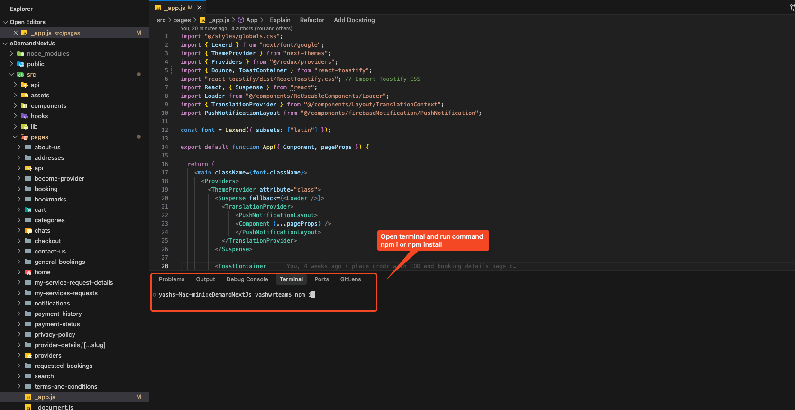
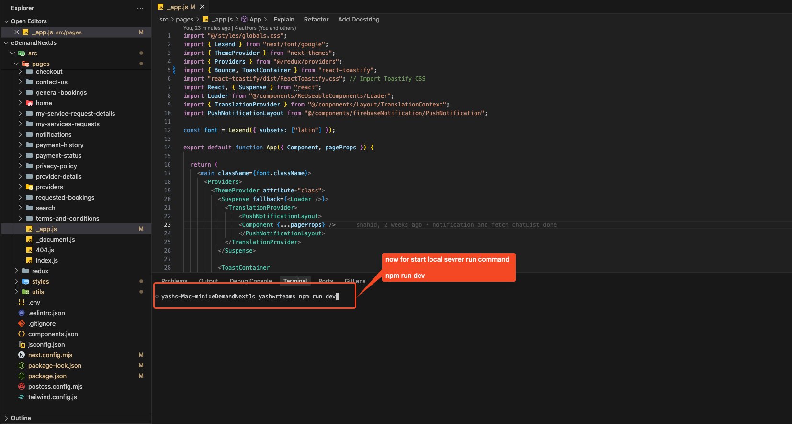

# Run Website Locally

## Install Packages and Dependencies

Install Packages and Dependencies. Run the command below to install all the required dependencies and packages:

   ```bash
   npm i
   ```

  

## Start the web app

Hit the below command to start the app and to check local server browser:

   ```bash
   npm run dev
   ```

   

## Open the browser
Open the browser and navigate to [http://localhost:3000/](http://localhost:3000/)

Check everything in a local browser (e.g., Google Chrome). Once everything works correctly, proceed to the deployment step.