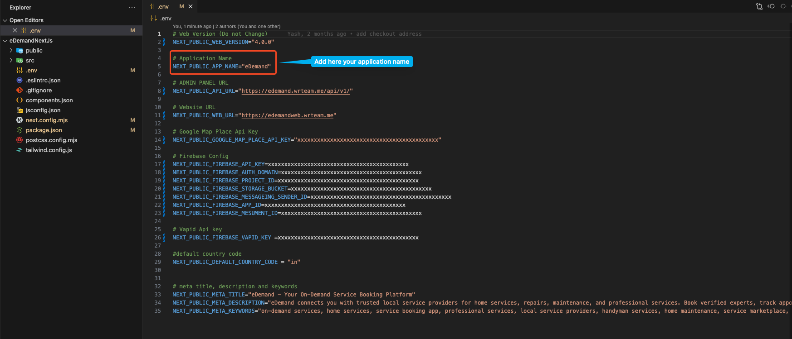
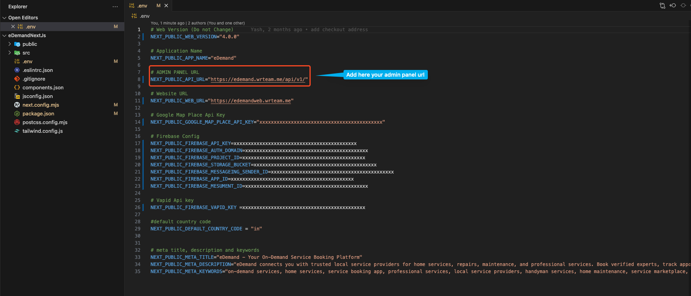
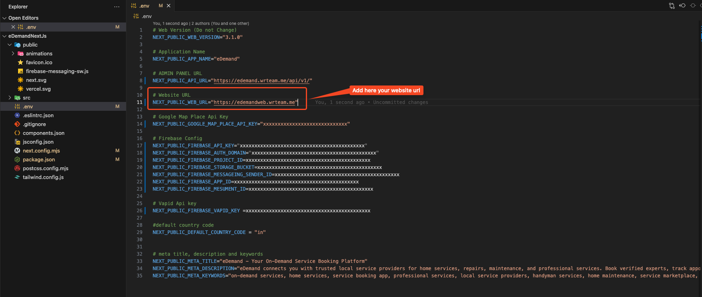
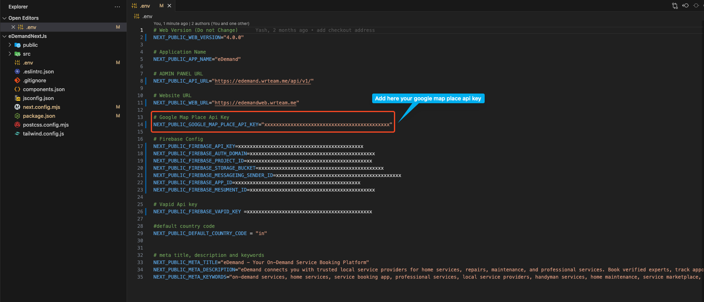
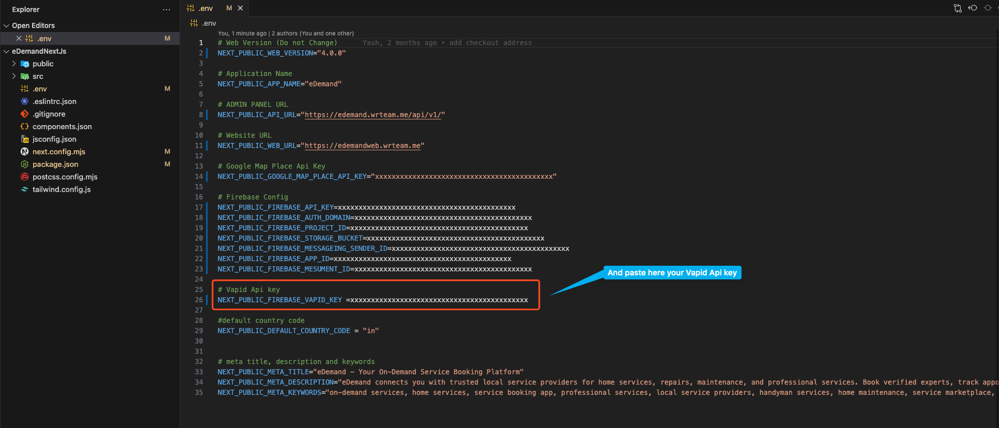
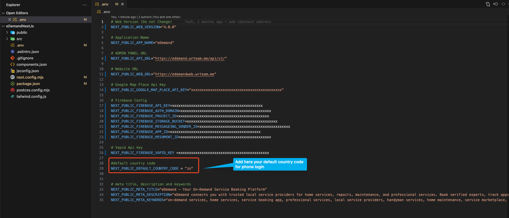
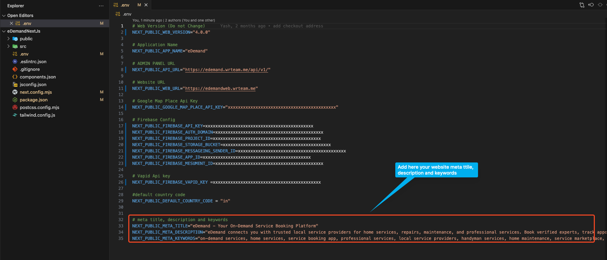

# Website Setup Locally

## Configure files

<!-- 1. **Copy Files**: Copy files from the downloaded code to your desired folder. For example: `C:\react\eDemand\` -->

Open the download web folder in a code editor like **VSCode**

## `.env` file configuration

Open the `.env` file and update the details as specified below.

:::tip
For each variable, only update the **value** after the `=` sign. Never change the variable name on the left.
:::

### - Update the Application Name

In the `.env` file, locate the line that starts with `NEXT_PUBLIC_APPLICATION_NAME=` and replace `YourAppName` with your desired application name. For example:

      <pre>NEXT_PUBLIC_APPLICATION_NAME="eDemand"</pre>

     

### - Update the Admin URL

In the `.env` file, locate the line that starts with `NEXT_PUBLIC_ADMIN_URL=` and replace `https://edemand.wrteam.me/api/v1/` with your desired admin URL. For example:

     <pre>NEXT_PUBLIC_ADMIN_URL="https://edemand.wrteam.me/api/v1/"</pre>

     

:::tip
To find the admin URL, follow these steps:

1. Go to **Admin Panel**.
2. Navigate to **System Settings**.
3. Select **API Key Settings**.
4. Under **Client API Keys**, you'll find the **API link for Customer App**.

This will give you the Admin URL you need.
:::
### - Update the Website URL

In the `.env` file, locate the line that starts with `NEXT_PUBLIC_WEB_URL=` and replace `https://edemandweb.wrteam.me/` with your desired website URL. For example:

      <pre>NEXT_PUBLIC_WEB_URL="https://edemandweb.wrteam.me/"</pre>

     

### - Update the Google Map Place API Key

In the `.env` file, locate the line that starts with `NEXT_PUBLIC_GOOGLE_MAP_API_KEY=` and replace `AIzaxxxxxxxxxxxxxxxxxxxxxxxxxxxx` with your desired Google Maps API key. For example:

      <pre>NEXT_PUBLIC_GOOGLE_MAP_API_KEY="AIzaxxxxxxxxxxxxxxxxxxxxxxxxxxxx"</pre>

     

### - Update the Firebase Vapid key for notifications

In the `.env` file, locate the line that starts with `NEXT_PUBLIC_FIREBASE_VAPID_KEY=` and replace `AIzaxxxxxxxxxxxxxxxxxxxxxxxxxxxx` with your desired Firebase Vapid key. For example:

      <pre>NEXT_PUBLIC_FIREBASE_VAPID_KEY=AIzaxxxxxxxxxxxxxxxxxxxxxxxxxxxx</pre>

To get the **Firebase Vapid Key**:

1. Go to your **Firebase project**.
2. Navigate to **Project Settings**.
3. In the **Cloud Messaging** section, go to **Web Configuration**.
4. Under **Web Push Certificates**, generate a key pair.
5. Copy the **Vapid Key** and paste it into your `.env` file.

### - Update the Default Country Code

:::tip

here you can find → [Default Country List](https://developers.google.com/hotels/hotel-prices/dev-guide/country-codes)

:::

In the `.env` file, locate the line that starts with `NEXT_PUBLIC_DEFAULT_COUNTRY_CODE=` and replace `in` with your desired default country code. For example:

      <pre>NEXT_PUBLIC_DEFAULT_COUNTRY_CODE=in</pre>

     

### - Update Website Meta Title, Description, and Keywords

In the `.env` file, locate and update the following lines with your desired meta information:

<pre>
NEXT_PUBLIC_META_TITLE="eDemand - Your On-Demand Service Booking Platform"

NEXT_PUBLIC_META_DESCRIPTION="eDemand connects you with trusted local service providers for home services, repairs, maintenance, and professional services. Book verified experts, track appointments, and get instant quotes. Your one-stop platform for all service needs."

NEXT_PUBLIC_META_KEYWORDS="on-demand services, home services, service booking app, professional services, local service providers, handyman services, home maintenance, service marketplace, instant booking, expert services, home repair, service professionals, trusted providers, service platform, local experts, service scheduling, verified professionals, service appointments, home improvement services, service booking platform"
</pre>

