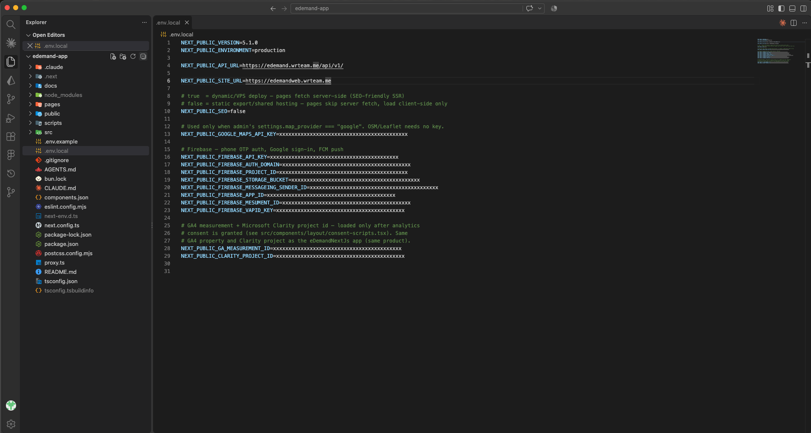

# Website Setup Locally

## Configure files

<!-- 1. **Copy Files**: Copy files from the downloaded code to your desired folder. For example: `C:\react\eDemand\` -->

Open the download web folder in a code editor like **VSCode**

## `.env` file configuration

Copy `.env.example` to `.env.local` in your project root, then update the values below. `.env.local` is git-ignored — your real keys never get committed.

:::tip
For each variable, only update the **value** after the `=` sign. Never change the variable name on the left.
:::



| Variable | What it's for | Where to get it |
|---|---|---|
| `NEXT_PUBLIC_API_URL` | Backend API base URL the web app calls | **Admin Panel → System Settings → API Key Settings → Client API Keys → API link for Customer App** |
| `NEXT_PUBLIC_SITE_URL` | This website's own deployed URL (used for canonical/OG/sitemap links) | Your domain, once deployed |
| `NEXT_PUBLIC_SEO` | `true` = VPS/Node deploy with SSR, `false` = static export | See [SEO for Web](./seo-for-web.md) / [Deployment Without SEO](./deployment-without-seo.md) |
| `NEXT_PUBLIC_GOOGLE_MAPS_API_KEY` | Map rendering — only needed if admin's map provider is set to Google | [Google Cloud Console](https://console.cloud.google.com/) → APIs & Services → Credentials (enable Maps JavaScript API) |
| `NEXT_PUBLIC_FIREBASE_API_KEY`, `_AUTH_DOMAIN`, `_PROJECT_ID`, `_STORAGE_BUCKET`, `_MESSAGEING_SENDER_ID`, `_APP_ID`, `_MESUMENT_ID` | Phone OTP auth, Google sign-in, FCM push | [Firebase Console](https://console.firebase.google.com/) → Project Settings → General → Your apps → **SDK setup and configuration** |
| `NEXT_PUBLIC_FIREBASE_VAPID_KEY` | Web push notification certificate | Firebase Console → Project Settings → **Cloud Messaging** → Web configuration → Web Push certificates → generate key pair |
| `NEXT_PUBLIC_GA_MEASUREMENT_ID` | Google Analytics 4 tracking | [Google Analytics](https://analytics.google.com/) → Admin → Data Streams → your web stream → Measurement ID |
| `NEXT_PUBLIC_CLARITY_PROJECT_ID` | Microsoft Clarity session recording/heatmaps | [Microsoft Clarity](https://clarity.microsoft.com/) → your project → Settings → Setup → Project ID |

:::note
`NEXT_PUBLIC_VERSION` and `NEXT_PUBLIC_ENVIRONMENT` are internal build/deploy metadata — **do not change these**.
:::

:::note
Analytics vars (`GA_MEASUREMENT_ID`, `CLARITY_PROJECT_ID`) only load after the visitor grants analytics consent — see `src/components/layout/consent-scripts.tsx`.
:::

### - Update the Application Name

The application name is no longer set via `.env` — it's now a code field. Open `src/lib/site-config.ts` and update the `appName` value:

      <pre>appName: "eDemand",</pre>

:::note
`appName` is used throughout the app — page titles, the "Open in App" prompt, OTP/email copy, PWA manifest name, etc. See [PWA Setup](./pwa-setup.md) for how it ties into the install prompt.
:::

<!--
### - Default phone country code

There's no env var for this anymore — it's hardcoded in `src/components/auth/shared/phone-number-field.tsx`:

```tsx
country="in"
```

Change `"in"` to your desired [country code](https://developers.google.com/hotels/hotel-prices/dev-guide/country-codes).
-->

### - Website meta title, description, and keywords

These moved out of `.env` too — set them in `src/lib/site-config.ts` alongside `appName`:

```ts
title: "eDemand - Your On-Demand Service Booking Platform",
description: "eDemand connects you with trusted local service providers...",
keywords: ["on-demand services", "home services", /* ... */],
```


